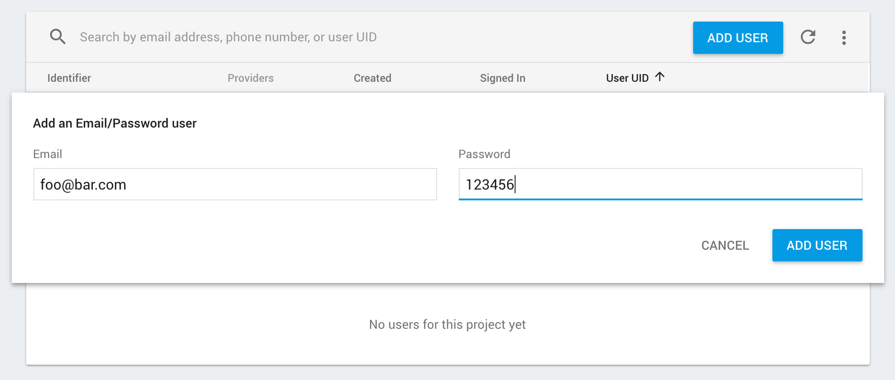

# Creating a sign-in form

We can now get onto allowing the user to login with their email and password. First off we need to create a dummy user for testing. This can be
done via the Firebase console on the 'Authentication' tab. Lets go ahead and create one now:



## Handling user input

React Native provides us with a [`TextInput`](https://facebook.github.io/react-native/docs/textinput.html) component, which renders the web
equivalent of an `input` box in our app. `TextInput` components are 'uncontrolled' meaning we have to explicitly give it a value and handle
updates the user enters. We're going to do this via component state, however you could also do this via our Redux store which is an option
other React developers would go down.

```jsx
// src/screens/unauthenticated/Login.js

import React, { Component } from 'react';
import { View, TextInput } from 'react-native';

class Login extends Component {

    static navigationOptions = {
        title: 'Login',
        headerStyle: {
            backgroundColor: '#E6853E',
        },
        headerTintColor: '#fff',
    };

    constructor() {
        super();
        this.state = {
           email: '',
           password: '',
        };
    }

    _updateEmail = (email) => {
        this.setState({ email });
    };

    _updatePassword = (password) => {
        this.setState({ password });
    };

    render() {
        return (
            <View>
                <TextInput
                    placeholder={'Email Address'}
                    onChangeText={this._updateEmail}
                    value={this.state.email}
                />

                <TextInput
                    placeholder={'Password'}
                    onChangeText={this._updatePassword}
                    value={this.state.password}
                />
            </View>
        );
    }
}

export default Login;
```

If you reload your app, you will see two plain `TextInput` boxes which can accept input. As these are updated, the `onChangeText` prop is triggered
which then updates state for that specific value. The inputs then individually update whenever their `value` from state changes:


> If you want to hide your users password, use the `secureTextEntry` prop.

## Communicating with Firebase

Now we've got our users input readily available in state, we can use the values to send to Firebase! First off we need a trigger to do this:

```jsx
// src/screens/unauthenticated/Login.js

import React, { Component } from 'react';
import { View, TextInput, Button } from 'react-native';

    ...

    _signIn = () => {

    };

    render() {
        return (
            <View>
                <TextInput
                    placeholder={'Email Address'}
                    onChangeText={this._updateEmail}
                    value={this.state.email}
                />

                <TextInput
                    placeholder={'Password'}
                    onChangeText={this._updatePassword}
                    value={this.state.password}
                />

                <Button
                  title={'Sign In'}
                  onPress={this._signIn}
                />
            </View>
        );
    }
```

As mentioned in 'Understanding Firebase Auth', we can call the `signInAndRetrieveDataWithEmailAndPassword` method on the Firebase API within our `_signIn` method,
using the state values.

```js
// src/screens/unauthenticated/Login.js

import firebase from 'react-native-firebase';

  ...

  _signIn = () => {
    // extract the values from state
    const { email, password } = this.state;

    firebase.auth().signInAndRetrieveDataWithEmailAndPassword(email, password)
      .catch((error) => {
        console.error(error);
      });
  };
```

The Firebase call will catch any errors (see list [here](https://rnfirebase.io/docs/v3.2.x/auth/reference/auth#signInAndRetrieveDataWithEmailAndPassword))
which may occur, such as a bad email address or incorrect email/password combination.

You may notice we don't listen our for the success response from the call (via the `.then`). As you may remember, back in our `App` component
our listener using `onAuthStateChanged` will pick up any successful sign in that occurs - and you guessed it, update the Redux store with
our users details, which causes `App` to re-render with our new `AuthenticatedStack`!

The `Welcome` component implemented below on the `AuthenticatedStack` contains a button which calls `firebase.auth().signOut()`, which triggers the
reverse motion of showing the `UnauthenticatedStack` to the user - simple!


> You may notice there's a delay when pressing the "Sign In" button and the `onAuthStateChanged` lister firing. An app should always give feedback
to a user when an action is happening. This can be accomplished through state/redux using many of the React Native components available such as
[`ActivityIndicator`](https://facebook.github.io/react-native/docs/activityindicator.html). You'll also want to handle any errors back from
Firebase to show to your user!

## Register / Forgot Password

The logic for registering or submitting a forgot password request is exactly the same as our sign in logic. Simply follow the same pattern
as we've done above using `TextInput` components and state. Once you've got the desired information, call Firebase with the methods you need, such as
[`createUserAndRetrieveDataWithEmailAndPassword`](https://rnfirebase.io/docs/v3.2.x/auth/reference/auth#createUserAndRetrieveDataWithEmailAndPassword)
or [`sendPasswordResetEmail`](https://rnfirebase.io/docs/v3.2.x/auth/reference/auth#sendPasswordResetEmail)!

Remember to allow the user to navigate between these screens using the `navigate` method provided by `react-navigation`.

> You could also try implementing [`TabNavigation`](https://reactnavigation.org/docs/tab-based-navigation.html) to allow horizontal navigation between
screens which is another common navigation pattern.
