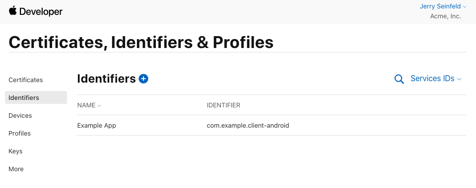
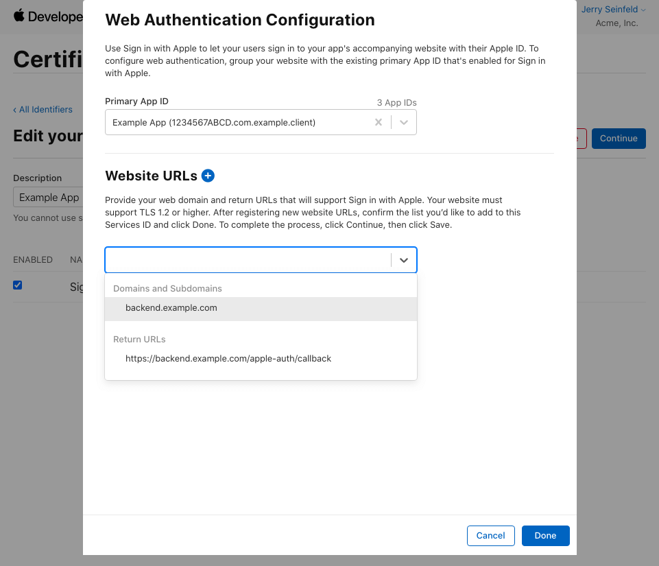

# Sign in with Apple for Android

## Services setup

To support Sign In with Apple on Android, we make use of Apple's [web setup](https://help.apple.com/developer-account/#/dev1c0e25352), but you'll need iOS configured as well.

Note: The name of your Service ID is what Apple will show to Android users when logging in. e.g. "Use your Apple ID to sign in to Example App".

When you're done with the web setup, you should have a Service ID that:
1. Is mapped to your domain
   - Must be the same domain that is in the return URL
2. Is using the App ID of your iOS app as it's primary
3. Includes the *exact* return URL you will provide to `appleAuthAndroid.configure`.
   - This library will intercept the redirect to this URL, so it's never actually invoked. It can be a blank endpoint on your backend, but the domain must match the one entered above.

## Example

