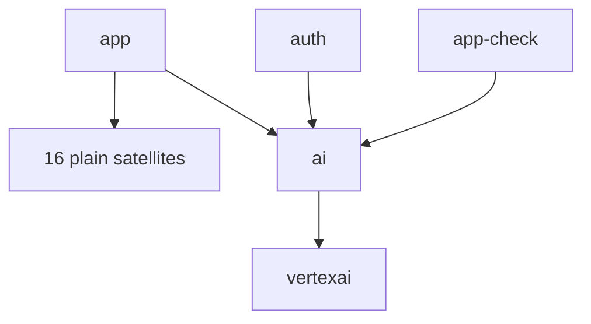

# Prepare, cache, and watch design

Durable design for RNFB monorepo build tooling. Decisions (the "what + why") are owned by [architecture-decisions.md](architecture-decisions.md); this doc holds the design detail those decisions imply. Rollout order and acceptance criteria are ephemeral — see the [rollout work queue](work-queue.md).

**Policy:** [OKF documentation and commit policy](../documentation-policy.md). **Canonical prepare command and agent rules:** [agent command policy](../testing/agent-command-policy.md) — this doc does not redefine the entrypoint.

## Package dependency graph

**Canonical owner of the package build graph and its counts.** Other docs (ADR, work queue) reference this section rather than restating package numbers ([documentation policy](../documentation-policy.md): single owner per fact). Two graphs exist; the build must respect the compile-time one.

### Package inventory (the counts other docs reference)

- **19 packages** total under `packages/*`.
- **`app`** — the hub; depends on nothing internal.
- **17 packages need an explicit `@react-native-firebase/app` `devDependency`** — every package **except `app` and `vertexai`** (the 16 plain satellites **plus `ai`**).
- **`vertexai`** needs **no** explicit `app` edge: it already declares `@react-native-firebase/ai` in `dependencies`, so it orders after `ai` (which orders after `app`) transitively.
- **18 packages peer-depend on `app`** (all except `app`). Peer edges are the runtime contract and are **ignored** by the task runner — they are not the same set as the build-ordering devDeps above.

### Compile-time graph (what `bob`/`tsc` actually need)

| Consumer                                                  | Needs built first                                     | Evidence                                                                                                                                                          |
| --------------------------------------------------------- | ----------------------------------------------------- | ----------------------------------------------------------------------------------------------------------------------------------------------------------------- |
| 16 plain satellites + `ai` (all except `app`, `vertexai`) | `@react-native-firebase/app` → `packages/app/dist/**` | package `tsconfig.json` `paths` map `@react-native-firebase/app` → `../app/dist/typescript/lib`; `lib/**` imports of `@react-native-firebase/app/dist/module/...` |
| `ai`                                                      | `app` + `auth` + `app-check`                          | `packages/ai/tsconfig.json` paths; `lib/service.ts` imports `app` + `auth`                                                                                        |
| `vertexai`                                                | `ai` (→ `app` transitively)                           | `dependencies["@react-native-firebase/ai"]`; re-exports it                                                                                                        |
| `in-app-messaging`, `remote-config`                       | peer `analytics` only — **no** `lib/**` import        | runtime/peer constraint, not a build edge                                                                                                                         |

Shape: a **star hub** (`app`) with one chain `(auth, app-check) → ai → vertexai`.

### Runner graph (what Lerna/Nx sort on)

Lerna/Nx topologically sort on **`dependencies` + `devDependencies`**. `peerDependencies` are **ignored**. Before this work only `ai` (devDeps `auth`, `app-check`) and `vertexai` (dep `ai`) had visible edges, so `app` and its dependents sat in one parallel wave — a clean-tree race (see [MonoTool-AD-3](architecture-decisions.md#monotool-ad-3--build-order-via-devdependencies-not-manual-phase-scripts--accepted)).

### Fix: declare compile edges as devDependencies

Add `"@react-native-firebase/app": "<version>"` to `devDependencies` of the **17** packages above (16 plain satellites + `ai`). `vertexai` is intentionally excluded — its `ai` dependency already orders it. Resulting runner graph:



`devDependencies` are stripped from published tarballs (npm consumers unaffected); `peerDependencies` stay the runtime contract.

## Nx local cache

Add `nx.json`; keep the `yarn lerna:prepare` entrypoint name, with `NX_NO_CLOUD` forced on the inline command (delegates to Nx). No wrapper script ([MonoTool-AD-4](architecture-decisions.md#monotool-ad-4--one-inlined-prepare-command-no-wrapper-script--accepted)).

```json
{
  "neverConnectToCloud": true,
  "namedInputs": {
    "jsSource": [
      "{projectRoot}/lib/**/*",
      "{projectRoot}/plugin/**/*",
      "{projectRoot}/tsconfig.json",
      "{projectRoot}/plugin/tsconfig.json",
      "{projectRoot}/package.json",
      "{workspaceRoot}/tsconfig.packages.base.json",
      "{workspaceRoot}/yarn.lock"
    ]
  },
  "targetDefaults": {
    "prepare": {
      "dependsOn": ["^prepare"],
      "inputs": ["jsSource"],
      "cache": true,
      "outputs": [
        "{projectRoot}/dist/**",
        "{projectRoot}/plugin/build/**",
        "{projectRoot}/lib/version.ts"
      ]
    }
  }
}
```

- `dependsOn: ["^prepare"]` + the devDependency edges enforce hub-before-satellite ordering (Nx pulls in upstream `prepare` outputs and their hashes automatically).
- **`inputs: ["jsSource"]`** scopes the cache key to what `prepare` actually consumes (JS source + plugin sources + the package/base tsconfig + `package.json`, which carries the bob config, plus workspace `yarn.lock` so lockfile-only toolchain bumps bust the cache). Without this, Nx defaults inputs to the whole `{projectRoot}`, so unrelated edits to `__tests__/**`, `e2e/**`, `android/**`, `ios/**`, or docs would needlessly bust the `prepare` cache and — via `^prepare` — every dependent. See [MonoTool-AD-11](architecture-decisions.md#monotool-ad-11--scope-prepare-cache-inputs-with-a-jssource-namedinput--accepted). (`lib/version.ts` is gitignored, so Nx's file hasher excludes it from inputs even though it matches the `lib/**` glob — no self-invalidation.)
- **`outputs` must list every file `prepare` writes**, including the _generated, gitignored_ ones, or a cache **hit** restores `dist/**` but leaves those files missing on a clean tree. `genversion` writes `lib/version.ts` in every package (imported by 18 packages' `lib` source), so it is a shared output. See [generated-file outputs](#generated-file-outputs-cache-correctness) and [MonoTool-AD-10](architecture-decisions.md#monotool-ad-10--generated-version-files-are-declared-cache-outputs-not-committed--accepted).
- **No-cloud everywhere:** see [MonoTool-AD-1](architecture-decisions.md#monotool-ad-1--nx-local-cache-via-the-lerna-runner-no-turborepo-no-nx-cloud--accepted) + [MonoTool-AD-8](architecture-decisions.md#monotool-ad-8--nxcache-shared-on-ci-not-on-publish--accepted) — `NX_NO_CLOUD=true` on the local entrypoint and every CI job that runs Nx.
- **`patch-package` prepare is not cacheable** — see [below](#patch-package-prepare-must-not-be-nx-cached) and [MonoTool-AD-12](architecture-decisions.md#monotool-ad-12--never-nx-cache-prepare-when-the-script-is-patch-package--accepted).

<a id="patch-package-prepare-must-not-be-nx-cached"></a>

### `patch-package` prepare must not be Nx-cached

Most packages' `prepare` is bob transpile (`lib/**` → `dist/**`) and is correctly cached under [MonoTool-AD-11](architecture-decisions.md#monotool-ad-11--scope-prepare-cache-inputs-with-a-jssource-namedinput--accepted). The **tests** workspace is different: its `prepare` script is **`patch-package`**, which mutates `tests/node_modules/**` (including React Native's `fmt.podspec` via `tests/patches/react-native+0.78.3.patch`).

That target must set **`"cache": false`** on the project-level Nx `prepare` override. Reasons:

1. **Inputs ≠ side effects.** For tests, the `jsSource` prepare hash **is** stable across yarn re-links (no `lib/**` to change), so re-link does not invalidate prepare and a warm Nx cache always reports a hit — that was the bug.
2. **Yarn re-link resets the mutation.** Root `yarn` re-links packages to unpatched content, then `lerna:prepare` runs. If Nx skips `tests:prepare`, patches are never re-applied.
3. **Adding `patches/**` to inputs is not enough.** After a re-link the patch files are unchanged → still a cache hit → still skipped.

Root `prepare` is also `patch-package`, but it runs via Yarn (`postinstallDev` → `yarn prepare`) outside Nx, so only `tests` needs the override. Agent verification of fmt after install remains mandatory: [install / patch / fmt gate](../testing/agent-command-policy.md#install-patch-fmt-gate-blocking).

### Generated-file outputs (cache correctness)

`prepare` emits gitignored generated files that downstream tools need; all must be declared `outputs` so a cache replay reproduces a complete tree:

| Generated file                                                                                        | Produced by                                  | Consumed by                                                                                   | Declared where                          |
| ----------------------------------------------------------------------------------------------------- | -------------------------------------------- | --------------------------------------------------------------------------------------------- | --------------------------------------- |
| `{projectRoot}/lib/version.ts` (all 19 pkgs)                                                          | `build` → `genversion`                       | `lib` source in 18 pkgs (`import { version } from './version'`); Jest/eslint compile `lib/**` | shared `targetDefaults.prepare.outputs` |
| `packages/app/ios/RNFBApp/RNFBVersion.m`                                                              | `app` `build:version` → `genversion-ios`     | iOS native build                                                                              | `app` per-project override (below)      |
| `packages/app/android/src/reactnative/java/io/invertase/firebase/app/ReactNativeFirebaseVersion.java` | `app` `build:version` → `genversion-android` | Android native build                                                                          | `app` per-project override (below)      |

Only `app` produces the native version files, so they go in an `app`-scoped target override (project-level `outputs` **replace** `targetDefaults` outputs, so all four entries are re-listed) rather than in the shared defaults, keeping satellites free of app-only globs:

```jsonc
// packages/app/package.json
"nx": {
  "targets": {
    "prepare": {
      "outputs": [
        "{projectRoot}/dist/**",
        "{projectRoot}/plugin/build/**",
        "{projectRoot}/lib/version.ts",
        "{projectRoot}/ios/RNFBApp/RNFBVersion.m",
        "{projectRoot}/android/src/reactnative/java/io/invertase/firebase/app/ReactNativeFirebaseVersion.java"
      ]
    }
  }
}
```

**Why outputs, not commit:** committing these files creates constant per-release churn (they change on every version bump) and re-introduces the "generated file in git" smell the `# do not modify or commit` banners already warn against. Declaring them as cache outputs keeps them generated-on-miss / restored-on-hit with no tracked-file churn. **Correctness:** all three are gitignored → excluded from Nx input hashing (no self-invalidation); they are restored into `lib/` and `ios/`/`android/` (safe — regenerated artifacts); `genversion-ios`/`-android` read `lib/version.ts`, which is emitted earlier in the same `prepare` and restored alongside them on a hit, so the set stays internally consistent.

### `ai` special case

`ai:prepare` must be deterministic to cache. The mock download moves out of `prepare` into a Jest prerequisite ([MonoTool-AD-7](architecture-decisions.md#monotool-ad-7--ai-test-fixtures-are-a-jest-prerequisite-not-a-build-step--accepted)):

```diff
# packages/ai/package.json
- "prepare": "yarn tests:ai:mocks && yarn run build && yarn compile"
+ "prepare": "yarn run build && yarn compile"
```

Fixtures (`vertexai-sdk-test-data*`, gitignored) download only when AI Jest tests run.

**Jest wiring:** the root [`jest.config.js`](../../../jest.config.js) is a **single flat config** (one `testMatch`, no `projects`, no `globalSetup`). A bare `globalSetup` would therefore fetch AI mocks for **every** `yarn tests:jest` run (network on all suites) — re-introducing exactly the non-determinism AD-7 removes from `prepare`. Two acceptable shapes; **gate the fetch on AI-test detection** is the lighter option:

- **Gate on AI-test detection (preferred):** a `globalSetup` that no-ops unless the current run includes `packages/ai/__tests__/**` (e.g. inspect the resolved test paths / `testPathPattern`), so non-AI runs pay nothing. No jest-config restructure.
- **`projects` split:** convert `jest.config.js` to a `projects` array with a dedicated `ai` project carrying its own `globalSetup`. Cleaner isolation, larger change.

**Fetch must be fast-exit/idempotent:** `scripts/fetch_ai_mock_responses.ts` already skips the clone when the target dir exists, but it still runs a network `git ls-remote --tags` on **every** call to compute the latest tag. Add a local-clone fast path — if a `vertexai-sdk-test-data_*` clone is already present, return **without** the `ls-remote` — so repeat AI runs are fully offline; only refresh (or an explicit opt-in) hits the network.

### Where local cache helps

| Workflow                           | Effect                                                      |
| ---------------------------------- | ----------------------------------------------------------- |
| `yarn` with no package changes     | Large — postinstallDev prepare replays cache                |
| `yarn lerna:prepare` with no edits | Large — all packages cache-hit                              |
| Edit one `lib/**` file             | Moderate — rebuild that package (+ dependents); rest replay |
| Branch switch, same input hashes   | Moderate — cache hits across branches                       |
| Fresh clone / cleaned `dist`       | None on first run; fast on the second                       |

Cache lives in `.nx/cache` (gitignored); clear with `nx reset`. CI may share it via `actions/cache`; publish does not ([MonoTool-AD-8](architecture-decisions.md#monotool-ad-8--nxcache-shared-on-ci-not-on-publish--accepted)).

## Declaration maps

Enable in the shared base and the two standalone configs only ([MonoTool-AD-5](architecture-decisions.md#monotool-ad-5--keep-react-native-builder-bob-emit-declaration-maps--accepted)):

```json
// tsconfig.packages.base.json  (inherited by 17 packages)
// packages/ai/tsconfig.json    (standalone)
// packages/vertexai/tsconfig.json (standalone)
"declaration": true,
"declarationMap": true
```

bob's `typescript` (tsc) target emits `.d.ts` + `.d.ts.map` beside `dist/typescript/**`; IDE go-to-definition lands on `lib/**` source. Because each package's `files` already publishes `lib` (source) alongside `dist`, the emitted map resolves for **external** consumers too — verify by opening a published `.d.ts.map` and confirming its `sources` point at the shipped `lib/*.ts` with no absolute paths leaking (see [work-queue MT2 acceptance](work-queue.md#mt2--declaration-maps)).

## Dependency-cycle linting

`dependency-cruiser` as `yarn lint:deps` ([MonoTool-AD-6](architecture-decisions.md#monotool-ad-6--dependency-cycle-linting-via-dependency-cruiser-as-lintdeps--accepted)). Validates `packages/*/lib/**`:

- `no-circular` — no import cycles
- `not-to-own-dist` — **scoped** rule: `lib/**` must not import its **own** package's built output via a _relative_ `../dist/**` / `./dist/**` path. It must **not** forbid the intentional hub API `@react-native-firebase/app/dist/module/...`, which ~15 satellites import by design (mapped to type stubs via each package's tsconfig `paths`). A blanket `no lib → **/dist/**` rule would fail on the **current** tree — see [MonoTool-AD-6](architecture-decisions.md#monotool-ad-6--dependency-cycle-linting-via-dependency-cruiser-as-lintdeps--accepted).
- graph allowlist — satellites import only `@react-native-firebase/app` (its published subpaths); `ai` → `auth`/`app-check`; `vertexai` → `ai`

**Config scoping** (`.dependency-cruiser.cjs`) — required for correct, fast, false-positive-free runs:

- `doNotFollow` / `exclude` for `node_modules`, `packages/*/dist/**`, `packages/*/__tests__/**`, `packages/*/e2e/**` so the built output and tests are not analysed as source.
- `options.tsConfig` + `enhancedResolveOptions` so the `@react-native-firebase/*` path aliases resolve; otherwise cross-package edges are silently unresolved and the MT4 allowlist has nothing to enforce. Verify one real cross-package edge is actually detected (not skipped as unresolvable).

**Agent/CI wiring** (commands and gates): [validation checklist § lint](../testing/validation-checklist.md#lint-and-formatting), [change authoring § validation evidence](../testing/change-authoring-workflow.md#validation-evidence-blocking). Optional non-CI `lint:deps-report` (HTML) for debugging.

## Developer watch and the e2e TDD hook chain — **deferred (gap-analysis pre-phase)**

> **Deferred.** No incremental dev-watch / hot-reload loop exists today. The whole watch + event-driven-rerun design is deferred to a **gap-analysis pre-phase** ([work-queue MT-WATCH](work-queue.md#mt-watch--dev-watch--e2e-rerun-gap-analysis-pre-phase--deferred)) that produces detailed, verified analysis before any implementation. The prepare/cache/graph/declaration-map/lint work below and above does **not** depend on it. The command sketches here are **inputs to that analysis, not accepted commands** — they carry known defects called out inline.

**Bundling premise:** per [running e2e § Rules #3](../testing/running-e2e.md#rules) (canonical owner). The inner loop is therefore `lib` edit → `dist` rebuild → Metro re-bundle → test rerun ([MonoTool-AD-9](architecture-decisions.md#monotool-ad-9--dev-watch-rebuilds-prepare-e2e-tdd-rerun-is-event-driven-off-metro--deferred)).

### Tier A — prepare watch + unit TDD (sketch, to be validated)

```
# first pass, then watch (do NOT rely on `--all --initialRun`, see caveats)
nx run-many -t prepare
nx watch --all -- nx run-many -t prepare -p $NX_PROJECT_NAME
```

- Watches `packages/*/lib/**`; incremental bob rebuild into `dist/`.
- **Command caveats to resolve in the pre-phase:**
  - `--all --initialRun` was a **no-op bug** fixed only Aug-2025 (nx PR #32282); pin/verify the bundled nx version (updating Lerna to current pulls a current nx — see [work-queue prerequisite](work-queue.md#mt00--update-lerna-to-current-prerequisite)). Do the first pass explicitly with `nx run-many -t prepare` instead of trusting `--initialRun`.
  - `$NX_PROJECT_NAME` is **comma-joined** when several projects change in one watch batch, so `nx run <a,b>:prepare` is invalid — use `nx run-many -t prepare -p $NX_PROJECT_NAME`.
- Unit TDD: `yarn tests:jest --watch -- packages/<pkg>/__tests__/<file>.test.ts` (same-package imports resolve to `../lib`; cross-package needs upstream `dist`).

### Tier C — event-driven e2e rerun (spike)

The post-nx-rebuild point is **upstream** of Metro finishing its bundle, so do not chain a `sleep`. Trigger the rerun on a Metro **bundle-ready event**:

| Signal                              | Source                                               | Nature                                    |
| ----------------------------------- | ---------------------------------------------------- | ----------------------------------------- |
| HMR `update-done` WebSocket message | Metro HMR protocol (`update-start` → `update-done`)  | Client-observable "update applied in app" |
| `onBundleBuilt` callback            | Metro `createConnectMiddleware`                      | Server-side "bundle finished"             |
| App-side reload hook                | RNFB owns Jet; the in-app client can emit "reloaded" | In-process, precise                       |

Chain: `lib` edit → `nx watch` rebuilds `dist` → Metro re-bundles → **`update-done`** → host `POST`s a re-run action to the Jet control plane (HTTP on `JET_REMOTE_PORT + 1`, default **8091**; see [running e2e § test-runner orchestration](../testing/running-e2e.md#test-runner-host-orchestration-log-triage-only)) → Jet re-executes the loaded (narrowed) mocha suite in-app.

RNFB owns Jet, so a `POST /rerun` control action is feasible alongside the existing `/launch-ready` / `/orchestrate-state` endpoints. Native/codegen/spec changes still require `:build`; fast-rerun may need to bypass the coverage-teardown handshake. The **same** Metro bundle-ready signal is the correct driver for a future Appium-based e2e rerun — Appium drives UI, not bundling, so Metro remains the shared "bundle ready" source regardless of runner.

## Benchmark methodology

A macOS shell script (`scripts/benchmark-prepare.sh`) records median-of-3 timings to keep cache/graph claims honest. Scenarios:

| #   | Name                | Setup                                                                          | Command              |
| --- | ------------------- | ------------------------------------------------------------------------------ | -------------------- |
| A   | Cold install        | `rm -rf node_modules .nx/cache packages/*/dist packages/*/plugin/build`        | `yarn`               |
| B   | Full rebuild        | after A; keep `node_modules`; `rm -rf packages/*/dist packages/*/plugin/build` | `yarn lerna:prepare` |
| C   | No-op rebuild       | after B; no edits                                                              | `yarn lerna:prepare` |
| D   | Single-package edit | after B; touch one `packages/firestore/lib/*` file                             | `yarn lerna:prepare` |

Record pre-Nx baselines (B/C/D before `nx.json`) and post-Nx numbers; C and D are where the local cache shows. A macOS-only script is representative for CI too: **most RNFB CI runs on macOS runners**, so a local macOS median is a valid proof of the CI gain (no separate Linux capture needed). Results live in the ephemeral [rollout work queue](work-queue.md) / a benchmarks note, not in this durable doc.

## Related docs

| Topic                             | Document                                                                                             |
| --------------------------------- | ---------------------------------------------------------------------------------------------------- |
| Decisions + rejected alternatives | [architecture-decisions.md](architecture-decisions.md)                                               |
| Rollout phases, gates, acceptance | [work-queue.md](work-queue.md)                                                                       |
| Canonical prepare/e2e commands    | [agent command policy](../testing/agent-command-policy.md), [running e2e](../testing/running-e2e.md) |
