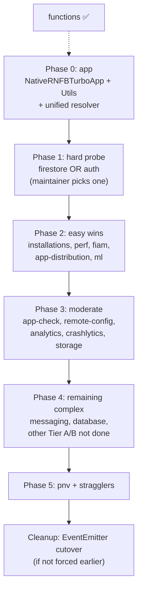

# TurboModule migration — work queue

> **QUEUED (2026-06-25):** Planning document — awaiting maintainer review before implementation pickup.
> **Reference:** [`packages/functions`](../../../packages/functions/) ([PR #8603](https://github.com/invertase/react-native-firebase/pull/8603)).
> **Validation:** defer per-package checklists here; use [iteration vocabulary](../testing/iteration-vocabulary.md), [validation checklist](../testing/validation-checklist.md), and [running e2e](../testing/running-e2e.md) at implementation time.

Ephemeral tracker; see [OKF policy](../documentation-policy.md).

---

## Locked decisions

| # | Decision | Detail |
|---|----------|--------|
| 1 | **New Architecture only** | One coordinated semver break across the monorepo. No dual old/new bridge support per package (functions precedent: v24). |
| 2 | **Naming** | Codegen module names use `NativeRNFBTurbo*` prefix (e.g. `NativeRNFBTurboAuth`, `NativeRNFBTurboFirestore`). |
| 3 | **Typing** | Strong Codegen types wherever the API allows. Source of truth: existing `packages/*/lib/types/internal.ts`, native method inventories, and firebase-js-sdk shapes — not re-derived from ObjC/Java by hand. Use `Object` / open maps only where payloads are genuinely dynamic. |
| 4 | **Events** | **Defer** the larger Codegen EventEmitter cutover to a documented **cleanup phase** (see [Deferred cleanup](#deferred-cleanup-phase-eventemitter)). Keep fan-out via `RNFBAppModule` event proxy + `nativeEvents` arrays unless testing proves we cannot defer. |
| 5 | **Generated code** | Commit codegen output (`includesGeneratedCode: true`); mirror `packages/functions` android/ios `generated/` layout and podspec exclusions. |
| 6 | **Module resolution** | Add a unified resolver in `packages/app` — prefer `TurboModuleRegistry.get(name)` with fallback to `NativeModules[name]` during transition; turbo-only packages drop fallback once migrated. |

---

## What changes vs what stays

| Layer | Stays | Changes |
|-------|-------|---------|
| JS product API | `namespaced.ts`, `modular.ts`, web shims, `FirebaseModule` subclasses, arg prepending (`appName`, `databaseId`, …) | `nativeModuleName` → `NativeRNFBTurbo*`; `turboModule: true` in namespace config |
| Events (this phase) | Compile-time event names, `SharedEventEmitter` fan-out, `nativeEvents` registration | Native emitters unchanged; **no** Codegen event migration yet |
| Native | Firebase SDK integration, business logic | Extend generated `*Spec`; iOS `getTurboModule()`; Android `NativeRNFBTurbo*` classes; podspec new-arch guard |
| Release | Per-package semver today | **One coordinated major** requiring New Architecture for all native packages |

---

## Reference pattern (`functions`)

Each migrated package repeats this shape (see [`packages/functions`](../../../packages/functions/)):

1. **`specs/NativeRNFBTurbo*.ts`** — one spec file per legacy native module; extends `TurboModule`.
2. **`package.json` `codegenConfig`** — `includesGeneratedCode: true`, `jsSrcsDir: "specs"`, android `javaPackageName`, ios `modulesProvider`.
3. **`yarn codegen`** scripts — commit output under `android/.../generated` and `ios/generated`.
4. **Android** — `NativeRNFBTurbo*` extends generated `*Spec`; register in package class.
5. **iOS** — `.mm` implementation of spec protocol; `- (std::shared_ptr<TurboModule>)getTurboModule:` returning generated JSI class.
6. **JS** — update `nativeModuleName`, set `turboModule: true`.
7. **Podspec** — `install_modules_dependencies`, exclude duplicate RN provider files, old-arch guard (see [`RNFBFunctions.podspec`](../../../packages/functions/RNFBFunctions.podspec)).

Shared infrastructure already landed for functions:

* `turboModule` flag + iOS null sentinel encoding in [`packages/app/lib/internal/registry/nativeModule.ts`](../../../packages/app/lib/internal/registry/nativeModule.ts)
* [`packages/app/lib/internal/nullSerialization.ts`](../../../packages/app/lib/internal/nullSerialization.ts) + native interceptor

**Still required (cross-cutting, before or with Phase 0):**

* Unified module resolver in `packages/app/lib/internal/nativeModuleAndroidIos.ts` (decision 6)
* `getAppModule()` — flip `turboModule` TODO currently hard-coded `false`

---

## Deferred cleanup phase (EventEmitter)

Documented follow-on **after** all product TurboModules land. Not in scope for the coordinated break unless testing blocks deferral.

| Topic | Current | Cleanup target |
|-------|---------|----------------|
| Event subscription | `RNFBNativeEventEmitter` constructed from legacy `RNFBAppModule`; `eventsAddListener` / `eventsRemoveListener` proxy | Codegen TurboModule events or RN New Architecture event emitters |
| Native emit | `RNFBRCTEventEmitter` / `ReactNativeFirebaseEventEmitter` | Align with chosen Codegen event pattern |
| JS fan-out | Fixed `nativeEvents` strings + `SharedEventEmitter` prefixes | Re-evaluate once native side supports typed events |

**Deferral discriminator:** if e2e or device testing shows TurboModule method migration **cannot** work with the legacy event proxy (e.g. lifecycle, timing, New Architecture-only crashes), escalate that package's event path into the main migration PR rather than waiting for cleanup.

---

## Package inventory

### No native bridge (out of scope)

| Package | Notes |
|---------|-------|
| `@react-native-firebase/ai` | Pure JS (HTTP/WebSocket) |
| `@react-native-firebase/vertexai` | Re-export over `ai` |

### Already migrated

| Package | TurboModule(s) | Status |
|---------|----------------|--------|
| `@react-native-firebase/functions` | `NativeRNFBTurboFunctions` | ✅ reference |

### Native packages — complexity summary

Android `@ReactMethod` counts approximate spec surface area.

#### Multi-module (Tier A — hardest)

| Package | Legacy modules | Events | Methods ≈ | Notes |
|---------|----------------|--------|-----------|-------|
| **database** | `RNFBDatabaseModule`, `RNFBDatabaseReferenceModule`, `RNFBDatabaseQueryModule`, `RNFBDatabaseOnDisconnectModule`, `RNFBDatabaseTransactionModule` | 2 | ~22 | Transaction + sync listeners; keep **5 specs** (mirror current split) |
| **firestore** | `RNFBFirestoreModule`, `RNFBFirestoreCollectionModule`, `RNFBFirestoreDocumentModule`, `RNFBFirestoreTransactionModule` | 4 | ~31 | Pipelines via `pipelineExecute` on main module; listener IDs + sync events |

#### Single-module, high complexity (Tier B)

| Package | Legacy module | Events | Methods ≈ | Notes |
|---------|---------------|--------|-----------|-------|
| **auth** | `RNFBAuthModule` | 3 | **59** | Largest single spec; OAuth, phone, MFA |
| **messaging** | `RNFBMessagingModule` | 5–7 | 11 | Platform-conditional event lists; background iOS |

#### Single-module, moderate (Tier C)

| Package | Legacy module | Events | Methods ≈ |
|---------|---------------|--------|-----------|
| **storage** | `RNFBStorageModule` | 1 | 14 |
| **crashlytics** | `RNFBCrashlyticsModule` | 0 | 14 |
| **analytics** | `RNFBAnalyticsModule` | 0 | 11 |
| **remote-config** | `RNFBConfigModule` | 1 | 11 |
| **app-check** | `RNFBAppCheckModule` | 1 | 7 |
| **perf** | `RNFBPerfModule` | 0 | 7 |

#### Single-module, simple (Tier D)

| Package | Legacy module | Events | Methods ≈ | Notes |
|---------|---------------|--------|-----------|-------|
| **installations** | `RNFBInstallationsModule` | 0 | 3 | Smallest |
| **in-app-messaging** | `RNFBFiamModule` | 0 | 3 | |
| **app-distribution** | `RNFBAppDistributionModule` | 0 | 4 | |
| **ml** | `RNFBMLModule` | 0 | ~0 | Stub surface |
| **phone-number-verification** | `RNFBPnvModule` | 0 | 6 | Android-only; bypasses `createModuleNamespace` — direct resolver in `modular.ts` |

#### Foundation (Phase 0)

| Package | Legacy modules | Notes |
|---------|----------------|-------|
| **app** | `RNFBAppModule`, `RNFBUtilsModule` (+ Android utils) | Event proxy infrastructure; **blocker** for declaring migration complete |

---

## Phase ordering

Strategy: **foundation → hard thing first → easy wins → remaining complex → cleanup**.

Rationale for early hard package: validate multi-module specs, listener patterns, null serialization, and Codegen limits before batching Tier D. Pick **one** of firestore or auth immediately after app (maintainer choice at pickup — firestore exercises multi-module + pipelines; auth exercises maximal single-module spec).

### Phase table

| Phase | Focus | Status | Packages |
|-------|--------|--------|----------|
| **0** | App foundation + unified resolver | queued | `app` |
| **1** | Hard probe (multi-module **or** max single-module) | queued | `firestore` **or** `auth` — pick one |
| **2** | Easy wins | queued | `installations`, `perf`, `in-app-messaging`, `app-distribution`, `ml` |
| **3** | Moderate | queued | `app-check`, `remote-config`, `analytics`, `crashlytics`, `storage` |
| **4** | Remaining complex | queued | whichever of `firestore`/`auth` not taken in Phase 1, plus `messaging`, `database` |
| **5** | Android-only / misc | queued | `phone-number-verification` |
| **C** | EventEmitter cleanup | deferred | all — see [Deferred cleanup](#deferred-cleanup-phase-eventemitter) |

**Coordinated break:** ship consumer-facing major only when Phase 0–5 complete (functions already new-arch-only). Document migration guide update alongside final phase.

---

## Per-package implementation checklist

Repeat for each package (validation gates: [testing bundle](../testing/index.md) — not duplicated here).

| Step | Work |
|------|------|
| 1 | Inventory native methods from Java/ObjC; map to typed spec using `lib/types/internal.ts` |
| 2 | Add `specs/NativeRNFBTurbo*.ts` (one per legacy module) |
| 3 | Add `codegenConfig` + scripts; run codegen; **commit** generated artifacts |
| 4 | Android: `NativeRNFBTurbo*` extends `*Spec`; update package registration |
| 5 | iOS: implement spec + `getTurboModule()`; update podspec guard + exclusions |
| 6 | JS: `nativeModuleName`, `turboModule: true`; web shims unchanged |
| 7 | Remove legacy module classes once parity confirmed |
| 8 | If event deferral fails testing → inline event path changes; document in queue row |

### Multi-module convention

Keep one TurboModule spec per legacy module (database ×5, firestore ×4). Do **not** consolidate in the first pass — reduces risk and matches existing JS `nativeModuleName` arrays.

---

## iOS hazards (carry forward from functions)

* **Null in object properties** — encode via `encodeNullValues` + native sentinel restore ([RN issue #52802](https://github.com/facebook/react-native/issues/52802)). Highest risk: `auth`, `firestore`, `database`, `storage`.
* **Swift / ObjC interop** — follow functions podspec patterns for `use_frameworks!` and non-framework builds.

---

## Related links

* [New Architecture index](index.md)
* [Documentation policy](../documentation-policy.md)
* [Testing index](../testing/index.md)
* [Architecture skill](../../../.agents/skills/architecture-rnfb-gitctx/SKILL.md) — runtime registration and bridging flow
