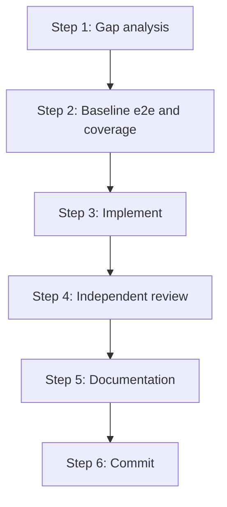

# Pipeline implementation workflow

Single source for one `.github/scripts/compare-types/configs/firestore-pipelines.ts` missing export. Other docs/prompts link here.

One iteration = one compare-types backlog entry + one focused commit.

**Policy:** [OKF documentation and commit policy](../../documentation-policy.md).

## Architecture and semantics (read first)

| Topic | Document |
|-------|----------|
| Bridge design, subqueries, coercion, native coverage strategy | [Pipelines implementation design](pipelines.md) |
| Coverage and parity phase tracker | [Pipeline coverage work queue](pipeline-coverage-work-queue.md) |
| E2e commands, fast iteration hacks, handoff rules | [Running e2e tests](../../testing/running-e2e.md) |
| Coverage policy, per-file reading, refactor-vs-test | [Coverage design](../../testing/coverage-design.md) |
| All validation commands | [Validation checklist](../../testing/validation-checklist.md) |
| Serialization tests per export | [Serialization testing](serialization-testing.md) |
| Compare-types machinery | `.github/scripts/compare-types/README.md` |

## Hard gates (blocking)

Commit/handoff only when **all** pass:

| Gate | Requirement |
|------|-------------|
| Gap analysis | Selected export confirmed against firebase-js-sdk; platform support verified; semantic dependencies identified |
| Baseline e2e | Full `Pipeline.e2e.js` on macOS/iOS/Android, **area** tier; no `.only` |
| Baseline coverage | `snapshot-pipeline-coverage.sh before-<export>` stdout recorded |
| Implementation | Public API, lowering, Jest, serialization matrix, consumer type-test, **focused** e2e ([focused tier](../../testing/running-e2e.md#e2e-tiers-implementer--reviewer--pre-merge)) |
| Review e2e | Full `Pipeline.e2e.js` on all platforms, **area** tier; no `.only` |
| Review coverage | `after-<export>` snapshot; [coverage policy](../../testing/coverage-design.md#coverage-as-completion-signal) |
| Validation | Full [Validation checklist](../../testing/validation-checklist.md) + OKF review § |
| Documentation | User docs + OKF bundle updates (decisions/learnings consolidated) |
| Commit | One focused commit; area narrowing and `.only` never staged |
| Pre-merge | **Full** unfocused 3-platform e2e; revert all narrowing ([pre-merge tier](../../testing/running-e2e.md#e2e-tiers-implementer--reviewer--pre-merge)) |

**Coverage acceptance:** [Coverage design § completion signal](../../testing/coverage-design.md#coverage-as-completion-signal) and [expectations (policy)](../../testing/coverage-design.md#coverage-expectations-policy).

### Coverage snapshots (pipeline)

After full 3-platform e2e:

```bash
bash scripts/snapshot-pipeline-coverage.sh before-<export-name>
bash scripts/snapshot-pipeline-coverage.sh after-<export-name>
```

Paste stdout in the iteration report.

## Implementation model

Run gap analysis + baseline first. Keep implementation/review in **separate contexts**.



| Step | Actor | OKF docs to load |
|-------|-------|------------------|
| 1 | Coordinator | Gap analysis; `firestore-pipelines.ts`; compare-types README |
| 2 | Coordinator | Baseline e2e + `before-<export>` — area narrowing OK, no `.only` |
| 3 | Implementer | [pipelines.md](pipelines.md); [serialization-testing.md](serialization-testing.md); [narrowing § below](#narrowing-during-pipeline-iterations) |
| 4 | Independent reviewer | [validation-checklist.md](../../testing/validation-checklist.md); [narrowing § below](#narrowing-during-pipeline-iterations) |
| 5 | Coordinator or implementer | `docs/firestore/pipelines/` conventions below |
| 6 | Coordinator | Commit scope below |

### Implementation context

- Selected export name and firebase-js-sdk reference paths (`node_modules/@firebase/firestore/pipelines/pipelines.d.ts`, `dist/pipelines.esm.js`)
- Follow [pipelines.md](pipelines.md) patterns only; no one-export abstraction
- **Fast iteration:** **focused** e2e tier — per [narrowing § below](#narrowing-during-pipeline-iterations) and [running-e2e](../../testing/running-e2e.md#e2e-tiers-implementer--reviewer--pre-merge)
- **Serialization blocking:** [serialization-testing.md](serialization-testing.md) all four checks
- Deliverable: diff, unit/e2e tests, consumer type-test updates; **do not commit**

### Review context

Fresh reviewer gets frozen diff:

- **Revert** `it.only` / `describe.only`; run **area**-tier e2e — area narrowing may remain per [narrowing § below](#narrowing-during-pipeline-iterations)
- Run the full [Validation checklist](../../testing/validation-checklist.md) (no `:test-cover-reuse`)
- Run full `Pipeline.e2e.js` e2e + coverage on macOS, iOS, Android; record `after-<export>` snapshot
- Compare coverage to baseline; coverage on touched files must rise until intractable limits or plateau → refactor
- Deliverable: pass/fail, commands, coverage delta; **do not commit**

If review fails, return to implementation fixes, then re-run independent review.

### iOS guard probe iterations

iOS guard probes/bridge fixes use the same split; stricter serial gate: [work queue runtime guard protocol](pipeline-coverage-work-queue.md#phase-j-iteration-protocol-strict) + [running-e2e serial policy](../../testing/running-e2e.md#serialized-e2e-dispatch).

Guard probes: one function per commit; no batching. Commands: [running-e2e.md](../../testing/running-e2e.md).

**Live gate status:** [pipeline-coverage-work-queue](pipeline-coverage-work-queue.md) (ephemeral tracker — see [documentation policy](../../documentation-policy.md)).

### Narrowing during pipeline iterations

Generic definitions: [test narrowing](../../testing/running-e2e.md#fast-iteration-test-narrowing), [e2e tiers](../../testing/running-e2e.md#e2e-tiers-implementer--reviewer--pre-merge). Pipeline rules:

| Kind | Implement (**focused**) | Review (**area**) | Pre-merge (**full**) | Commit |
|------|-----------------------------------|-------------------------------|--------------------------------|--------|
| **Area narrowing** (`tests/app.js`, `tests/globals.js`) | Allowed (tight scope OK) | Allowed — full `Pipeline.e2e.js`, no `.only` | Revert — all modules | Never |
| **Single-test** (`it.only`) | Allowed | Revert | Revert | Never |
| **Single-suite** (`describe.only`) | Allowed | Revert | Revert | Never |

Area setup: firestore-only `platformSupportedModules` + `require('../packages/firestore/e2e/Pipeline.e2e.js')`; `RNFBDebug = true`.

## Step 1 — Compare-types gap analysis

### Work queue: `missingInRN`

Primary queue: **`missingInRN`** in `.github/scripts/compare-types/configs/firestore-pipelines.ts`.

1. Read the config in **file order**.
2. Select first still-relevant `missingInRN` entry unless a semantic companion must ship first.
3. Confirm shape from installed SDK:
   - `node_modules/firebase/package.json` → `exports["./firestore/pipelines"]`
   - `node_modules/@firebase/firestore/pipelines/pipelines.d.ts`
   - `node_modules/@firebase/firestore/dist/pipelines.esm.js`
4. Check feasibility via [pipelines.md](pipelines.md). If any required platform blocked, **stop**.
5. Run `yarn compare:types` to confirm the entry is still undocumented drift (not stale).
6. Note ordering dependencies; do not skip ahead without user approval.

`compare-types` config is backlog, not permission. Remove `missingInRN` only when RNFB matches firebase-js-sdk shape.

### Shape differences: `differentShape`

`differentShape` is not the default queue. Each entry needs a strict, intractable RN technical reason (bridge, platform SDK, Hermes/Metro, etc.).

- If indefensible, align RNFB to firebase-js-sdk and remove the entry.
- Do not use `differentShape` for avoidable drift (formatting, naming, optional params).
- When implementing a `missingInRN` export, do not introduce new `differentShape` drift without the same intractability bar.

`extraInRN`: justify RN-specific surface or remove.

## Step 2 — Coverage baseline (before coding)

Skip only when continuing immediately after same-worktree `after-<export>` snapshot.

**Retroactive baseline:** If implementation was already committed without baseline numbers, check out the parent commit, apply harness only if needed for e2e load, run full baseline, snapshot `before-<export>`, return to HEAD.

1. Revert leftover `.only`; area narrowing allowed for pipeline baseline.
2. Start [running e2e prerequisites](../../testing/running-e2e.md): emulators, packager, rebuild native if needed.
3. Full pipeline e2e + coverage on **macOS, iOS, Android**; no reuse variants.
4. `bash scripts/snapshot-pipeline-coverage.sh before-<export-name>` — paste full stdout into the iteration report.

Start implementation only after green 3-platform baseline.

## Step 3 — Implement

1. Trace patterns in `packages/firestore/lib/pipelines/`, `internal.ts`, native parsers, web bridge.
2. Implement public API matching firebase-js-sdk **exactly** (including lowercase string unions — native may normalize internally).
3. Add Jest, consumer `type-test.ts`, serialization matrix, e2e cases.
4. Use focused narrowing during development; area narrowing may persist — [narrowing](#narrowing-during-pipeline-iterations).
5. Re-run focused e2e per fix with clean [pre-flight](../../testing/running-e2e.md#pre-flight-is-the-host-clear-to-start).

## Step 4 — Review

1. Remove `it.only` / `describe.only`.
2. Keep area narrowing if applied — [narrowing §](#narrowing-during-pipeline-iterations).
3. Full [Validation checklist](../../testing/validation-checklist.md).
4. Full `Pipeline.e2e.js` e2e + coverage on all platforms; `after-<export>` snapshot.
5. Compare before/after; touched-file coverage must rise until intractable limit. Plateau below limit → refactor.
6. Remove `firestore-pipelines.ts` entry when shape matches.

## Step 5 — Documentation

Per export, same commit:

**User docs**

- Page or section under `docs/firestore/pipelines/`
- Parity table row on pipelines overview
- `docs.json` sidebar entry for new pages
- `yarn lint:markdown` and `yarn lint:spellcheck`

**OKF bundle maintenance**

Durable learnings, same commit:

- Update `pipelines.md`, `serialization-testing.md`, or this workflow for changed bridge behavior/gotchas/rules.
- Cross-cutting testing/coverage learnings go in `okf-bundle/testing/`.
- Move ad-hoc notes into OKF; fix conflicting linked docs.
- Record non-obvious choices in OKF, not only commit messages.

Skills/docs link to OKF; do not restate.

## Step 6 — Commit

Message:

```text
feat(firestore): expose pipeline <export-name>
```

**Never stage:** area narrowing in `tests/app.js` / `tests/globals.js`, any `.only`, skill snapshot logs.

Verify before commit:

```bash
git status
git diff --stat
rg '\.only\(' packages/firestore/e2e/
```

## Gotchas

- **macOS is first-class** — web SDK interop; parity bugs often appear there first.
- **Serialization ≠ types** — `compare:types` and `type-test.ts` do not validate `.serialize()` output.
- **Never add zero-argument helpers** to `EXPRESSION_METHOD_NAMES` (invalid fluent chains).
- **Two native expression builders per platform** — edit the live path; use coverage to disambiguate ([pipelines.md § Cross-platform e2e](pipelines.md#two-expression-builders-per-platform--edit-the-live-one)).
- iOS profraw pull can flake — retry once before treating as environment failure.

## Iteration report template

```markdown
# Pipeline iteration: <export>

## Gap analysis
- why this item was next
- companion exports (if any)

## Baseline
- e2e: macOS / iOS / Android — pass | fail
- before-<export> snapshot (paste)

## Implementation
- summary of changes

## Review
- validation checklist: pass | fail
- e2e: macOS / iOS / Android — pass | fail
- after-<export> snapshot (paste)
- coverage delta / refactor notes

## Documentation
- user docs: pages / parity table / docs.json
- OKF bundle: files updated, decisions recorded, conflicts resolved

## Commit
- hash + message (or blocked reason)
```
