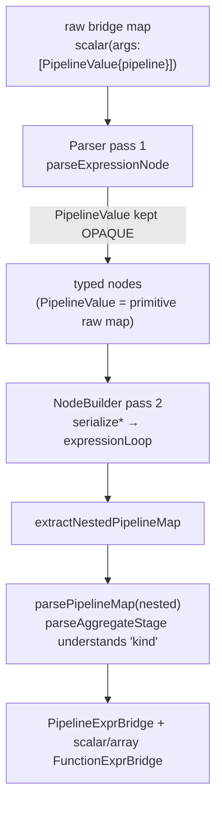

# ELI5 overview

Imagine you write a recipe (the "pipeline") in JavaScript: "take the `restaurants` collection, add a field that summarizes each restaurant's reviews, then keep only `name` and `reviewSummary`." React Native Firebase can't run that recipe itself — the real Firestore engine lives in native code (Swift on iOS, Java on Android). So RNFB does three things:

1. **Write the recipe down (serialize).** The JS layer turns your pipeline into a plain JSON tree — no functions, no objects with hidden behavior, just maps/arrays/strings/numbers that can cross the React Native bridge.
2. **Read the recipe back on the other side (parse + build).** Native code reads that JSON, type-checks it, and rebuilds it as real Firebase `Pipeline` / expression objects.
3. **Cook (execute).** Native runs the pipeline against the cloud `pipelines-e2e` Enterprise database and sends the results back as JSON.

A **subquery** is a recipe inside a recipe: `subcollection('reviews').aggregate(...).toScalarExpression()` is a little pipeline that gets embedded as one "field value" of the outer pipeline. In the serialized JSON it shows up as a special `PipelineValue` node that *wraps a whole nested pipeline*. The golden rule that makes everything work: **when native is reading the outer recipe, it must treat a `PipelineValue` as a sealed box — do not read the inner recipe with the outer recipe's reader.** The inner pipeline has its own grammar (e.g. aggregate stages) and must be handed to the *pipeline* parser, not the *expression* parser. Breaking that rule is exactly what caused the iOS/Android hang documented below.

# Overview

Firestore Pipelines in RNFB mirror the firebase-js-sdk modular `pipelines` API. User code builds a pipeline in JavaScript; execution crosses the React Native bridge; native code constructs Firebase `Pipeline` objects and runs them against Firestore.


**Coverage strategy:** Native Swift/Java for pipeline node building is exercised through **Detox/Jet e2e** (`Pipeline.e2e.js`), not standalone XCTest/JUnit suites. iOS profraw is pulled after each Jet run (including failures) and merged via `process-ios-native-coverage.js`. See also [Coverage design](/testing/coverage-design.md).

# Backend: cloud Enterprise, not the local emulator

Pipeline `execute()` requires **Firestore Enterprise edition**. The local emulator used by RNFB e2e (`yarn tests:emulator:start`) is configured as **Standard** edition and does not faithfully run pipeline queries.

| Database | Emulator connected in `tests/app.js`? | Used for |
|----------|--------------------------------------|----------|
| `(default)` | Yes (`localhost:8080`) | Regular Firestore e2e |
| `second-rnfb` | Yes | Second-database e2e |
| **`pipelines-e2e`** | **No — intentionally omitted** | **Pipeline e2e only** |

On `main`, `tests/app.js` calls `connectFirestoreEmulator` only for `(default)` and `second-rnfb`. `Pipeline.e2e.js` uses `getFirestore('pipelines-e2e')`, which therefore talks to the **live** `pipelines-e2e` database on the `react-native-firebase-testing` Firebase project (Enterprise), not the emulator.

Evidence in-repo:

* `tests/local-tests/firestore/pipelines-e2e.tsx` — comment: *"default database does not seem to work"*; manual harness uses `getFirestore('pipelines-e2e')` against cloud.
* Pipelines are an Enterprise-only API; Standard `(default)` databases reject pipeline execute.

CI still starts the Firestore emulator for auth/database/functions/storage and for regular Firestore e2e, but **pipeline integration tests are cloud-backed**. They need network access to Google APIs during Detox/Jet runs.

### Emulator status (2026)

The Firestore emulator has **partial** Enterprise/pipeline support when started with `"edition": "enterprise"` in `firebase.json` (`firestore.edition` or `emulators.firestore.edition`). RNFB does **not** configure this today. Even with Enterprise emulator mode, coverage is incomplete (vector `findNearest`, some stages) compared to cloud.

Do **not** add `connectFirestoreEmulator(..., 'pipelines-e2e')` unless deliberately migrating pipeline e2e to an Enterprise emulator setup — doing so breaks tests that expect the cloud `pipelines-e2e` database.

### Vector indexes / `findNearest`

Vector indexes belong in **`firestore.pipelines-e2e.indexes.json`** (`vectorConfig` with `dimension` + `flat`), **not** in security rules. Example in repo under `.github/workflows/scripts/`. Deploy with `./deploy-firestore.sh` after editing.

### Cloud rules and indexes (operator summary)

See [Firebase testing project and emulator setup](/testing/firebase-testing-project.md) for the full map (emulator ports, database matrix, CI, pitfalls). Scripts live in `.github/workflows/scripts/`:

* `./sync-firestore-indexes.sh` — pull indexes from cloud into repo
* `./deploy-firestore.sh` — push rules + indexes to `react-native-firebase-testing`

# JavaScript layer

* Expression helpers (`field`, `constant`, `add`, `map`, `array`, aggregates, etc.) build plain JSON-serializable trees.
* `pipeline().collection(…).select(…)` produces a `Pipeline` object; `execute()` sends the serialized pipeline to native.
* `packages/firestore/lib/pipelines/pipeline_support.ts` lists **iOS-unsupported** function names validated before execute (e.g. `arrayGet`, `conditional`) so e2e can assert clear errors.

# Native layer (iOS)

`RNFBFirestorePipelineNodeBuilder.swift` walks serialized expression nodes and produces `ExprBridge` / stage bridges consumed by `RNFBFirestorePipelineBridgeFactory.swift`.

Key responsibilities:

1. **Type coercion** — bridge values arrive as `NSDictionary`, `NSArray`, `NSString`, `NSNumber`, etc.
2. **Literal vs expression** — integer positions (offsets, counts) use `tryIntegerLiteral`; expression slots use `scalarConstantBridge` or expression frames.
3. **Boolean expressions** — `and` / `or` / `xor` / `nor` and aggregate predicates (`count_if`) coerce args through `.booleanExpression` paths.

# Nested pipelines / subqueries (`subcollection`, `toScalarExpression` / `toArrayExpression`)

This is the most subtle area of the bridge and the source of a hard-to-debug infinite loop. Read this before touching the native parsers.

## JS shape

* `subcollection(path)` (in `lib/pipelines/subcollection.ts`) calls `createDetachedPipeline({ source: 'subcollection', path })`. A *detached* pipeline has **no Firestore instance** and cannot be executed directly (`execute()` throws a "created without a database" error).
* `.toScalarExpression()` / `.toArrayExpression()` call `createPipelineSubqueryExpression('scalar' | 'array', pipeline)`. That wraps the detached pipeline in a **`PipelineValue`** expression node and then wraps *that* in a `scalar`/`array` function expression:

```
addFields field "reviewSummary":
{ exprType: 'Function', name: 'scalar', args: [
    { exprType: 'PipelineValue', __kind: 'expression', selectable: true,
      pipeline: { source: { source: 'subcollection', path: 'reviews' },
                  stages: [ { stage: 'aggregate', options: { accumulators: [...] } } ] } }
] }
```

* Aggregates serialize **differently from scalar functions**: `createAggregate(kind, args)` emits `{ exprType: 'AggregateFunction', kind: 'countAll', args: [] }` — note the discriminant is **`kind`, not `name`**. This detail is load-bearing for the bug below.

## Native round-trip (the important part)

Both platforms use a two-pass design:

1. **Parser** (`RNFBFirestorePipelineParser`) converts the raw bridge map into *typed* nodes (`RNFBFirestoreParsed*` on iOS, `Parsed*ValueNode` on Android).
2. **Node builder** (`RNFBFirestorePipelineNodeBuilder`) converts typed nodes **back** into a raw map (`serializeExpressionNode` / `serializeValueNode` on iOS; `parsedValueNodeToObject` on Android) and then walks *that* raw map in `expressionLoop` to produce real `ExprBridge` objects. For `scalar`/`array` it calls `extractNestedPipelineMap` → `buildNestedPipelineSubquery`, which re-enters `parsePipelineMap` on the nested pipeline and produces `FunctionExprBridge(name: "scalar"|"array", args: [PipelineExprBridge(stages:)])` (iOS) or `nestedPipeline.toScalarExpression()/toArrayExpression()` (Android).

The crucial invariant: **the `PipelineValue` must survive pass 1 intact (raw map preserved) so pass 2 can re-parse the inner pipeline with the dedicated `parsePipelineMap` / `parseAggregateStage` code** (which understands `kind`). The expression parser does **not** understand aggregate `kind`.



## The infinite-loop bug (2026-06, fixed)

**Symptom:** iOS/Android e2e hung forever on the first `subcollection(...).toScalarExpression()` test (looked like "hangs around test 98" in the full suite). No native pipeline log ever printed.

**Why it was hard to see:**

* The JS `.serialize()` Jest test passes — it only checks serialization, never the native parse, `validateSerializedPipeline`, or `getIOSUnsupportedPipelineFunctions`.
* `RNFBFirestorePipelineDebug`/`NSLog`/`Log.i` traces never fired because the loop is **inside the parser, before** the first log statement.
* Proof came from a process `sample` of the hung simulator app, which showed 100% of samples in `RNFBFirestorePipelineParser.parseExpressionValueTree ⇄ isExpressionLike`.

**Root cause:** the parser treated the `PipelineValue` as transparent and walked *into* its nested pipeline as if those were ordinary outer expressions. Eventually it reached the aggregate node `{ exprType: 'AggregateFunction', kind: 'countAll', args: [] }`:

* `isExpressionLike(map)` returned `true` (the map has an `exprType`).
* …so the walker pushed an `expressionEnter` frame, but `expressionEnter` has **no handler** for it (no `name`, no `path`, `exprType` is not `field`/`constant`/`variable`).
* …so it fell through to the constant fallback, which re-pushed a `valueEnter` frame on the **same map**.
* `valueEnter` → `isExpressionLike` true → `expressionEnter` → fallback → `valueEnter` … forever. A stack-machine ping-pong that never shrinks its input.

An earlier "fix" that made `isExpressionLike` return `false` for `pipelinevalue` actually made it **worse**: returning false told the walker to descend into the `PipelineValue` as a generic map — which is precisely how it reached the aggregate node.

**The fix (correct invariant):** treat `PipelineValue` as **opaque** in pass 1.

* iOS — `RNFBFirestorePipelineParser.swift`, `valueEnter`: if `map["exprType"] == "pipelinevalue"`, store `box.value = .primitive(value)` (the raw map verbatim) and stop. `serializeValueNode` returns that raw map unchanged, so the node builder's `extractNestedPipelineMap` still finds the `pipeline` key and re-parses it.
* Android — `ReactNativeFirebaseFirestorePipelineParser.java`, `ValueEnterFrame`: same check → `ParsedPrimitiveValueNode(value)`. `extractNestedPipelineMap` gained an `extractNestedPipelineMapFromRaw` branch to unwrap a primitive-held raw map (`pipeline` key, or a bare `{source,stages}`).

Result: the nested pipeline's stages are never walked by the expression parser; they reach `parsePipelineMap` → `parseAggregateStage`, which correctly reads `kind`. iOS full suite: **107 passing**.

## Guard rails for future edits

* **Never** route a `PipelineValue` (or any whole nested pipeline) through the generic expression/value walker. Keep it opaque until the node builder hands it to `parsePipelineMap`.
* If you add a new serialized node type with an `exprType` the expression parser doesn't explicitly handle, beware the **`valueEnter`↔`expressionEnter` fallback loop**: `isExpressionLike` returning `true` while `expressionEnter` has no branch for it is an infinite loop, not a thrown error. Either add an explicit handler or keep the node opaque.
* Aggregates are discriminated by **`kind`**, scalar/boolean functions by **`name`**. The expression parser only understands `name`. Aggregate parsing must go through `parseAggregateStage`.
* Fastest reproduction loop is **not** e2e. The JS serialization Jest test exercises serialization; to exercise the native parser logic without a device, prefer a serialization-matrix/fluent-serialization test (pure JS) plus a sampled native run. To catch a *native* hang, `sample <pid>` the simulator app — don't rely on logs, the loop precedes them.

## Recursion, stack-safety & performance (design spike, 2026-06)

A focused spike on recursion/parsing correctness and latent performance turned up **two real JS-side defects** plus the design rationale for the native side. Probes and regression guards live in `packages/firestore/__tests__/pipelines-pathological.test.ts` (pure JS, fast, no device needed).

### Native parsers: already stack-safe (keep it that way)

Both native parsers are **explicit work-list state machines** (a `stack` of frames + boxes), *not* mutual recursion — deliberately:

* Swift does **not** guarantee tail-call optimization, so deep recursive descent risks `EXC_BAD_ACCESS` stack overflow.
* The JVM has a bounded thread stack and no TCO; deep recursion risks `StackOverflowError`.

Because the algorithms are heap-allocated work-lists, expression depth is bounded by heap, not the call stack. **Preserve this property.** The one place not flattened across pipeline boundaries is `buildNestedPipelineSubquery`, which re-enters `parsePipelineMap` once per *subquery nesting level* (not per expression node). That is fine for realistic nesting; only truly absurd subquery-in-subquery depth would grow the native stack.

### Defect 1 — exponential blow-up in `getIOSUnsupportedPipelineFunctions` (fixed)

`collectIOSUnsupportedFunctions` (in `pipeline_support.ts`) traversed a function node's `args` **explicitly** *and* again via `Object.values`. That double-visit makes it **O(2^depth)**. Measured on `add(add(add(…)))`:

| depth | old elapsed |
|------:|------------:|
| 14 | 66 ms |
| 16 | 224 ms |
| 18 | 880 ms |
| 20 | 3 487 ms |

So a depth-~30 expression (very plausible for generated queries) takes minutes, and ~35+ effectively **hangs iOS `execute()` before it ever reaches native** — the same user-visible symptom as the parser hang, in a different function. Fix: drop the redundant explicit `args` traversal (`Object.values` already covers it) → **O(n)**. After the fix, depth 20 went 3487 ms → 0 ms.

### Defect 2 — recursion depth ceiling (hardened)

`collectIOSUnsupportedFunctions` was also recursive, so very deep nesting threw `RangeError: Maximum call stack size exceeded` (~5 000 in Node; lower on Hermes). It now uses an **iterative work-list**, matching the native design, and is verified stack-safe at depth 20 000.

### Known remaining bound — `serializeValue`

`serializeValue` (`pipeline_runtime.ts`) is still recursive and runs on **every** `execute()` on **all** platforms. It tolerates ~5 000 depth in Node (less on Hermes) before `RangeError`. This is **not** considered urgent: legitimate pipelines are shallow, and the Firestore backend rejects absurdly deep nesting anyway. It is a candidate follow-up to convert to a work-list (with the existing `WeakSet` circular-reference guard preserved) if deep machine-generated pipelines ever become a use case. It already throws a clear error on circular structures; it does **not** yet throw a friendly "too deeply nested" message.

### Guard rails

* Keep native parsers work-list-based; never reintroduce mutual recursion for expression/value traversal.
* When traversing serialized trees in JS, **visit each property once** — never both an explicit child list and `Object.values` of the same node (that is what caused the exponential blow-up).
* Prefer iterative work-lists for any new tree walk that can see attacker- or generator-controlled depth.

## Cross-platform e2e + coverage pass (2026-06)

Thorough subquery/recursion e2e cases were added to `Pipeline.e2e.js` (`describe('pathological subqueries and recursion')`) and run on **all three** platforms: a scalar subquery with a `where` filter + multiple accumulators (the exact aggregate-in-`PipelineValue` trigger), an array subquery (`toArrayExpression`), sibling scalar+array subqueries in one `addFields`, and a depth-30 arithmetic chain (which would have hung iOS under the pre-fix exponential analysis). Result: **iOS 111, Android 111, macOS 106 passing.**

### Lesson: there are two expression builders per platform — edit the live one

**ELI5.** Each native side has *two* machines that turn a serialized expression into a Firebase expression: an old one and a new one. Only the **new** one is actually plugged in and running. If you teach the **old** one a new trick, nothing happens at runtime — like fixing the spare engine that isn't in the car. You have to teach the engine that's actually driving, and the way to know which engine is driving is to look at the coverage report: the live one lights up, the spare stays at 0%.

**ELII.** On both platforms expression lowering exists twice:

* **iOS** — the iterative `coerceExpressionTree` (live) vs. a recursive cluster `coerceFunctionExpression`/`buildArrayExpression`/`coerceBooleanOperatorExpression`/… (dormant; **removed** this pass).
* **Android** — the raw-map work-list (`EnterObjectExpressionFrame` → `scheduleExpressionFunctionLowering`, live) vs. the parsed-node path (`buildExpressionFunctionFromParsedArgs` + `coerceExpressionValueNode`, dormant).

The execute-time path on each platform is the iterative/work-list one; the recursive/parsed-node sibling is reachable from (almost) nothing. Consequences and rules:

* **When you add or change expression/function handling, change the path that actually runs at `execute()`** — otherwise it silently has no effect (this is exactly the Android subquery bug below). The dormant path having a `scalar`/`array` case is a trap: it looks done but never runs.
* **Coverage is the disambiguator.** A large 0%/uncovered block in `NodeBuilder` is a strong signal you are looking at the dormant path; the live path shows hits. Use that before adding tests *or* before deleting code.
* The dormant path is a deletion candidate (see "dead code" below) — but verify with coverage first, especially on Android where the parsed-node path is interwoven via `coerceExpressionValueNode`.

### Android bug found and fixed: scalar/array subqueries never executed

The pre-existing "subcollection scalar subquery" e2e had only ever been verified on iOS. On Android it failed with `[firestore/invalid-argument] pipelineExecute() could not convert stage.options.fields[0].expr.args[0] into a pipeline expression.` — i.e. **every** subquery (scalar and array) failed.

Cause: Android has two expression builders. The **active** runtime path is the raw-map work-list (`EnterObjectExpressionFrame` loop → `scheduleExpressionFunctionLowering`); the parsed-node path (`buildExpressionFunctionFromParsedArgs` with its `scalar`/`array` cases) is **not** the one reached at execute time. The active path treated `array` only as an array *literal* and had no `scalar` handling, so the opaque `PipelineValue` argument fell through to the generic walker and was rejected.

Fix (`ReactNativeFirebaseFirestorePipelineNodeBuilder.java`): detect a nested-pipeline argument at the top of `scheduleExpressionFunctionLowering` (single `scalar`/`array` arg whose raw map is a `PipelineValue`, via `extractNestedPipelineMapFromRaw`) and build it through `buildRawNestedPipelineSubquery` → `nestedPipelineBuilder` → `toScalarExpression()` / `toArrayExpression()`. Also fixed a `toLowerCase()` → `toLowerCase(Locale.ROOT)` Android-lint failure in the parser's PipelineValue detection.

> **`toArrayExpression` result shape:** a single-field `select()` inside an array subquery yields the **scalar values**, not documents — e.g. `subcollection('reviews').select('rating').toArrayExpression()` → `[3, 4, 5]`, not `[{rating:3}, …]`.

### Native coverage baselines + dead code

Coverage baselines for the pipeline files (from focused `tests:<platform>:test-cover` + the documented processing steps):

| File | iOS | Android |
|------|-----|---------|
| Parser | 83% | 79% |
| NodeBuilder | 63% → **66.5%** | 55% |
| Executor / CallHandler / BridgeFactory | 71–78% | 49% |

The iOS `RNFBFirestorePipelineNodeBuilder` contained a **dead recursive expression-builder cluster** (`coerceFunctionExpression`, `coerceBooleanFunctionExpression`, `buildArrayExpression`, `buildMapExpression`, `coerceBooleanOperatorExpression`, and the orphaned `coerceComparisonOperand` / `coerceExpressionValue` / `coerceVectorExpressionValue` wrappers) — all superseded by the iterative `coerceExpressionTree` and reachable from nothing. Removed (~117 lines); iOS e2e stayed at 111. **Android has an analogous parsed-node path (`buildExpressionFunctionFromParsedArgs`) that is far more interwoven via `coerceExpressionValueNode`; confirm with coverage before removing.**

The remaining native gap is overwhelmingly **live-but-untested operator lowering** inside `coerceExpressionTree` / `buildExpressionFunction*` (individual Firestore functions not exercised by e2e) plus defensive error branches in the executor. Closing it is an incremental e2e-per-operator effort, not a structural fix.

JS coverage for the files owned by this work is now maxed: `subcollection.ts` 100%, `pipeline_support.ts` 100%, `pipeline_validate.ts` 100% lines (negative/failure-branch tests in `pipelines-validate.test.ts`).

### DEFERRED: native coverage gain to 100% (pending approval)

> **Status: needed, not yet done — deferred pending approval.** Per the coverage policy (see [Coverage expectations](/testing/coverage-design.md)), these native files must reach 100% (minus any quantified, intractable Swift-codegen unreachable lines) before this work is considered complete. Two tracks remain:
>
> 1. **Add e2e coverage for every live-but-untested operator/stage** in `coerceExpressionTree` (iOS) and `buildExpressionFunction*` (Android), plus negative/failure-branch tests for the executors. Incremental, mechanical.
> 2. **Android dead-code investigation** — the parsed-node path (`buildExpressionFunctionFromParsedArgs` and friends) is the analogue of the iOS recursive cluster already removed, but it is heavily interwoven via `coerceExpressionValueNode`. Confirm with coverage which path is actually reached at runtime before removing anything.
>
> Plan: do this iterative work with a **cost-efficient model** (it is repetitive add-test/run/measure looping); escalate to a stronger model only if a structural refactor (not just test addition) turns out to be required. Baselines to beat: iOS NodeBuilder ~66.5%, Android NodeBuilder ~55%, Android Executor ~49%.

# Integer / boolean coercion

## Problem

On iOS, React Native often delivers JavaScript booleans as `NSNumber` backed by `CFBoolean` (`kCFBooleanTrue` / `kCFBooleanFalse`). The same bridge also carries integers as `NSNumber`. Without care, `0`/`1` literals and booleans are indistinguishable at the `NSNumber` layer, and whole-number coercion can turn booleans into `0`/`1` or vice versa.

## `scalarConstantBridge` (constants and inline literals)

Order of checks in `RNFBFirestorePipelineNodeBuilder.swift`:

1. Swift `Bool` → `ConstantBridge(bool)`
2. `NSNumber` with `CFGetTypeID == CFBooleanGetTypeID()` → `ConstantBridge(boolValue)` **before** integer coercion
3. `NSNumber` passing `wholeNumberInt` (non-boolean, finite integer) → `ConstantBridge(int)`
4. Swift `Int` → `ConstantBridge(int)`
5. Fallback → `ConstantBridge(value)` (strings, doubles, nested structures)

## `wholeNumberInt`

Returns `nil` for boolean `NSNumber` instances so they never become `0`/`1` integers.

## Boolean expression operators

`xor`, `nor`, and `count_if` use the same boolean-expression coercion as `and`/`or` (not generic expression coercion).

## E2e implications

| Scenario | Risk | Mitigation in tests |
|----------|------|---------------------|
| `constant(true)` / `constant(false)` in `mapSet` | Must stay boolean | Assertions on `updated: true`, `disabled: false` |
| `constant(0)` / `constant(1)` inside **heterogeneous `array([…])` literals** | May still surface as bool on some bridge paths | Tier-1 mixed-literal test uses `constant('tail')` instead of `constant(0)` to validate the array-literal code path without ambiguous scalars |
| `constant(1)` in `map({ version: constant(1) })` | Map literal path preserves integers | Covered separately in map literal test |
| Document field booleans (`field('flagA')`) | Read from Firestore, not bridge constants | Safe |

**Alternatives considered for ambiguous numeric constants:**

1. Tag numeric constants in JS serialization (e.g. explicit `integerValue` discriminant) — most robust, larger API/serialization change.
2. Use `field('docField')` instead of `constant(n)` in arrays — couples literal tests to fixture data.
3. Restrict integer literal tests to `map({ … })` only — leaves `array([…])` builder less covered.
4. Further native heuristics — fragile; bool fix already uses `CFBooleanGetTypeID`.

String constants were chosen in the tier-1 **array literal** test as a minimal, unambiguous scalar while still covering mixed field+constant arrays.

# E2e environment

## Dedicated cloud database

Pipeline e2e uses database id **`pipelines-e2e`** (`DATABASE_ID` in `Pipeline.e2e.js`) — a named **Enterprise** database on `react-native-firebase-testing`. It is isolated from emulator-backed `(default)` / `second-rnfb` tests.

Tests use random collection path suffixes to avoid cross-test collisions on the shared cloud database. Do not call `helpers.wipe()` against `pipelines-e2e` from e2e — that helper targets the **emulator** REST endpoint and does not flush the cloud database.

## What CI runs

* The emulator (auth, RTDB, standard Firestore, functions, storage) — locally always started with `yarn tests:emulator:start` (see [Running e2e tests](/testing/running-e2e.md)). CI uses the `-ci` variant of that script.
* `Pipeline.e2e.js` — loaded with other Firestore e2e on `main`; pipeline execute hits **cloud** because `pipelines-e2e` is not emulator-connected.

# iOS platform gaps

Functions listed in `IOS_UNSUPPORTED_FUNCTION_NAMES` throw before native execute. E2e branches with `expectIOSUnsupportedFunctions` and runs a reduced pipeline on iOS (e.g. omit `arrayGet`).

# Measuring native coverage

Run e2e with coverage using the canonical commands in [Running e2e tests](/testing/running-e2e.md):

```bash
yarn tests:ios:build          # rebuild if native changed
yarn tests:ios:test-cover     # iOS (also: tests:android:test-cover, tests:macos:test-cover)
```

`tests/e2e/firebase.test.js` pulls iOS profraw in a `finally` block so **partial coverage is retained when Jet fails**. Stale profraw from a previous successful run was a common source of misleading 0% lines on `serializeValueNode` / `buildAggregateStage`. For where reports land and how Codecov flags/gates work, see [Coverage design](/testing/coverage-design.md).
