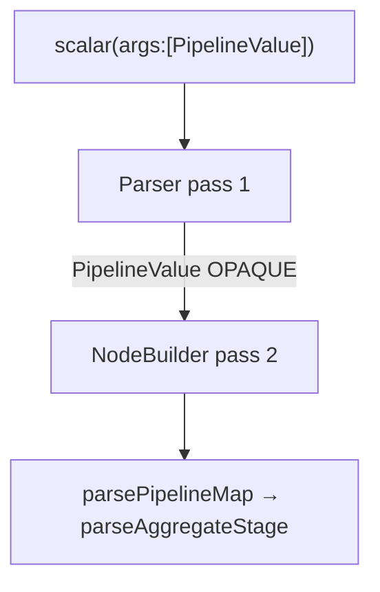

# ELI5 overview

Imagine you write a recipe (the "pipeline") in JavaScript: "take the `restaurants` collection, add a field that summarizes each restaurant's reviews, then keep only `name` and `reviewSummary`." React Native Firebase can't run that recipe itself — the real Firestore engine lives in native code (Swift on iOS, Java on Android). So RNFB does three things:

1. **Serialize** — JS turns the pipeline into a plain JSON tree for the bridge.
2. **Parse + build** — native reads JSON and rebuilds Firebase `Pipeline` / expression objects.
3. **Execute** — native runs against the cloud `pipelines-e2e` Enterprise database and returns JSON results.

A **subquery** embeds a whole inner pipeline as a **`PipelineValue`** node inside a `scalar`/`array` function. **Golden rule:** treat `PipelineValue` as a sealed box in parser pass 1 — hand it to `parsePipelineMap` in pass 2, never walk it with the expression parser (aggregates use `kind`, not `name`).

# Overview

**Coverage strategy:** native pipeline code is exercised through **Detox/Jet e2e** (`Pipeline.e2e.js`), not standalone XCTest/JUnit. See [Coverage design](/testing/coverage-design.md).

# Backend: cloud Enterprise, not the local emulator

Pipeline `execute()` requires **Firestore Enterprise**. The local emulator is **Standard** and does not faithfully run pipeline queries.

| Database | Emulator in `tests/app.js`? | Used for |
|----------|----------------------------|----------|
| `(default)` | Yes (`:8080`) | Regular Firestore e2e |
| `second-rnfb` | Yes | Second-database e2e |
| **`pipelines-e2e`** | **No** | **Pipeline e2e only** (cloud Enterprise) |

CI starts the emulator for auth/RTDB/functions/storage and Standard Firestore e2e; **pipeline execute hits cloud** and needs network.

### Emulator status (2026)

Partial Enterprise support exists if `"edition": "enterprise"` is set in `firebase.json`. RNFB does **not** use it; cloud remains authoritative (incl. vector `findNearest`).

### Why `pipelines-e2e` has its own rules and indexes (cloud deploy split)

The emulator serves one rules/index bundle for `(default)` and does not model multiple cloud databases well. Mixing Enterprise pipeline work with Standard emulator databases broke **security-rules testing** for regular Firestore e2e.

**Resolution:** `pipelines-e2e` is **cloud-only** for execute, rules, and indexes.

| Database | Rules file | Indexes file | Emulator | Cloud deploy |
|----------|------------|--------------|----------|--------------|
| `(default)` | `firestore.rules` | `firestore.indexes.json` | Yes | Yes |
| `second-rnfb` | *(same `firestore.rules`, `database == "second-rnfb"` guards)* | *(none in repo)* | Yes | No `firebase.json` entry |
| **`pipelines-e2e`** | **`firestore.pipelines-e2e.rules`** | **`firestore.pipelines-e2e.indexes.json`** | **No** | **Yes** |

Vector indexes (`findNearest`) live in **`firestore.pipelines-e2e.indexes.json`** only. Do **not** `connectFirestoreEmulator(..., 'pipelines-e2e')` without a deliberate Enterprise-emulator migration.

**Deploy/sync:** [Firebase testing project](/testing/firebase-testing-project.md#cloud-project-deploy-rules-and-indexes) — `./sync-firestore-indexes.sh`, `./deploy-firestore.sh`.

# JavaScript layer

* Expression helpers build plain JSON-serializable trees; `execute()` sends serialized pipeline to native.
* `pipeline_support.ts` — **iOS-unsupported** function names validated before execute (`arrayGet`, `conditional`, etc.).

# Native layer

`RNFBFirestorePipelineNodeBuilder` (Swift/Java) coerces bridge types, separates literal vs expression slots, and builds `ExprBridge` / stage bridges for `RNFBFirestorePipelineBridgeFactory`.

# Nested pipelines / subqueries

## JS shape

* `subcollection(path)` → detached pipeline (no Firestore instance; direct `execute()` throws).
* `.toScalarExpression()` / `.toArrayExpression()` → `PipelineValue` wrapped in `scalar`/`array` function node.
* Aggregates: `{ exprType: 'AggregateFunction', kind: 'countAll', … }` — discriminant is **`kind`**, not `name`.

## Native round-trip (two-pass)

1. **Parser** — bridge map → typed nodes.
2. **Node builder** — typed nodes → raw map → `expressionLoop` → SDK bridges. Nested pipelines: `extractNestedPipelineMap` → `parsePipelineMap` ( understands aggregate `kind`).

## Decision: `PipelineValue` opaque in parser pass 1

**Why:** Walking into a `PipelineValue` with the expression parser reaches `AggregateFunction` nodes (`kind`, not `name`). Unhandled `exprType` + `isExpressionLike` true causes a **`valueEnter`↔`expressionEnter` infinite loop** (hang with no logs — confirm with `sample <pid>` on simulator, not NSLog).

**Fix (both platforms):** pass 1 stores `PipelineValue` as primitive raw map; pass 2 re-parses via `parsePipelineMap`. Jest `.serialize()` alone does **not** catch this — need native e2e or sampled run.

**Guard rails:**

* Never route `PipelineValue` through the generic expression/value walker.
* New `exprType` without an explicit handler → opaque or explicit branch (unhandled + `isExpressionLike` = loop, not error).
* Aggregates → `parseAggregateStage` only; scalars/booleans → `name`.
* Regression: `pipelines-pathological.test.ts` (JS); e2e `describe('pathological subqueries and recursion')` — **111 iOS/Android, 106 macOS** after fixes.

> **`toArrayExpression` shape:** single-field `select()` in an array subquery returns **scalar values** — e.g. `[3, 4, 5]`, not `[{rating:3}, …]`.

# Iterative algorithms vs recursion

## Decision: native parsers use work-list state machines

**Tradeoff:** Swift has no reliable TCO; JVM stacks are bounded → mutual recursion risks overflow. Heap-allocated frame stacks bound depth by heap, not call stack.

**Exception:** `buildNestedPipelineSubquery` re-enters `parsePipelineMap` once per subquery nesting level — fine in practice; only absurd subquery depth grows the native stack.

**Guard rail:** never reintroduce recursive expression/value traversal in native parsers.

## JS tree walks — lessons (fixed 2026-06)

Probes: `packages/firestore/__tests__/pipelines-pathological.test.ts`.

| Issue | Cause | Threshold / fix |
|-------|-------|-----------------|
| `getIOSUnsupportedPipelineFunctions` hang | `args` visited explicitly **and** via `Object.values` → **O(2^depth)** | depth 20: 3487 ms → **0 ms** after single-visit fix |
| Same function stack overflow | Recursive walk | **Iterative work-list**; verified depth **20 000** |
| `serializeValue` still recursive | Runs every `execute()` | ~**5000** depth in Node (less Hermes) before `RangeError`; backend rejects deep nesting — **low urgency** |

**Guard rails:** visit each tree property once; prefer work-lists for attacker/generator-controlled depth.

### DEFERRED: `serializeValue` work-list conversion

Convert `serializeValue` (`pipeline_runtime.ts`) to iterative if deep machine-generated pipelines become a use case. Preserve `WeakSet` circular guard; add friendly "too deeply nested" message.

# Two expression builders per platform — edit the live one

Each platform has a **live** execute-time lowering path and a **dormant** sibling (looks implemented in coverage but never runs).

| Platform | Live path | Dormant path |
|----------|-----------|--------------|
| iOS | `coerceExpressionTree` (iterative) | Recursive cluster — **removed ~117 lines** (0% coverage) |
| Android | `EnterObjectExpressionFrame` → `scheduleExpressionFunctionLowering` | `buildExpressionFunctionFromParsedArgs` + `coerceExpressionValueNode` — **interwoven; confirm with coverage before delete** |

**Lesson (Android subqueries):** `scalar`/`array` were implemented on the dormant path only; live path treated `array` as literal and ignored `scalar` → all subqueries failed until `scheduleExpressionFunctionLowering` gained `extractNestedPipelineMapFromRaw` → `buildRawNestedPipelineSubquery`.

**Guard rails:**

* Change the path that runs at `execute()` — dormant-path cases are a trap.
* **Coverage disambiguates** live vs dormant (0% block = suspect dormant code).
* e2e must run on **all three platforms**; iOS-only green hid the Android subquery gap.

# Native coverage baselines (2026-06)

From `tests:<platform>:test-cover` + post-processing; refresh with `bash scripts/map-pipeline-coverage-gaps.sh <label>`:

Durable coverage principle: use e2e coverage to distinguish live paths from dormant lowering code, then document any intractable gaps. Current snapshot numbers and phase-specific deltas live in the [pipeline coverage work queue](pipeline-coverage-work-queue.md#current-snapshot).

### Native coverage gap map

Live-path holes concentrate in **expression lowering** and **stage coercion**, not dormant parsed-node clusters (Android dormant `buildParsed*` cluster removed 2026-06). Remaining high-value gaps:

- **Android:** expression-frame lowering, parsed aggregate tails, executor branches.
- **iOS:** stage coercion, operand modes, map passthrough success paths.
- **TS:** runtime/validation branches reachable by direct Jest or e2e tamper tests.

Quantified tables and next-phase priorities: [pipeline-coverage-work-queue.md](pipeline-coverage-work-queue.md). Summary script: `bash scripts/map-pipeline-coverage-gaps.sh <label>`.

### DEFERRED: native coverage to 100% (pending approval)

**Status: needed, not done.** Per [Coverage expectations](/testing/coverage-design.md):

1. **E2e per live-but-untested operator/stage** in `coerceExpressionTree` (iOS) and live Android lowering, plus remaining executor error branches.
2. **Android parsed-aggregate tail** — partially live (`coerceAliasedAggregate` from Executor); target with e2e, not deletion.

Baselines to beat: iOS NodeBuilder ~69%, Android NodeBuilder ~68%, Android Executor ~58%. Prefer cost-efficient passes; escalate model only if structural refactor required.

**Compare-types exports:** deferred — separate track from coverage expansion ([work queue](pipeline-coverage-work-queue.md)).

# Integer / boolean coercion (iOS bridge)

**Problem:** RN delivers JS booleans as `CFBoolean` `NSNumber`; integers also `NSNumber` — `0`/`1` and bools collide without care.

**Decision — `scalarConstantBridge` check order:**

1. Swift `Bool` → bool constant
2. `NSNumber` + `CFBooleanGetTypeID()` → bool **before** integer coercion
3. `wholeNumberInt` (non-bool) → int
4. Swift `Int` → int
5. Fallback (string, double, nested)

`xor` / `nor` / `count_if` use boolean-expression coercion like `and`/`or`.

**E2e mitigation:** avoid ambiguous `constant(0)`/`constant(1)` in heterogeneous `array([…])` literals — tier-1 test uses `constant('tail')`. Tagging integers in serialization was considered and deferred (larger API change).

# E2e environment

* Database: **`pipelines-e2e`** (`DATABASE_ID` in `Pipeline.e2e.js`); random collection suffixes; **no** `helpers.wipe()` (emulator REST only).
* CI: emulator for Standard modules; `Pipeline.e2e.js` execute → cloud. Commands: [Running e2e tests](/testing/running-e2e.md).

# Platform parity

Cross-platform behavior is a **co-equal goal** with coverage ([Coverage design](/testing/coverage-design.md)). Differences must be **SDK limitations** (documented) or **closed via bridge fixes** — not silent e2e workarounds.

| Topic | Document |
|-------|----------|
| Parity policy, drift registry | [Pipeline platform parity](pipeline-platform-parity.md) |
| SDK unsupported-function audit (repeatable) | [Pipeline SDK support audit](pipeline-sdk-support-audit.md) |
| Coverage + parity work queue | [pipeline-coverage-work-queue.md](pipeline-coverage-work-queue.md) |

# iOS platform gaps (SDK / API)

`IOS_UNSUPPORTED_FUNCTION_NAMES` throw before native execute. E2e uses `expectIOSUnsupportedFunctions` and reduced pipelines on iOS. Registry row **P-003** in [pipeline-platform-parity.md](pipeline-platform-parity.md).

# Measuring native coverage

[Running e2e tests](/testing/running-e2e.md); compare-types snapshots: [Pipeline implementation workflow](pipeline-implementation-workflow.md), [Coverage design](/testing/coverage-design.md#coverage-as-completion-signal).
