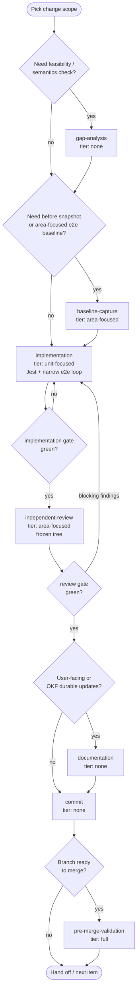
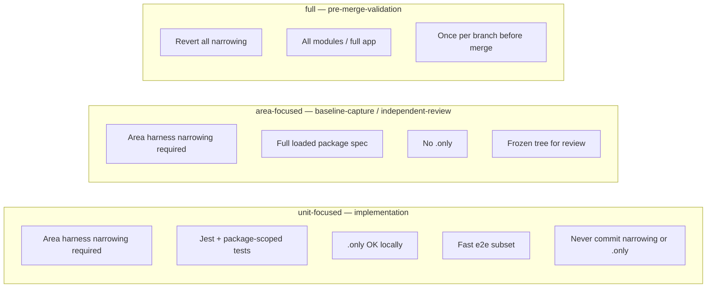
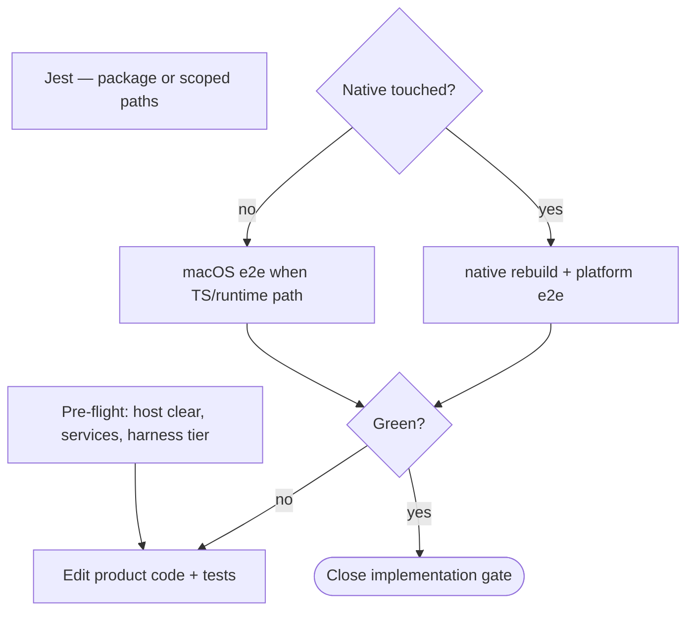

# Change authoring workflow

Single source for **how to author and verify a product change** in RNFB (bug fix, feature, parity, coverage). Package workflows add artifacts; work queues add ephemeral gate state — neither restates this loop.

**Policy:** [OKF documentation and commit policy](../documentation-policy.md). **Terms:** [iteration vocabulary](iteration-vocabulary.md).

## Primary loop



## Work types

| Work type | When | Validation tier | Product edits | Commit |
|-----------|------|-----------------|---------------|--------|
| `gap-analysis` | Unclear feasibility, export shape, platform support | none | read-only | no |
| `baseline-capture` | Need before metrics or area-focused e2e on the item | `area-focused` | harness narrow OK locally | no |
| `implementation` | Author fix/feature + tests | `unit-focused` | yes | no |
| `independent-review` | Verify frozen diff | `area-focused` | no — [frozen tree](#frozen-tree) | no |
| `documentation` | User docs + durable OKF updates | none | docs only | no |
| `commit` | Gates closed for the item | none | staging only | yes |
| `pre-merge-validation` | Branch merge gate | `full` | revert narrowing first | no |

**Commands per work type:** [validation checklist](validation-checklist.md) — link only; do not duplicate here.

## Validation tiers

Tier id strings: [iteration vocabulary § validation tier identifiers](iteration-vocabulary.md#validation-tier-identifiers).



E2e scope, pre-flight, and harness gate: [running e2e § validation tiers](running-e2e.md#e2e-validation-tiers-unit-focused-area-focused-full), [harness narrowing gate](running-e2e.md#harness-narrowing-gate-blocking).

## Gates

| Gate | Closes when |
|------|-------------|
| `implementation` | `implementation` work type complete — code plus **unit-focused**-tier checks green |
| `review` | `independent-review` complete — **area-focused**-tier (and checklist where required) green on frozen tree |
| `commit` | Durable commit exists for the item |

**Trust rule:** Code on disk or in git with `review` still **open** is unverified until `independent-review` closes the gate.

If review finds blocking issues, return to **`implementation`** (`unit-focused`), then repeat **`independent-review`** (`area-focused`).

## Frozen tree

Required for **`independent-review`** and for any `:test-cover` run that closes the **`review`** gate:

- No edits to `packages/**`, `tests/**` (except reverting `.only`), or bundle-affecting OKF docs during the run.
- Wait for or cancel in-flight runs before editing again.

Keep **`implementation`** and **`independent-review`** in separate passes. E2e enforcement during runs: [running e2e § rules](running-e2e.md#rules).

## Host rule

On a shared dev host during change authoring:

- One `:test-cover` at a time — never overlap **unit-focused**-tier and **area-focused**-tier runs.
- Every run starts from [running e2e § pre-flight](running-e2e.md#pre-flight-is-the-host-clear-to-start) (host-clear probes, services, harness tier).
- Use only [canonical e2e commands](running-e2e.md#rules). Stalled runs → [stalled run detection](running-e2e.md#stalled-run-detection).

## `implementation` inner loop



**Host rule:** one `:test-cover` at a time; never overlap **unit-focused** and **area-focused** tiers on one host ([§ host rule](#host-rule)).

Step detail: [running e2e § unit-focused iteration loop](running-e2e.md#unit-focused-tier-iteration-loop).

## `independent-review`

On a **frozen tree**:

1. Revert all `.only`.
2. Keep area narrowing; run **area-focused**-tier e2e for loaded package spec(s).
3. Run applicable [validation checklist](validation-checklist.md) rows.
4. If the package workflow requires coverage: [coverage design § completion signal](coverage-design.md#coverage-as-completion-signal).
5. Outcome closes **review gate** or returns to **`implementation`**.

Keep **`implementation`** and **`independent-review`** in separate passes ([§ frozen tree](#frozen-tree)).

## Harness narrowing

**Before the first `:test-cover` at `unit-focused` or `area-focused` tier:** apply package area narrowing in `tests/app.js` / `tests/globals.js` even when the branch commit has full harness. Full app load is **`full`** tier only.

| Kind | `implementation` (**unit-focused**) | `independent-review` (**area-focused**) | `pre-merge-validation` (**full**) | `commit` |
|------|-------------------------------------|------------------------------------------|-----------------------------------|----------|
| **Area narrowing** | Required before `:test-cover` | Required before `:test-cover` | Revert — all modules | Never |
| **Single-test** (`.only`) | Allowed | Revert | Revert | Never |
| **Single-suite** (`describe.only`) | Allowed | Revert | Revert | Never |

Package workflows define **which module/spec** to load (e.g. Firestore → [pipeline implementation workflow § narrowing](../packages/firestore/pipeline-implementation-workflow.md#pipeline-area-harness)).

**Sanity check:** pass counts must match loaded scope — not full-app totals ([running e2e § gate](running-e2e.md#harness-narrowing-gate-blocking)).

## `commit`

- One focused commit per item when gates close.
- **Never stage:** area narrowing, any `.only`, ad-hoc harness edits.

```bash
git status
git diff --stat
rg '\.only\(' packages/
```

## Package extensions

| Package / area | Adds to this loop |
|----------------|-------------------|
| Firestore Pipelines | Compare-types gap pick, serialization matrix, `Pipeline.e2e.js` setup, coverage snapshots — [pipeline implementation workflow](../packages/firestore/pipeline-implementation-workflow.md) |
| Other packages | `okf-bundle/packages/<pkg>/` index when a workflow exists |

Ephemeral coordination (gate rows, `next_work_type`, SHAs): **work queues only** — not part of this workflow.

## Related docs

| Topic | Document |
|-------|----------|
| Term ids and queue field schema | [iteration-vocabulary.md](iteration-vocabulary.md) |
| E2e commands | [running-e2e.md](running-e2e.md) |
| Validation commands | [validation-checklist.md](validation-checklist.md) |
| Coverage policy | [coverage-design.md](coverage-design.md) |
