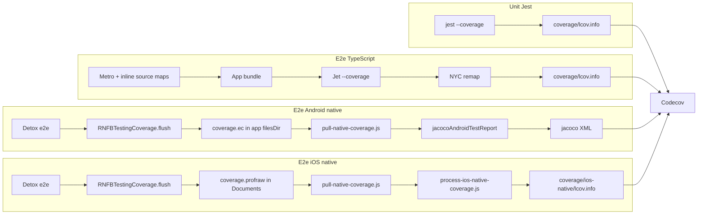

# Goals

Coverage shows exercised **TS library sources** (`packages/*/lib/**`) and **native sources** (`packages/*/{android,ios}/**`).

| Layer | Proves | Consumers |
|-------|--------|-----------|
| **Unit (Jest)** | Package logic with mocks | Fast feedback on `lib/**` |
| **E2e (Jet / Detox)** | Real app behaviour against Firebase emulators and cloud APIs | TS + native bridge integration |

Codecov merges CI uploads. Project-level % can be noise; **file-level changed-source coverage** is signal. macOS e2e uses firebase-js-sdk only; no RNFB native coverage.

# Coverage expectations (policy)

For **new code**:

* **Coverage only goes up** on files the change touches.
* **100% is the goal** for touched TS/native sources. "Mostly covered" is not enough.
* **Gaps need quantified intractability** — e.g. "~NN% unreachable Swift codegen"; no hand-waving.
* **Any other gap is either testable or dead code** — add tests (negative paths, failure branches, every reachable branch) or delete unreachable/duplicate/superseded code. Large uncovered blocks: ask "is this reachable?" before writing tests.

Gap passes should **add tests and remove dead code** together.

## Coverage as completion signal

File-level coverage, not green tests/types alone, marks completion.

1. **Baseline** after full e2e (all relevant platforms).
2. Implement with tests.
3. **After** full e2e with single-test/suite narrowing reverted (area narrowing may persist per package workflow until pre-merge).
4. Touched files: coverage **only rises** until **intractable limits** (above).

**Plateau below that limit → refactor**, not ship:

* Large uncovered native blocks often mean **dormant code paths** — use coverage to find the live path, delete the rest.
* Duplicate traversal (e.g. visiting the same tree property twice) can pass tests while leaving untestable structure — simplify until coverage rises.

Do not hand off closable gaps. Package workflows may define snapshot tooling (e.g. [pipeline scripts](../packages/firestore/pipeline-implementation-workflow.md)).

## Platform parity (pipeline and bridge code)

For native-bridge features, **platform parity precedes coverage expansion**: iOS/Android/macOS behavior must match unless blocked by native SDK. RNFB bridge gaps are defects, not permanent `Platform.*` e2e branches.

* **Policy and drift registry:** [Pipeline platform parity](../packages/firestore/pipeline-platform-parity.md)
* **Work queue:** [Pipeline coverage and parity work queue](../packages/firestore/pipeline-coverage-work-queue.md)

## Reading per-file coverage locally

After `tests:<platform>:test-cover`:

* **JS:** `npx jest <path> --coverage --collectCoverageFrom='packages/<pkg>/lib/**/*.ts' --coverageReporters=text`
* **iOS native:** `yarn tests:ios:test:process-coverage` → `coverage/ios-native/lcov.info` (`DA:` lines). **Deletes processed `.profraw`** — re-run e2e before re-processing.
* **Android native:** `yarn tests:android:post-e2e-coverage` → Jacoco XML per `sourcefile`. **Deletes processed `emulator_coverage.ec`** after a successful report — re-run e2e before re-processing.
* macOS e2e overwrites `coverage/lcov.info`; process iOS/Android native before a macOS run if you need both.

## Stale coverage data

Native artifacts (`.profraw`, `.ec`, Jacoco XML) are trustworthy only with the fresh e2e run that produced them. Re-processing leftovers can create valid-looking stale reports.

If numbers look wrong, run the clean cycle before debugging generators:

```bash
# iOS
yarn tests:ios:build && yarn tests:ios:test-cover && yarn tests:ios:test:process-coverage

# Android
yarn tests:android:build && yarn tests:android:test-cover && yarn tests:android:post-e2e-coverage

# macOS (TS only)
yarn tests:macos:test-cover
```

Post-process deletes raw iOS `.profraw` / Android `.ec`; missing raw file means "no fresh coverage." Do not use reuse variants for native deltas ([runbook](running-e2e.md)).

# End-to-end overview



# Unit coverage (Jest)

```bash
yarn tests:jest-coverage
```

- Jest + `coverageProvider: "babel"` (Istanbul), **not** NYC.
- Scope: `packages/**/__tests__/**` (`jest.config.js`).
- Output: `coverage/lcov.info` at repo root.
- Instruments `packages/*/lib/**` directly — no source-map remap.

# E2e TypeScript coverage (Jet + NYC)

Commands: [e2e runbook](running-e2e.md).

| Platform | Script | Notes |
|----------|--------|-------|
| macOS | `tests:macos:test-cover` | Jet only |
| iOS | `tests:ios:test-cover` | Detox → Jet `--coverage` |
| Android | `tests:android:test-cover` | Detox → Jet `--coverage` |

Jet self-wraps under NYC with `--coverage`.

**Tooling:**

- Metro bundles `packages/*/dist/module/**` with inline source maps (`tests/.babelrc`: `useInlineSourceMaps: true`).
- NYC (`tests/nyc.config.js`) remaps to `packages/*/lib/**` → **`coverage/lcov.info`** (`cwd: '..'`).
- Jet re-invokes under `tests/node_modules/.bin/nyc` (checks `NYC_CONFIG`). Detox/macOS need no extra `nyc` prefix; Jet must run from `tests/`.
- **Transfer:** patched Jet/mocha-remote WS only (`coverage-ready` → `pull-coverage` → `coverage-data` → `coverage-ack`); HTTP POST `/coverage` deleted (`attachHttpServer` removed). Host launch/orchestrate control uses a **separate** HTTP server on **8091** (not the 8090 WS stack) — see [Jet host orchestration](running-e2e.md#jet-host-orchestration-ports-and-launch-gate). Patches: `.yarn/patches/` (`jet`, `mocha-remote-client`, `mocha-remote-server`). See [iOS issues 6–6b](../ci-workflows/ios.md#6-jet-websocket-disconnect-1006--1001), [issue 8](../ci-workflows/ios.md#8-coverage-teardown-handshake-failure-tests-pass-nyc-00), [jet patch workflow](../ci-workflows/detox-patches.md#updating-the-jet-patch-headless).

**NYC settings:**

```javascript
include: ['packages/*/lib/**/*.{js,ts,tsx}', 'packages/*/dist/**/*.js'],
sourceMap: true, 'exclude-after-remap': true, instrument: false,
reporter: ['lcov', 'html', 'text-summary'],
```

**Verify:** `coverage-ready` → `WS received N file(s)` (N > 0) → non-zero NYC; `coverage/lcov.info` has `SF:packages/...`, not only `dist/`. If `merged 0 file(s)`, see [troubleshooting](#ts-e2e-coverage-troubleshooting).

### TS e2e coverage troubleshooting

| Symptom | Cause | Fix |
|---------|-------|-----|
| `[jet-coverage] merged 0 file(s)` | Jet client still POSTs to removed `/coverage` HTTP endpoint, or stale Metro bundle | `yarn install` (jet patch wires `client.uploadCoverage()`); macOS: restart packager with `yarn react-native start --reset-cache` in `tests/` |
| macOS bundle still has `'/coverage'` fetch | Metro resolves Jet via `"react-native": "src/index"` — patch must touch `jet/src/index.tsx`, not only `lib/` | Re-run after patch; `--reset-cache` |
| iOS/Android merged 0, macOS OK | Prebuilt app bundle predates Jet/Istanbul fix | `yarn tests:ios:build` / `yarn tests:android:build` then `:test-cover` |
| Metro 500 on bundle | Missing babel plugins in `tests/` | `yarn install`; confirm `tests/node_modules/babel-plugin-istanbul` exists |

# E2e Android native (Jacoco)

1. `testCoverageEnabled` on RNFB modules (`tests/android/build.gradle`).
2. Jet `after` in `tests/app.js` → `NativeModules.RNFBTestingCoverage.flush()` in **app** process → `coverage.ec` in `filesDir` **before** Detox SIGINT.
3. After Detox: `yarn tests:android:post-e2e-coverage` (or `pull-native-coverage`) → `emulator_coverage.ec` → `jacocoAndroidTestReport` → **delete local `.ec`**. Missing file: warning, not test/CI fail (`continue-on-error` on Codecov upload). Missing `.ec` on a later post-e2e without a new e2e run means Jacoco has no execution data — by design.
4. XML: `tests/android/app/build/reports/jacoco/jacocoAndroidTestReport/jacocoAndroidTestReport.xml`

**Why app-process flush:** Detox SIGINT kills instrumentation after Jet; post-`Detox.runTests()` dump in `DetoxTest.java` never runs.

**Jacoco notes:**

- AGP 8 classes: `build/intermediates/javac/debug/compileDebugJavaWithJavac/classes`
- Sources: include `src/reactnative/java`
- Modules: `rootProject.ext.firebaseModulePaths` (`tests/android/build.gradle`)
- Tasks in `tests/android/app/jacoco.gradle`: `jacocoAndroidTestReport` (e2e `**/*.ec`, CI uses this), `jacocoUnitTestReport` (`**/*.exec`), `jacocoTestReport` (merged)

# E2e iOS native (LLVM)

1. **Build:** LLVM flags in **`tests/ios/Podfile` `post_install`** (`pod install` after checkout):
   - **`testing` target:** compile + link profile flags + Swift toolchain search paths (Firebase static pods on CI)
   - **`RNFB*` pods:** compile-only flags — **no** `-fprofile-instr-generate` on pod `OTHER_LDFLAGS` (breaks `swiftCompatibility56` on CI)
2. **Runtime:** `RNFBTestingConfigureCoverageProfilePath()` at launch → `Documents/coverage.profraw`. Jet `after` → `RNFBTestingCoverage.flush()`. **No custom URL scheme** (iOS "Open in 'testing'?" dialog blocks Detox).
3. **Pull:** Jet exit 0 → `pull-native-coverage.js` → `simulator_coverage.profraw`. **Fails if missing.** Pull on Jet `close`, not `afterAll` (before Detox teardown).
4. **Export:** `yarn tests:ios:test:process-coverage` / `process-ios-native-coverage.js`:
   - exit **1** if no `.profraw`
   - merge from `tests/ios/build/output/coverage/` (+ optional `Build/ProfileData/` for `xcodebuild test`, unused by Detox)
   - `xcrun llvm-cov export -format=lcov` vs app binary → temp file (stdout buffer limit)
   - rewrite `SF:` to repo-relative `packages/**` → **`coverage/ios-native/lcov.info`**
   - **delete processed `.profraw`** (missing file next run = no fresh coverage)

ObjC + Swift share this. Raw export is mostly Pods/SDK; healthy full run includes ~50–60 `packages/*/ios/**` files among ~2000 entries.

**CocoaPods → SPM:** move same flags to SPM targets; post-test script unchanged.

# Codecov uploads (CI)

[codecov-action](https://github.com/codecov/codecov-action) v7, explicit `files` + `flags`. Upload steps continue on error; **blocking** = `codecov.yml` status checks.

## Flags

Names must match in **`codecov.yml`** and workflow `flags:`.

| Flag | Workflow | File | Blocks PR? |
|------|----------|------|------------|
| `jest` | `tests_jest.yml` | `coverage/lcov.info` | No |
| `e2e-ts-ios` | `tests_e2e_ios.yml` (debug) | `coverage/lcov.info` | No |
| `ios-native` | `tests_e2e_ios.yml` (debug) | `coverage/ios-native/lcov.info` | **Yes** |
| `e2e-ts-android` | `tests_e2e_android.yml` | `coverage/lcov.info` | No |
| `android-native` | `tests_e2e_android.yml` | Jacoco XML path below | **Yes** |
| `e2e-ts-macos` | `tests_e2e_other.yml` | `coverage/lcov.info` | No |

iOS release legs: no upload. macOS: TS only.

## Native gates

`carryforward: false`, `target: 1%` — gates **upload presence**, not % regression. Missing upload → 0% → fail. `codecov/project` overall: `informational: true`.

## CI steps before upload

| Workflow | Steps |
|----------|-------|
| `tests_jest.yml` | `yarn tests:jest-coverage` |
| `tests_e2e_ios.yml` (debug) | Detox → `yarn tests:ios:test:process-coverage` (`continue-on-error: true` for now) |
| `tests_e2e_android.yml` | Detox → `yarn tests:android:post-e2e-coverage` |
| `tests_e2e_other.yml` | macOS Jet e2e |

**Paths:** JS `coverage/lcov.info`; iOS native `coverage/ios-native/lcov.info`; Android `tests/android/app/build/reports/jacoco/jacocoAndroidTestReport/jacocoAndroidTestReport.xml`. Uploads tab: **Processed** = good; **Unusable** = fix format/paths.

# Local iteration

E2e per [runbook](running-e2e.md), then native post-processing:

```bash
yarn tests:ios:test:process-coverage
yarn tests:android:post-e2e-coverage
```

Optional Codecov CLI:

```bash
.codecov-venv/bin/codecovcli upload-process \
  -t "$CODECOV_TOKEN" -r invertase/react-native-firebase \
  --git-service github -C "$(git rev-parse HEAD)" -B "$(git branch --show-current)" \
  -f coverage/ios-native/lcov.info -n local-ios-native --disable-search
```

No `:test-cover-reuse` / `:test-reuse` — stale native risk ([runbook](running-e2e.md)).

# Critical invariants

| Invariant | Enforced |
|-----------|----------|
| LLVM profile flags (iOS) | `Podfile` `post_install` |
| Profile path at launch (iOS) | `AppDelegate` → `RNFBTestingConfigureCoverageProfilePath()` |
| Jacoco instrumentation (Android) | `testCoverageEnabled` in `tests/android/build.gradle` |
| Module name | `RNFBTestingCoverage` / `NativeModules.RNFBTestingCoverage` in `tests/app.js` |
| Flush after Mocha | Jet `after` in `tests/app.js` |
| Profraw pull before Detox teardown (iOS) | `pull-native-coverage.js` on Jet `close` in `firebase.test.js` |
| Android ec pull after Detox | `yarn tests:android:post-e2e-coverage` |
| Fresh profraw processed (iOS) | `process-ios-native-coverage.js` deletes after export |
| Fresh ec processed (Android) | `pull-native-coverage.js` deletes local `.ec` after successful Jacoco report |

# Troubleshooting

| Symptom | Cause | Fix |
|---------|-------|-----|
| "Open in 'testing'?" dialog | Custom URL scheme | Native module flush only |
| No profraw; test passes | Pull in `afterAll` after cleanup, wrong module name | Pull on Jet `close`; verify export name |
| Stale profraw uploaded | Re-process without re-e2e | Process deletes profraw; exit 1 if missing next time |
| Stale Android Jacoco / collapsed native % | Re-run `post-e2e-coverage` without fresh e2e | Post-e2e deletes `.ec` after report; run full `:build` → `:test-cover` → `:post-e2e-coverage` |
| Coverage numbers suspect (any platform) | Leftover raw artifacts or reuse shortcuts | Full clean cycle per platform; see [Stale coverage data](#stale-coverage-data) |
| No `packages/` hits in iOS export | Wrong binary / not instrumented | `yarn tests:ios:build`; check Podfile |
| Empty Jacoco XML (~235 B) | AGP 8 path, missing `src/reactnative/java`, no ec | Check post-e2e logs |
| Android ec missing after pass | SIGINT before flush | `[native-coverage] flushing android coverage` in log; `MainApplication` registration |
| Jet after: coverage not enabled | Release / non-instrumented build | Use `:test-cover` debug builds |
| `swiftCompatibility56` undefined | Profile link flags on all Pods | App target only for `OTHER_LDFLAGS` |
| No `[jet-coverage] WS received` | Patches missing | `yarn install`; `.yarn/patches/` |
| WS closed on `reconnect_recovered` | Handshake on dead socket | Client retry + server pull; `JET_COVERAGE_TEARDOWN_RE` — [iOS issue 8](../ci-workflows/ios.md#8-coverage-teardown-handshake-failure-tests-pass-nyc-00) |
| Empty NYC / lcov | Jet not from `tests/` cwd | Detox spawns `yarn jet` in `tests/` |
| Codecov missing iOS native | Wrong path/name | `coverage/ios-native/lcov.info` |
| Upload **Unusable** | Bad `SF:` paths | `process-ios-native-coverage.js` rewrite |
| `ios-native` / `android-native` fail | Upload missing → 0% | Uploads tab; process/post-e2e steps |

# Future cleanups

- Drop `continue-on-error: true` on iOS process-coverage CI step when stable.

# Citations

[1] [OKF spec](https://github.com/GoogleCloudPlatform/knowledge-catalog/blob/main/okf/SPEC.md) · [2] [Codecov CLI](https://docs.codecov.com/docs/the-codecov-cli)
