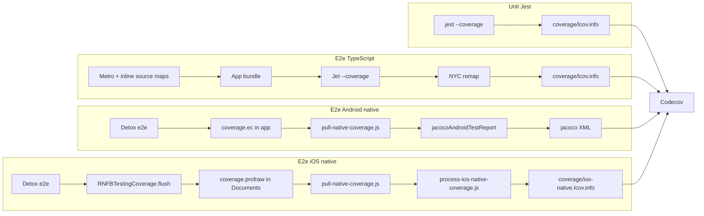

# Goals

Coverage exists to show which **TypeScript library sources** (`packages/*/lib/**`) and **native module sources** (Java, Objective-C, Swift under `packages/*/android/**` and `packages/*/ios/**`) are exercised by tests.

| Layer | What it proves | Primary consumers |
|-------|----------------|-------------------|
| **Unit (Jest)** | Package logic in isolation with mocks | Fast feedback on `packages/*/lib/**` |
| **E2e (Jet / Detox)** | Real app behaviour against Firebase emulators | Integration coverage for TS + native bridges |

Codecov merges uploads from CI into a single project view. Small project-level percentage swings can be noise (non-deterministic indirect lines); **file-level** coverage on `packages/*/lib/modular/**` and native startup files is the meaningful signal.

macOS e2e uses the **firebase-js-sdk** only — native RNFB coverage is not applicable there.

# End-to-end overview



# Unit coverage (Jest)

## Command

```bash
yarn tests:jest-coverage
```

## Tooling

- **Provider:** Jest with `coverageProvider: "babel"` (Istanbul via `babel-jest`), **not** NYC.
- **Scope:** `packages/**/__tests__/**` only (see root `jest.config.js`).
- **Output:** `coverage/lcov.info` at repo root (among other Istanbul artifacts).

## Behaviour

Jest instruments TypeScript/JavaScript directly under `packages/*/lib/**`. No source-map remapping is required because tests import library sources, not Metro bundles.

# E2e TypeScript coverage (Jet + NYC)

## Commands

| Platform | Yarn script | Notes |
|----------|-------------|-------|
| macOS | `yarn tests:macos:test-cover` | Jet only |
| iOS CI | `yarn tests:ios:test-cover` | Detox → Jet `--coverage` |
| iOS local (reuse build) | `yarn tests:ios:test-cover-reuse` | Same; Jet self-wraps under NYC when `--coverage` is passed |
| Android | `yarn tests:android:test-cover` | Detox → Jet `--coverage` |

Android/iOS run Detox, which spawns Jet with `--coverage`. macOS runs Jet directly.

## Tooling

- **Metro** bundles `packages/*/dist/module/**` with inline source maps (`tests/.babelrc`: `useInlineSourceMaps: true`).
- **NYC** (`tests/nyc.config.js`) collects coverage from instrumented bundles, remaps to `packages/*/lib/**` via source maps, and writes **`coverage/lcov.info`** (NYC `cwd: '..'`).
- **Jet self-wrap:** When `--coverage` is passed, `tests/node_modules/jet/jet.js` re-invokes itself under `tests/node_modules/.bin/nyc` (checks `NYC_CONFIG` to avoid double-wrap). Detox/macOS do **not** need an extra `nyc` prefix on the yarn script — only Jet needs to run from the `tests/` directory so it can find NYC.
- **Transfer:** Patched Jet / mocha-remote send coverage over the existing WebSocket (`coverage-data` event), replacing HTTP POST that failed on large (~4.5MB+) payloads. Patches live in `.yarn/patches/` (`jet`, `mocha-remote-client`, `mocha-remote-server`).

## Key NYC settings

```javascript
include: ['packages/*/lib/**/*.{js,ts,tsx}', 'packages/*/dist/**/*.js'],
sourceMap: true,
'exclude-after-remap': true,
instrument: false,
reporter: ['lcov', 'html', 'text-summary'],
```

## Verification

After a Detox/macOS e2e run, expect log lines like `[jet-coverage] WS received N file(s)` and an NYC summary. `coverage/lcov.info` should contain `SF:packages/...` paths (not only `packages/*/dist/...`).

# E2e Android native coverage (Jacoco)

## Pipeline

1. Gradle enables `testCoverageEnabled` on RNFB Android library modules (`tests/android/build.gradle`).
2. Detox e2e runs; the instrumented app writes `coverage.ec`.
3. When the Jet process exits successfully, `tests/scripts/pull-native-coverage.js` copies the `.ec` file to `tests/android/app/build/output/coverage/emulator_coverage.ec`. **A failed pull logs a warning and does not fail the Detox test** (intermittent on CI when `coverage.ec` is not flushed in time). Jacoco report may be empty for that run.
4. `yarn tests:android:test:jacoco-report` runs `jacocoAndroidTestReport`, producing XML at:

   `tests/android/app/build/reports/jacoco/jacocoAndroidTestReport/jacocoAndroidTestReport.xml`

CI runs steps 3–4 in sequence inside the emulator job.

## Jacoco configuration notes

- Class directories must use the AGP 8.x path: `build/intermediates/javac/debug/compileDebugJavaWithJavac/classes` (not legacy `.../debug/classes`).
- Source directories must include `src/reactnative/java` where modules place React Native entry code (e.g. `ReactNativeFirebaseAppInitProvider`).
- Module list comes from `rootProject.ext.firebaseModulePaths` populated in `tests/android/build.gradle`.
- `tests/android/app/jacoco.gradle` defines three report tasks sharing the same AGP 8 class paths and `firebaseModulePaths` source dirs:
  - **`jacocoAndroidTestReport`** — e2e only (`**/*.ec` from Detox pull)
  - **`jacocoUnitTestReport`** — unit tests only (`**/*.exec`; for when module/app unit tests are added)
  - **`jacocoTestReport`** — merged unit + e2e (`**/*.exec` and `**/*.ec`)
  CI uses `jacocoAndroidTestReport` after Detox.

# E2e iOS native coverage (LLVM)

## Pipeline

1. **Build-time instrumentation:** LLVM profile flags are set in **`tests/ios/Podfile` `post_install`** only (run `pod install` after checkout):
   - **`testing` app target:** compile + link profile flags, plus Swift toolchain library search paths (needed when linking Firebase Swift static pods on CI)
   - **`RNFB*` pod targets:** compile-time profile flags only — **not** `-fprofile-instr-generate` on `OTHER_LDFLAGS` for third-party / Firebase pods (breaks `swiftCompatibility56` linking on CI)
2. **Runtime flush:** At app launch, `RNFBTestingConfigureCoverageProfilePath()` sets the profile output to `Documents/coverage.profraw`. After all Mocha tests complete, the Jet `after` hook in `tests/app.js` calls `NativeModules.RNFBTestingCoverage.flush()` (native module exported via `RCT_EXPORT_MODULE(RNFBTestingCoverage)`). **Do not use a custom URL scheme** — iOS shows an “Open in 'testing'?” dialog that blocks Detox.
3. **Pull:** When the Jet process exits with code 0, `tests/scripts/pull-native-coverage.js` copies profraw from the simulator app container to `tests/ios/build/output/coverage/simulator_coverage.profraw`. **The Detox test fails if no profraw is found.** Pull happens on Jet `close` (not in `afterAll`) so it runs before Detox environment teardown.
4. **Post-test export:** `yarn tests:ios:test:process-coverage` runs `tests/scripts/process-ios-native-coverage.js`, which:
   - exits **1** if no `.profraw` files are present (missing profraw after a successful e2e means flush or pull failed)
   - merges `.profraw` from `tests/ios/build/output/coverage/` (Detox) and optionally `Build/ProfileData/` (`xcodebuild test` only — not used by Detox today)
   - exports lcov with `xcrun llvm-cov export -format=lcov` against the main app binary (statically linked RNFB code), writing to a temp file (large reports exceed Node stdout buffer limits)
   - streams and rewrites `SF:` paths to repo-relative `packages/**` paths
   - writes **`coverage/ios-native.lcov.info`**
   - **deletes the processed `.profraw` files** so a missing file on the next run is a clear signal that e2e did not produce fresh native coverage

## Objective-C and Swift

Both languages are covered by the same LLVM pipeline. Swift files (e.g. under `packages/firestore/ios/**`) appear in the exported lcov alongside `.m` / `.mm` files.

Most entries in the raw llvm-cov export are Pods/SDK/system code; only paths under `packages/` matter for Codecov. A healthy full e2e run typically reports on the order of **~50–60 `packages/*/ios/**` files** among ~2000 total source entries.

## CocoaPods → SPM

The Podfile `post_install` coverage flags are temporary. When native dependencies move to SPM, enable the same build settings on SPM targets; the post-test script remains unchanged.

# Codecov uploads (CI)

CI uses [codecov-action](https://github.com/codecov/codecov-action) v6 with `verbose: true`. It discovers coverage files under the repo, including:

| Workflow | Artifacts |
|----------|-----------|
| `tests_jest.yml` | `coverage/lcov.info`, `coverage-final.json`, `clover.xml` |
| `tests_e2e_android.yml` | `coverage/lcov.info` + Jacoco XML |
| `tests_e2e_other.yml` | `coverage/lcov.info` (macOS TS) |
| `tests_e2e_ios.yml` (debug) | `coverage/lcov.info` + `coverage/ios-native.lcov.info` |

The iOS workflow runs `yarn tests:ios:test:process-coverage` after Detox (`if: always()`, `continue-on-error: true` for now). The process step exits 1 when profraw is missing.

## File naming

The repo standard for JavaScript lcov is `coverage/lcov.info`. iOS native uses **`coverage/ios-native.lcov.info`**. Codecov detects **lcov format by file content**, not only by the exact name `lcov.info`.

Check the Codecov commit **Uploads** tab for **Processed** vs **Unusable** per upload — that is the authoritative signal, not small project percentage deltas.

# Local iteration

```bash
# Full iOS (build once, then reuse)
yarn tests:ios:build
yarn tests:ios:test-cover-reuse
yarn tests:ios:test:process-coverage

# Or combined
yarn tests:ios:test-cover-and-process   # clean Detox run + process (no --reuse)

# Android (after e2e)
yarn tests:android:test-cover-reuse
yarn tests:android:test:jacoco-report

# Codecov CLI (optional)
.codecov-venv/bin/codecovcli upload-process \
  -t "$CODECOV_TOKEN" -r invertase/react-native-firebase \
  --git-service github -C "$(git rev-parse HEAD)" -B "$(git branch --show-current)" \
  -f coverage/ios-native.lcov.info -n local-ios-native --disable-search
```

Metro must be running (`yarn tests:packager:jet`) for Detox e2e.

# Critical invariants

These must all be true for native iOS coverage to work. If any break, the e2e test should fail (not silently upload stale data).

| Invariant | Where enforced |
|-----------|----------------|
| App built with LLVM profile flags | `Podfile` `post_install` (run `pod install`) |
| Profile path set at launch | `AppDelegate` → `RNFBTestingConfigureCoverageProfilePath()` |
| JS module name matches native export | `RCT_EXPORT_MODULE(RNFBTestingCoverage)` + `NativeModules.RNFBTestingCoverage` in `tests/app.js` |
| Flush runs after Mocha tests | Jet `after` hook in `tests/app.js` |
| Profraw pulled before Detox teardown | `pull-native-coverage.js` on Jet `close` in `firebase.test.js` |
| Fresh profraw processed after e2e | `process-ios-native-coverage.js` (deletes profraw after export) |

# Troubleshooting

| Symptom | Likely cause | Fix |
|---------|--------------|-----|
| Simulator “Open in 'testing'?” dialog | Custom URL scheme handler | Use native module flush only; no `rnfb-testing://` |
| No profraw after e2e; test still passes (old behaviour) | Pull in `afterAll` after `detox.cleanup()`, or wrong module name | Pull on Jet `close`; verify `RNFBTestingCoverage` export name |
| Stale profraw uploaded | Re-processed old file without re-running e2e | Process step deletes profraw after export; missing file + exit 1 on next process |
| `process-ios-native-coverage` succeeds but no `packages/` hits | Wrong binary / not instrumented | Rebuild with `yarn tests:ios:build`; check Podfile flags |
| Empty Jacoco XML (~235 bytes) | AGP 8 class path, missing `src/reactnative/java`, or no `coverage.ec` pulled | See `jacocoAndroidTestReport`; check `[native-coverage] Android native coverage pull failed` warning |
| iOS link: `swiftCompatibility56` undefined | Profile link flags applied to all Pods | Restrict `OTHER_LDFLAGS` profile flags to app target; RNFB pods compile-only |
| No `[jet-coverage] WS received` lines | Patches not applied | `yarn install` from repo root; check `.yarn/patches/` |
| NYC summary missing / empty `lcov.info` | Jet not run from `tests/` cwd | Detox spawns `yarn jet` inside `tests/`; macOS uses `cd tests && npx jet` |
| Codecov upload **Unusable** | Wrong `SF:` paths | Confirm path rewrite in `process-ios-native-coverage.js`; check Uploads tab message |

# Future cleanups (non-blocking)

- **CI:** drop `continue-on-error: true` on the iOS process-coverage step once stable in CI.

# Citations

[1] [Open Knowledge Format (OKF) specification](https://github.com/GoogleCloudPlatform/knowledge-catalog/blob/main/okf/SPEC.md)
[2] [Codecov CLI documentation](https://docs.codecov.com/docs/the-codecov-cli)
