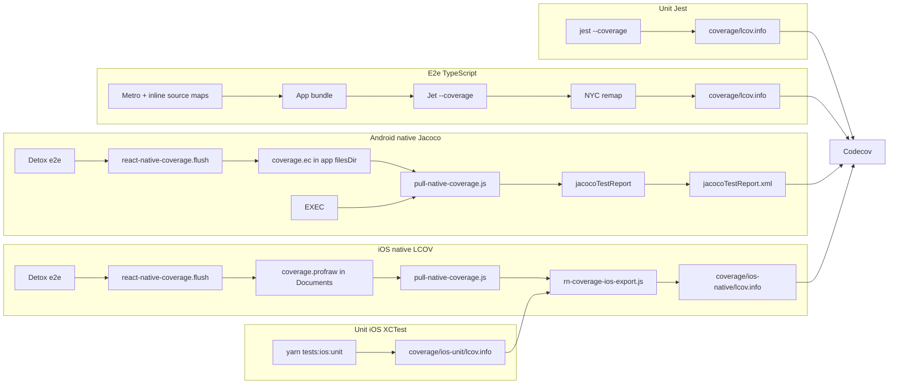

# Goals

Coverage shows exercised **TS library sources** (`packages/*/lib/**`), **native sources** (`packages/*/{android,ios}/**`), and **iOS Ruby helpers** (`packages/app/**/*.rb`, exclude `__tests__`).

| Layer | Proves | Consumers |
|-------|--------|-----------|
| **Unit (Jest)** | Package logic with mocks | Fast feedback on `lib/**` |
| **Unit (iOS Ruby)** | CocoaPods/SPM helper logic (`firebase_spm.rb`, etc.) via Minitest + SimpleCov | Fast feedback on `packages/app/**/*.rb`; LCOV `coverage/ios-ruby/lcov.info` |
| **Unit (Android JVM)** | Java state-machine / bridge logic — [AndroidTest-AD-1](android-architecture-decisions.md#androidtest-ad-1) | Fast feedback on `packages/*/android/**`; Jacoco `*.exec` |
| **Unit (iOS XCTest)** | Foundation/UIKit-free native logic — [IosTest-AD-1](ios-architecture-decisions.md#iostest-ad-1) | Fast feedback on `packages/*/ios/**`; LCOV merged into `coverage/ios-native/lcov.info` |
| **E2e (Jet / Detox)** | Real app behaviour against Firebase emulators and cloud APIs | TS + native bridge integration |

Codecov merges CI uploads. Project-level % can be noise; **file-level changed-source coverage** is signal. macOS e2e uses firebase-js-sdk only; no RNFB native coverage.

**Android native coverage** merges JVM unit (`*.exec`) and e2e (`*.ec`) into **`jacocoTestReport`** — that merged XML is what Codecov `android-native` uploads. Lines exercised only by allowlisted Android unit tests **count** toward the 100% touched-line bar below.

**iOS native coverage** merges in-package XCTest LCOV (`coverage/ios-unit/lcov.info` from `yarn tests:ios:unit`) and e2e LLVM export into **`coverage/ios-native/lcov.info`**. Lines exercised only by allowlisted iOS unit tests **count** toward the 100% touched-line bar — [IosTest-AD-1](ios-architecture-decisions.md#iostest-ad-1).

# Coverage expectations (policy)

For **new code**:

* **Coverage only goes up** on files the change touches.
* **100% on touched TS/native/Ruby helper sources is the requirement**, not an aspiration. "Mostly covered" does not close the gate.
* **Android JVM unit Jacoco (`*.exec`)** counts toward that bar when allowlisted tests under `packages/*/android/src/test/java` exercise the touched lines — scope and e2e non-substitution: [AndroidTest-AD-1](android-architecture-decisions.md#androidtest-ad-1); platforms where the module loads still need e2e ([platform coverage gate](running-e2e.md#platform-coverage-gate-blocking)).
* **iOS XCTest LCOV** counts toward that bar when allowlisted in-package tests (`yarn tests:ios:unit`) exercise touched `packages/*/ios/**` lines; unit LCOV **must merge** into `coverage/ios-native/lcov.info` — [IosTest-AD-1](ios-architecture-decisions.md#iostest-ad-1); [§ Unit coverage (iOS XCTest)](#ios-xctest-unit-lcov).
* **iOS Ruby SimpleCov** counts toward that bar for touched `packages/app/**/*.rb` (exclude `__tests__`) when exercised by `yarn tests:ios:ruby` — [§ iOS Ruby SimpleCov](#ios-ruby-simplecov).
* **The only acceptable uncovered line is covered by an [acceptable exception](change-authoring-workflow.md#acceptable-exceptions)** — an evidence-backed intractable limitation, quantified (e.g. "~NN% provably-unreachable Swift codegen"), or a user-accepted deferral with recorded rationale.
* **HandleMap TurboModule/Helper wiring** is a user-accepted exception to that 100% bar: lines that only delegate to a package Registry or `RNFBHandleMap` (`put` / `get` / `take` / `takeAll`) may stay uncovered. Do **not** extract a production `*Bridge` type solely so XCTest/JUnit can compile those TurboModule branches. Non-trivial lifecycle (replace = take then put, take-if-idle, take-then-abort / abort-all, unique-put collision abort) belongs on Registry or an existing holder — [IosTest-AD-1](ios-architecture-decisions.md#iostest-ad-1).
* **Every other gap is testable or dead code** — add the test (negative paths, failure branches, every reachable branch) or delete the unreachable/duplicate/superseded code.

An uncovered line surfaced in `independent-review` is a review finding subject to [zero-deferral resolution](change-authoring-workflow.md#review-findings--resolve-do-not-defer): fix it (add the test or delete the code) or clear it against the bar. Gap passes **add tests and remove dead code** together.

## Coverage as completion signal

File-level coverage, not green tests/types alone, marks completion.

1. **Baseline** after full e2e (all relevant platforms).
2. Implement with tests.
3. **After** full e2e with single-test/suite narrowing reverted (area narrowing may persist per package workflow until pre-merge).
4. Touched files: coverage **only rises** until **intractable limits** (above).

**Plateau below that limit → refactor**, not ship:

* Large uncovered native blocks often mean **dormant code paths** — use coverage to find the live path, delete the rest.
* Duplicate traversal (e.g. visiting the same tree property twice) can pass tests while leaving untestable structure — simplify until coverage rises.

Do not hand off closable gaps. Package workflows may define snapshot tooling (e.g. [pipeline scripts](../packages/firestore/pipeline-implementation-workflow.md)).

<a id="coverage-evidence-package"></a>

## Coverage evidence package

**Blocking.** Required before **`review` gate** closes when the frozen diff touches `packages/*/lib/**`, native bridge sources (`packages/*/{android,ios}/**`), **or** iOS Ruby helpers (`packages/app/**/*.rb`). Jest green alone is insufficient.

Produce after fresh e2e on every required platform (when native/lib touched), then post-process native artifacts ([§ stale coverage](#stale-coverage-data)); for Ruby-only diffs, fresh `yarn tests:ios:ruby` is enough:

| Section | Contents |
|---------|----------|
| **Artifacts** | Timestamps for `coverage/ios-native/lcov.info`, `coverage/ios-ruby/lcov.info` (when Ruby touched), Android merged `jacocoTestReport.xml` (unit `*.exec` + e2e `*.ec`), and any Jest coverage run |
| **Touched regions** | Per-file or per-function line % for changed logic (not whole-package aggregates only) |
| **Branch map** | Table: branch / input shape → test or e2e that exercises it |
| **Gaps** | Every line or branch below 100%: **fix** (test or delete dead code), or **acceptable exception** with wire/runtime evidence in durable OKF (e.g. [pipeline platform parity](../packages/firestore/pipeline-platform-parity.md) probe row) |

**Verdict line:** `100% on reachable touched lines` **or** `NOT 100%` with numbered gaps and disposition (fixed / intractable with evidence / user-accepted deferral).

Record in `.agents/reports/<item>/coverage-evidence.md` (preferred) or work-queue notes. Orchestrators **must not** close `coverage_evidence_gate` or `review_gate` without this file when lib/native bridge is touched.

Reviewers treat missing, stale, or NYC-only summaries as a **serious** finding ([change authoring § independent-review](change-authoring-workflow.md#independent-review)).

### Subagent return fields (native / lib bridge touched)

Blocking YAML (or equivalent table) before `coverage_evidence_gate` closes:

```yaml
coverage_verdict: "100% on reachable touched lines" | "NOT 100%"
coverage_artifacts:
  jacoco_xml: path   # Android; use lcov path for iOS native
  timestamp: ISO-8601
touched_regions:
  - file: packages/.../Foo.java
    lines: "L10-L45"
    line_pct: 100
branch_map:
  - branch: "onComplete when still registered"
    test: "Functions.e2e.js — streaming cancel race"
gaps: []  # or numbered: disposition fixed | intractable+evidence | user-accepted deferral
```

<a id="anti-patterns-not-coverage-evidence"></a>

### Anti-patterns (not coverage evidence)

| Looks like coverage | Why it is not |
|---------------------|---------------|
| Jet NYC `text-summary` after narrowed `:test-cover` | Remapped TS aggregate for loaded modules — does not report Jacoco/lcov on native bridge lines |
| Whole-package or whole-harness statement % | Signal is **per changed file/region** in the frozen diff |
| Stale Jacoco XML / lcov without matching e2e run | Post-process deletes raw artifacts; re-run e2e first ([§ stale coverage](#stale-coverage-data)) |
| E2e pass counts alone | Proves behaviour, not line/branch coverage on touched native code |

## Platform parity (pipeline and bridge code)

For native-bridge features, **platform parity precedes coverage expansion**: iOS/Android/macOS behavior must match unless blocked by native SDK. RNFB bridge gaps are defects, not permanent `Platform.*` e2e branches.

* **Policy and drift registry:** [Pipeline platform parity](../packages/firestore/pipeline-platform-parity.md)
* **Work queue:** [Pipeline coverage and parity work queue](../packages/firestore/pipeline-coverage-work-queue.md)

## Reading per-file coverage locally

After `tests:<platform>:test-cover`:

* **JS:** `npx jest <path> --coverage --collectCoverageFrom='packages/<pkg>/lib/**/*.ts' --coverageReporters=text`
* **iOS Ruby:** `yarn tests:ios:ruby` → `coverage/ios-ruby/lcov.info` (`SF:` / `DA:` lines); HTML under `coverage/ios-ruby/` — [§ iOS Ruby SimpleCov](#ios-ruby-simplecov)
* **iOS native:** `yarn tests:ios:unit` → `coverage/ios-unit/lcov.info` (merged into `coverage/ios-native/lcov.info`). After e2e: `yarn tests:ios:test:process-coverage` → e2e LLVM export **then merge unit LCOV** → `coverage/ios-native/lcov.info` (`DA:` lines). **Deletes processed `.profraw`** — re-run e2e before re-processing.
* **Android native:** `yarn tests:android:unit` (produces module `*.exec`) then e2e + `yarn tests:android:post-e2e-coverage` → merged **`jacocoTestReport`** XML per `sourcefile`. **Deletes processed `emulator_coverage.ec`** after a successful report — re-run e2e before re-processing. Unit-only: `yarn tests:android:test:jacoco-report` (same merged task; needs fresh `*.exec` and any available `*.ec`).
* macOS e2e overwrites `coverage/lcov.info`; process iOS/Android native before a macOS run if you need both.

**Baseline stability (repeatability):** after two full Law `:test-cover` (+ process) cycles on one slot, record metrics with `yarn tests:coverage:capture-baseline` → `tests/coverage-artifacts/coverage-baseline.json` (see `tests/coverage-artifacts/README.md`). Provisional relative variance threshold **T=1%** between run 1 and run 2; `--finalize` compares observed variance to T.

<a id="ios-ruby-simplecov"></a>

## iOS Ruby SimpleCov

Minitest suites under `packages/app/__tests__/*_test.rb` cover production Ruby helpers (`packages/app/**/*.rb`, excluding `__tests__`).

| Item | Value |
|------|-------|
| **Command** | `yarn tests:ios:ruby` (after `yarn ruby:install` or root `yarn`; CI uses `BUNDLE_FROZEN=true bundle install`) |
| **Runner** | `packages/app/__tests__/run_with_coverage.rb` — SimpleCov starts before any production `.rb` / suite load; glob-discovers all `*_test.rb`; each suite runs in an **isolated subprocess** (mock unit vs real cocoapods/xcodeproj cannot share a process); Coverage counters are peek-merged across production `load` resets |
| **LCOV** | `coverage/ios-ruby/lcov.info` (repo-relative `SF:…/packages/app/…`) |
| **HTML** | `coverage/ios-ruby/index.html` (optional local browse) |
| **Codecov flag** | `ios-ruby` — dedicated upload from `tests_e2e_ios.yml` debug+spm cell (same regime as `jest`: flag upload, **no** `flag_management` hard gate; local OKF review gate owns the touched-line bar) |
| **CI** | `tests_e2e_ios.yml` (debug + spm): `BUNDLE_FROZEN=true bundle install` → yarn → `yarn tests:ios:ruby` → Codecov `flags: ios-ruby`. Not run on Jest or `tests_e2e_other.yml` — iOS job guarantees clang/ar/file for embed suites |
| **Gems** | Committed root `Gemfile`/`Gemfile.lock` (+ `CHECKSUMS`); Dependabot `bundler` at `/` (cooldown in dependabot.yml — not Gemfile `cooldown:`, which needs Bundler 4+) |

**Review gate:** when the frozen diff touches `packages/app/**/*.rb` or `packages/app/__tests__/*_test.rb`, `review_gate` **cannot close** without `yarn tests:ios:ruby` exit 0 and coverage evidence that touched production Ruby lines have test support ([validation checklist § iOS Ruby](validation-checklist.md#ios-ruby-unit-tests)).

## Stale coverage data

Native artifacts (`.profraw`, `.ec`, Jacoco XML) are trustworthy only with the fresh e2e run that produced them. Re-processing leftovers can create valid-looking stale reports.

If numbers look wrong, run the clean cycle before debugging generators — e2e steps: [running e2e § Rules](running-e2e.md#rules) and [typical loop](running-e2e.md#typical-loop); then post-process below (this doc owns post-e2e coverage export only). Android merge needs fresh unit `*.exec` as well — [Local iteration](#local-iteration):

```bash
yarn tests:ios:test:process-coverage
yarn tests:ios:unit                    # fresh coverage/ios-unit/lcov.info merged into ios-native
yarn tests:android:unit                # fresh module *.exec when Android native touched
yarn tests:android:post-e2e-coverage
```

Post-process deletes raw iOS `.profraw` / Android `.ec`; missing raw file means "no fresh coverage." Do not use reuse variants for native deltas ([runbook](running-e2e.md)).

# End-to-end overview


```mermaid
flowchart LR
  subgraph unit [Unit Jest]
    J1[jest --coverage] --> J2[coverage/lcov.info]
  end
  subgraph ios_unit [Unit iOS XCTest]
    U2[yarn tests:ios:unit] --> UNITLCOV["coverage/ios-unit/lcov.info"]
  end
  subgraph ts_e2e [E2e TypeScript]
    M[Metro + inline source maps] --> A[App bundle]
    A --> J[Jet --coverage]
    J --> N[NYC remap]
    N --> T2[coverage/lcov.info]
  end
  subgraph android_native [Android native Jacoco]
    D1[Detox e2e] --> FLA["react-native-coverage.flush"]
    FLA --> EC[coverage.ec in app filesDir]
    EC --> P1[pull-native-coverage.js]
    EXEC --> P1
    P1 --> JTR[jacocoTestReport]
    JTR --> AX[jacocoTestReport.xml]
  end
  subgraph ios_native [iOS native LCOV]
    D2[Detox e2e] --> FLI["react-native-coverage.flush"]
    FLI --> PR[coverage.profraw in Documents]
    PR --> P2[pull-native-coverage.js]
    P2 --> LLVM[rn-coverage-ios-export.js]
    UNITLCOV --> LLVM
    LLVM --> I2[coverage/ios-native/lcov.info]
  end
  J2 --> C[Codecov]
  T2 --> C
  AX --> C
  I2 --> C
```

# Unit coverage (Android JVM)

```bash
yarn tests:android:unit
```

- Runner choice and `@Config` / `sdk` policy under `packages/*/android/src/test/java` — [AndroidTest-AD-1](android-architecture-decisions.md#androidtest-ad-1).
- Gradle entry: `tests/android` `./gradlew rnfbDebugUnitTests` (all RNFB library `:testDebugUnitTest` tasks).
- Output: Jacoco `*.exec` under each module `build/` (and app build tree as configured).
- **Counts toward** the 100% touched-line bar when allowlisted unit tests exercise those lines.
- Not a substitute for e2e on platforms where the module loads ([platform coverage gate](running-e2e.md#platform-coverage-gate-blocking)).

<a id="ios-xctest-unit-lcov"></a>

# Unit coverage (iOS XCTest)

```bash
yarn tests:ios:unit
```

- Host/macOS-first in-package xcodeproj — [IosTest-AD-1](ios-architecture-decisions.md#iostest-ad-1).
- Discovers `packages/*/ios/*UnitTests/*.xcodeproj`; LLVM export → `coverage/ios-unit/lcov.info`.
- **Merges into** `coverage/ios-native/lcov.info` (create or max-hits merge per `SF:`/`DA:`). After e2e, `rn-coverage-ios-export.js` merges the same unit file so e2e export does not drop XCTest hits.
- **Counts toward** the 100% touched-line bar when allowlisted unit tests exercise those lines.
- Not a substitute for e2e on platforms where the module loads ([platform coverage gate](running-e2e.md#platform-coverage-gate-blocking)).

# Unit coverage (Jest)

```bash
yarn tests:jest-coverage
```

- Jest + `coverageProvider: "babel"` (Istanbul), **not** NYC.
- Scope: `packages/**/__tests__/**` (`jest.config.js`).
- Output: `coverage/lcov.info` at repo root.
- Instruments `packages/*/lib/**` directly — no source-map remap.

# E2e TypeScript coverage (Jet + NYC)

**Run e2e:** [running e2e § Rules](running-e2e.md#rules) — canonical `:test-cover` commands only; do not duplicate them here.

| Platform | Entry (repo root) | Notes |
|----------|-------------------|-------|
| macOS | `tests:macos:test-cover` | See runbook |
| iOS | `tests:ios:test-cover` | See runbook |
| Android | `tests:android:test-cover` | See runbook |

Jet self-wraps under NYC with `--coverage`.

**Tooling:**

- Metro bundles `packages/*/dist/module/**` with inline source maps (`tests/.babelrc` and `tests-macos/.babelrc`: `useInlineSourceMaps: true`).
- NYC (`tests/nyc.config.js` and `tests-macos/nyc.config.js`) remaps to `packages/*/lib/**` → **`coverage/lcov.info`** (`cwd: '..'`).
- Jet re-invokes under the test-app `nyc` (checks `NYC_CONFIG`) — `tests/` for iOS/Android, `tests-macos/` for macOS. Detox/macOS need no extra `nyc` prefix; start Jet only via [running e2e](running-e2e.md) packager commands.
- iOS/Android Jet-close also uses package `rn-coverage js pull`; their native post-processing
  entrypoints run `rn-coverage js report` into `coverage/js/<platform>/lcov.info`, using
  `tests/nyc.config.js` for source-map remap. This supplements rather than replaces the RNFB
  Jet/NYC transport and its `coverage/lcov.info` artifact.
- **Transfer:** patched test-runner/mocha-remote WS only (`coverage-ready` → `pull-coverage` → `coverage-data` → `coverage-ack`); HTTP POST `/coverage` deleted (`attachHttpServer` removed). Host launch/orchestrate control uses a **separate** HTTP server on **8091** (not the 8090 WS stack) — see [test-runner orchestration (log triage)](running-e2e.md#test-runner-host-orchestration-log-triage-only). Patches: `.yarn/patches/` (`jet`, `mocha-remote-client`, `mocha-remote-server`). See [iOS issues 6–6b](../ci-workflows/ios.md#6-jet-websocket-disconnect-1006--1001), [issue 8](../ci-workflows/ios.md#8-coverage-teardown-handshake-failure-tests-pass-nyc-00), [jet patch workflow](../ci-workflows/detox-patches.md#updating-the-jet-patch-headless).

**NYC settings:**

```javascript
include: ['packages/*/lib/**/*.{js,ts,tsx}', 'packages/*/dist/**/*.js'],
sourceMap: true, 'exclude-after-remap': true, instrument: false,
reporter: ['lcov', 'html', 'text-summary'],
```

**Verify:** `coverage-ready` → `WS received N file(s)` (N > 0) → non-zero NYC; `coverage/lcov.info` has `SF:packages/...`, not only `dist/`. If `merged 0 file(s)`, see [troubleshooting](#ts-e2e-coverage-troubleshooting).

### TS e2e coverage troubleshooting

| Symptom | Cause | Fix |
|---------|-------|-----|
| `[jet-coverage] merged 0 file(s)` | Stale Metro bundle or missing test-runner patch | `yarn install`; macOS: restart packager per [running e2e § Rules #1](running-e2e.md#rules) |
| macOS bundle still has `'/coverage'` fetch | Metro resolves Jet via `"react-native": "src/index"` — patch must touch `jet/src/index.tsx`, not only `lib/` | Re-run after patch; `--reset-cache` |
| iOS/Android merged 0, macOS OK | Prebuilt app bundle predates Istanbul fix | Re-run [running e2e § Rules](running-e2e.md#rules) (`:build` then `:test-cover`) |
| Metro 500 on bundle | Missing babel plugins in `tests/` | `yarn install`; confirm `tests/node_modules/babel-plugin-istanbul` exists |

# Android native (Jacoco — unit + e2e merged)

1. Package `rn-coverage.gradle` on RNFB modules (applied from `tests/android/build.gradle`): `enableAndroidTestCoverage = true` (e2e `*.ec`); `enableUnitTestCoverage = false` (parity with package helper — AGP library unit probes are empty; JVM unit `*.exec` comes from the separate unit path).
2. **JVM unit:** `yarn tests:android:unit` before or independent of Detox — produces module `*.exec`.
3. Jet `after` in `tests/app.js` → `react-native-coverage.flush()` in **app** process → `coverage.ec` in `filesDir` **before** Detox SIGINT.
4. After Detox: `yarn tests:android:post-e2e-coverage` (or `pull-native-coverage --android-post-e2e`) → `emulator_coverage.ec` → **`jacocoTestReport`** (merged unit `*.exec` + e2e `*.ec`) → **delete local `.ec`** → **presence assert** (invertase package LINE hits must be non-empty; exit **2** when strict). Missing `.ec` in strict mode (default): **exit 2** — silent empty e2e coverage must fail CI. Soft local: `--no-strict` / `RNFB_COVERAGE_STRICT=0`. Codecov upload may still use `continue-on-error`; the post-e2e yarn step itself is the blocking guard.
5. XML uploaded to Codecov: `tests/android/app/build/reports/jacoco/jacocoTestReport/jacocoTestReport.xml`

**Why app-process flush:** Detox SIGINT kills instrumentation after Jet; post-`Detox.runTests()` dump in `DetoxTest.java` never runs.

**Jacoco notes:**

- AGP 8 classes: `build/intermediates/javac/debug/compileDebugJavaWithJavac/classes`
- Sources: include `src/reactnative/java`
- Modules: `rootProject.ext.firebaseModulePaths` (`tests/android/build.gradle`)
- Tasks in `tests/android/app/jacoco.gradle`:
  - **`jacocoTestReport`** — merged unit + e2e (`**/*.exec` + `**/*.ec`); **CI / Codecov `android-native` uses this**
  - `jacocoUnitTestReport` — unit only (`**/*.exec`)
  - `jacocoAndroidTestReport` — e2e only (`**/*.ec`); local diagnostic, **not** the Codecov upload path
- Yarn: `tests:android:post-e2e-coverage` and `tests:android:test:jacoco-report` both drive `jacocoTestReport`

# E2e iOS native (LLVM)

1. **Build:** LLVM flags in **`tests/ios/Podfile` `post_install`** (`pod install` after checkout):
   - **`testing` target:** compile + link profile flags + Swift toolchain search paths (Firebase static pods on CI)
   - **`RNFB*` pods:** compile-only flags — **no** `-fprofile-instr-generate` on pod `OTHER_LDFLAGS` (breaks `swiftCompatibility56` on CI)
   - **Coverage pod:** `ReactNativeCoverage.apply_post_install!` (writes `CoverageConfig.h` with `RNFB` prefixes)
2. **Runtime:** `react-native-coverage` constructor + TurboModule flush → `Documents/coverage-%m.profraw` (`LLVM_PROFILE_FILE`). Jet `after` → `flush()` (tracked RNFB frameworks, then app). **No custom URL scheme** (iOS "Open in 'testing'?" dialog blocks Detox).
3. **Pull:** Jet exit 0 → `pull-native-coverage.js` → `simulator_coverage.profraw`. **Fails if missing.** Pull on Jet `close`, not `afterAll` (before Detox teardown).
4. **Export:** `yarn tests:ios:test:process-coverage` / `rn-coverage-ios-export.js`:
   - delegates to `rn-coverage ios export` (llvm-cov + `SF:` rewrite + presence assert)
   - **merge** `coverage/ios-unit/lcov.info` when present (`tests/scripts/ios-native-lcov.js`) so XCTest counts for 100%
   - **delete processed `.profraw`** (package CLI; missing file next run = no fresh coverage)

ObjC + Swift share this. Raw export is mostly Pods/SDK; healthy full run includes ~50–60 `packages/*/ios/**` files among ~2000 entries.

### SPM + dynamic frameworks

**Tests Podfile default (dynamic):** RNFB pods stay separate `RNFB*.framework` images. Compile-only instrumentation is not enough — those frameworks must **link** the profile runtime (`link_profile: true` for `RNFB*` when `linkage == dynamic`, including `-Wl,-u,___llvm_profile_set_filename` so set_filename is not dead-stripped), flush must dump **each** loaded RNFB image, and `rn-coverage ios export` must pass every `RNFB*.framework` binary as an extra `llvm-cov -object` (`ios.frameworkNamePrefixes: ['RNFB']`). App-only export → **`packagesHits=0`**.

**Why per-image flush (not atexit alone):** each dynamic image links its own `clang_rt.profile` copy; `__llvm_profile_write_file` in the app only dumps the app image. `LLVM_PROFILE_FILE=…/coverage-%m.profraw` (set via `setenv` in the package constructor) makes atexit dumps unique per image, but Jet pulls `Documents/*.profraw` on Jet **close** — before `terminateApp` — so atexit has not run yet. Detox SIGKILL can also skip atexit. `react-native-coverage` therefore discovers `RNFB*.framework` images at load via `_dyld_register_func_for_add_image`, resolves each image's local `___llvm_profile_write_file` through `__LINKEDIT`, flushes tracked images on Jet `after`, then writes the app image last (so flush-path counters land in the pulled app profraw). Static linkage still merges RNFB into the app binary (compile-only + app flush). Never put profile **link** flags on third-party/Firebase pods (`swiftCompatibility56`).

# Codecov uploads (CI)

[codecov-action](https://github.com/codecov/codecov-action) v7, explicit `files` + `flags`. Upload steps continue on error; **blocking** = `codecov.yml` status checks.

## Flags

Names must match in **`codecov.yml`** and workflow `flags:`.

| Flag | Workflow | File | Blocks PR? |
|------|----------|------|------------|
| `jest` | `tests_jest.yml` | `coverage/lcov.info` | No |
| `ios-ruby` | `tests_e2e_ios.yml` (debug + spm) | `coverage/ios-ruby/lcov.info` | No (upload like `jest`; OKF review gate owns touched Ruby lines) |
| `e2e-ts-ios` | `tests_e2e_ios.yml` (debug) | `coverage/lcov.info` | No |
| `ios-native` | `tests_e2e_ios.yml` (debug) | `coverage/ios-native/lcov.info` | **Yes** |
| `e2e-ts-android` | `tests_e2e_android.yml` | `coverage/lcov.info` | No |
| `android-native` | `tests_e2e_android.yml` | `tests/android/app/build/reports/jacoco/jacocoTestReport/jacocoTestReport.xml` | **Yes** |
| `e2e-ts-macos` | `tests_e2e_other.yml` | `coverage/lcov.info` | No |

iOS release legs: no upload. macOS: TS only.

## Native gates

`carryforward: false`, `target: 1%` — gates **upload presence**, not % regression. Missing upload → 0% → fail. `codecov/project` overall: `informational: true`.

## CI steps before upload

| Workflow | Steps |
|----------|-------|
| `tests_jest.yml` | `yarn tests:jest-coverage` → Codecov `jest` |
| `tests_e2e_ios.yml` (debug) | `yarn tests:ios:unit` → Detox → `yarn tests:ios:test:process-coverage` (e2e LCOV + merge unit + presence assert; **no** `continue-on-error`; fails the job when Detox succeeded but coverage exited non-zero — same policy as Android); **debug+spm:** `yarn tests:ios:ruby` → Codecov `ios-ruby` |
| `tests_e2e_android.yml` | `yarn tests:android:build` → `yarn tests:android:unit` → Detox → `yarn tests:android:post-e2e-coverage` (merged `jacocoTestReport` + presence assert; CI script fails the job when tests passed but coverage exited non-zero) |
| `tests_e2e_other.yml` | macOS Jet e2e |

**Paths:** JS `coverage/lcov.info`; iOS Ruby `coverage/ios-ruby/lcov.info`; iOS native `coverage/ios-native/lcov.info`; Android merged native `tests/android/app/build/reports/jacoco/jacocoTestReport/jacocoTestReport.xml`. Uploads tab: **Processed** = good; **Unusable** = fix format/paths.

# Local iteration

E2e per [runbook](running-e2e.md), Android JVM unit + native post-processing:

```bash
yarn tests:android:unit
yarn tests:ios:unit
yarn tests:ios:test:process-coverage
yarn tests:android:post-e2e-coverage   # pulls .ec then jacocoTestReport (merged)
# optional explicit merge report without pull:
yarn tests:android:test:jacoco-report
```

Optional Codecov CLI:

```bash
.codecov-venv/bin/codecovcli upload-process \
  -t "$CODECOV_TOKEN" -r invertase/react-native-firebase \
  --git-service github -C "$(git rev-parse HEAD)" -B "$(git branch --show-current)" \
  -f coverage/ios-native/lcov.info -n local-ios-native --disable-search
```

No `:test-cover-reuse` / `:test-reuse` — stale native risk ([runbook](running-e2e.md)).

<a id="test-native-modules"></a>

# Test-app native modules vs coverage flush

Do **not** conflate coverage flush with e2e probes.

| Module | Kind | Role |
|--------|------|------|
| **`Coverage` (`react-native-coverage`)** | Package TurboModule | Flush only — [§ react-native-coverage](#react-native-coverage). |
| **`NativeRNFBTesting`** | Test-app TurboModule | E2e probes (`completesNonFCMRemoteNotification`, `messagingStoreSupportsDisabledStorage`, …) — [running e2e](running-e2e.md#test-app-native-modules). |
| **`RNFBTestingMessaging`** | Test-app `RCTBridgeModule` | iOS `messagingPreservesExistingDelegate` — [running e2e](running-e2e.md#test-app-native-modules). |

**Probe hits in native coverage:** Messaging e2e `getRNFBTesting().completesNonFCMRemoteNotification()` and `NativeModules.RNFBTestingMessaging.messagingPreservesExistingDelegate()` exercise product sources (for example `RNFBMessaging+AppDelegate.m` non-FCM `completionHandler`). Android e2e `getRNFBTesting().messagingStoreSupportsDisabledStorage()` exercises `ReactNativeFirebaseMessagingStoreImpl` disabled-storage paths. After iOS `:test-cover` and `yarn tests:ios:test:process-coverage`, iOS probe lines appear as hits in `coverage/ios-native/lcov.info` (Android probe hits land in Jacoco). Record them in the [coverage evidence package](#coverage-evidence-package); passing probes are not a substitute for that artifact.

# Config-driven native coverage (Pattern C)

Native coverage knobs for the dedicated test app live in `tests/react-native-coverage.config.js`
(package-aligned shape). Node scripts load that file; Gradle copies are generated via
`yarn tests:coverage:generate-native-config` (`tests/android/coverage.properties`). LLVM
profile path and TurboModule flush come from **`react-native-coverage`**. Jacoco merge
(unit `*.exec` + e2e `*.ec`, `src/reactnative/java`) stays in `tests/android/app/jacoco.gradle`.

<a id="react-native-coverage"></a>

# react-native-coverage (tests app only)

Pattern C: only the **tests** workspace depends on published `react-native-coverage`:

```json
"react-native-coverage": "0.2.0"
```

in `tests/package.json`. Host yarn scripts call package `rn-coverage` (`tests/scripts/rn-coverage-*.js`,
`pull-native-coverage.js`). Runtime flush uses the package TurboModule (`Coverage` / `flush()`).
Test-app probe modules (`NativeRNFBTesting`, `RNFBTestingMessaging`) are **not** flush — [running e2e § test-app native modules](running-e2e.md#test-app-native-modules).

# Critical invariants

| Invariant | Enforced |
|-----------|----------|
| LLVM profile flags (iOS) | `Podfile` `post_install` + `ReactNativeCoverage.apply_post_install!` |
| Profile path at launch (iOS) | `react-native-coverage` constructor (`CoverageConfigureProfilePath`) |
| Jacoco instrumentation (Android) | package `rn-coverage.gradle` (`enableAndroidTestCoverage = true`, `enableUnitTestCoverage = false`) |
| Module name | `Coverage` / `react-native-coverage.flush()` |
| Flush after Mocha | Jet `after` in `tests/app.js` |
| Profraw pull before Detox teardown (iOS) | `pull-native-coverage.js` on Jet `close` in `firebase.test.js` |
| Android JVM unit before / with merge | `yarn tests:android:unit` → module `*.exec` |
| iOS XCTest unit merged into ios-native | `yarn tests:ios:unit` → `coverage/ios-unit/lcov.info` merged into `coverage/ios-native/lcov.info` |
| Android ec pull after Detox | `yarn tests:android:post-e2e-coverage` → **`jacocoTestReport`** (not e2e-only `jacocoAndroidTestReport`) |
| Codecov android-native file | `jacocoTestReport/jacocoTestReport.xml` |
| Fresh profraw processed (iOS) | `rn-coverage-ios-export.js` (package CLI) deletes after export |
| Fresh ec processed (Android) | `pull-native-coverage.js` deletes local `.ec` after successful Jacoco report |
| JVM unit ≠ e2e substitute | [AndroidTest-AD-1](android-architecture-decisions.md#androidtest-ad-1); [platform coverage gate](running-e2e.md#platform-coverage-gate-blocking) still applies |
| iOS XCTest ≠ e2e substitute | [IosTest-AD-1](ios-architecture-decisions.md#iostest-ad-1); unit LCOV still merges into ios-native |

# Troubleshooting

| Symptom | Cause | Fix |
|---------|-------|-----|
| "Open in 'testing'?" dialog | Custom URL scheme | Native module flush only |
| No profraw; test passes | Pull in `afterAll` after cleanup, wrong module name | Pull on Jet `close`; verify export name |
| Stale profraw uploaded | Re-process without re-e2e | Process deletes profraw; exit 1 if missing next time |
| Stale Android Jacoco / collapsed native % | Re-run `post-e2e-coverage` without fresh e2e (and/or without fresh unit `*.exec`) | Post-e2e deletes `.ec` after report; run `:build` → `tests:android:unit` → `:test-cover` → `:post-e2e-coverage` |
| Coverage numbers suspect (any platform) | Leftover raw artifacts or reuse shortcuts | Full clean cycle per platform; see [Stale coverage data](#stale-coverage-data) |
| No `packages/` hits in iOS export | Dynamic/SPM multi-image path incomplete | [SPM + dynamic frameworks](#spm--dynamic-frameworks); rebuild `tests:ios:build` → `:test-cover`; syslog `tracked profile image` / `flush tracked image` |
| Empty Jacoco XML (~235 B) | AGP 8 path, missing `src/reactnative/java`, no ec/exec | Check post-e2e logs; confirm `jacocoTestReport` not e2e-only task |
| Uploaded e2e-only Jacoco | Wrong report task / path | Codecov must use `jacocoTestReport.xml`, not `jacocoAndroidTestReport.xml` |
| Android ec missing after pass | SIGINT before flush | `[native-coverage] flushing android coverage` in log; `MainApplication` registration |
| Jet after: coverage not enabled | Release / non-instrumented build | Use `:test-cover` debug builds |
| `swiftCompatibility56` undefined | Profile link flags on all Pods | App target only for `OTHER_LDFLAGS` |
| No `[jet-coverage] WS received` | Patches missing | `yarn install`; `.yarn/patches/` |
| WS closed on `reconnect_recovered` | Handshake on dead socket | Client retry + server pull; `JET_COVERAGE_TEARDOWN_RE` — [iOS issue 8](../ci-workflows/ios.md#8-coverage-teardown-handshake-failure-tests-pass-nyc-00) |
| Empty NYC / lcov | Environment or patch issue during `:test-cover` | Re-run per [running e2e](running-e2e.md) — do not invoke the test runner directly |
| Codecov missing iOS native | Wrong path/name | `coverage/ios-native/lcov.info` |
| Upload **Unusable** | Bad `SF:` paths | package `sourcePathRewrite` + `ios-native-lcov.js` |
| `ios-native` / `android-native` fail | Upload missing → 0% | Uploads tab; process/post-e2e steps |

# Future cleanups

- Host `rn-coverage-ios-export.js` still merges XCTest `coverage/ios-unit/lcov.info` after
  package `ios export` — keep that until the package grows a unit-merge flag.
- `tests/android/app/jacoco.gradle` stays RNFB-specific (firebase module paths,
  `src/reactnative/java`). Do not replace it with the package Jacoco helper.

# Citations

[1] [OKF spec](https://github.com/GoogleCloudPlatform/knowledge-catalog/blob/main/okf/SPEC.md) · [2] [Codecov CLI](https://docs.codecov.com/docs/the-codecov-cli)
