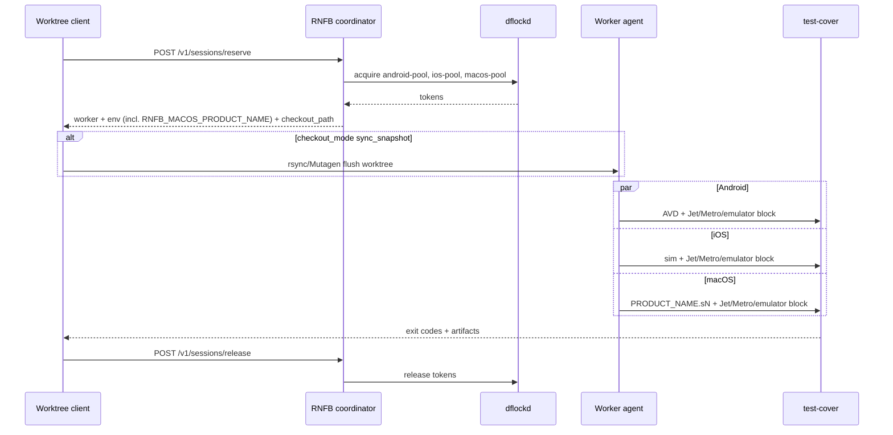

# E2e parallel execution and host coordination

Architecture and lifecycle for running Android, iOS, and macOS e2e in parallel (within a worktree and across worktrees). **Commands** live in [running e2e](running-e2e.md) ([slot lifecycle](running-e2e.md#slot-lifecycle), [parallel topology](running-e2e.md#parallel-e2e-topology), [infrastructure change bar](running-e2e.md#e2e-infrastructure-change-bar)); this doc explains *why* resources collide, how parameterization isolates them, and how Mellifera / Tart relate.

**Policy:** [OKF documentation and commit policy](../documentation-policy.md) — public vs ephemeral vs private; [Efficiency](../documentation-policy.md#efficiency). **Coverage:** [coverage design](coverage-design.md).

## How parallel e2e works (ELI14)

RNFB’s local e2e stack is a small set of **named host resources**. If two runs share any of them, they fight. Parameterization gives each run its own copy.

After the `tests-macos/` split, **iOS/Android** Metro (`yarn tests:packager:*`, cwd `tests/`) and **macOS** Metro (`yarn tests:macos:packager:*`, cwd `tests-macos/`) are separate packagers. Serial unslotted runs still cannot share `:8081` between those two roots.

### 1. Exact resources (serial defaults)

| Resource | What it is | Serial default |
|----------|------------|----------------|
| **Metro** | JS bundler listen port | `:8081` — **two roots**: `tests/` (iOS/Android) vs `tests-macos/` (macOS) |
| **Jet WebSocket** | Mocha-remote test runner | `:8090` |
| **Jet control HTTP** | Paired control plane | `:8091` (Jet+1) |
| **Firebase emulator suite** | auth / database / firestore / functions / storage / hub / logging | `:9099` / `:9000` / `:8080` / `:5001` / `:9199` / `:4400` / `:4500` |
| **Emulator aux ports** | Firestore websocket, Eventarc, Cloud Tasks (Firebase Tools still binds these) | `:9150` / `:9299` / `:9499` (collide if two suites share a host) |
| **Android** | AVD + adb serial | Serial: `TestingAVD` / `emulator-5554` (yarn tests:* pin `RNFB_ANDROID_CONSOLE_PORT=5554`). Slotted: `TestingAVD-{n}` (incl. `-0`) + console `5556+2n` (`emulator-5556/5558/5560`, …). Detox must not pick FreePortFinder **10000–20000**; check/release treat those leftover serials as BUSY / kill |
| **iOS** | Simulator device name | Serial: `iPhone 17`. Slotted: `RNFB E2E iOS slot-{n}` (incl. `slot-0`) |
| **macOS** | Process / `PRODUCT_NAME` (+ derived bundle id) | `io.invertase.testing` |
| **Coverage paths** | NYC / coverage — `tests/` (iOS/Android) and `tests-macos/` (macOS); see [coverage design § e2e TS](coverage-design.md#e2e-typescript-coverage-jet--nyc) | Fixed per worktree (same-platform parallel overwrites) |
| **CocoaPods CDN cache** | Trunk spec CDN under `~/.cocoapods` | **Not** parameterized. Overlapping `yarn tests:ios:pod:install` can miss trunk specs (`SocketRocket (~> 0.7.1)`) while siblings succeed. Serialize Apple `pod:install` before overlapping `:build`/`:test-cover` ([running e2e § slot lifecycle](running-e2e.md#slot-lifecycle)). `:build` does not run pod install. |

One worktree also has **one** `tests-macos/macos/build` (and iOS/Android build product tree) — not safe for two same-platform `:test-cover`s in that tree.

### 2. Why that forces serialized testing (if not parameterized)

- **One listener per port** — second Metro/Jet/emulator bind → `EADDRINUSE` or a stolen session.
- **One macOS process name** — `killall` / Jet client collision; stale macOS on a shared Jet port breaks Android.
- **Shared emulator DB** — Firestore `wipe()` and auth/storage state are global per emulator process.
- **One derived-data / build tree per worktree** — two same-platform runs race native products and coverage files.
- **One CocoaPods CDN cache per host** — overlapping Apple `pod:install` races trunk spec downloads; serialize `yarn tests:ios:pod:install` / `yarn tests:macos:pod:install` across worktrees. Do not disable Swift explicit modules to paper over that.
- **OKF serial default** still assumes the table above ([running e2e § Rules #6](running-e2e.md#rules)): correct for gate closure, slow for iteration (~15m macOS + ~45–60m iOS + ~45–60m Android wall-clock if run one after another).

### 3. How parameterization fixes it

- **Per-platform env:** `RNFB_{ANDROID,IOS,MACOS}_METRO_PORT`, `_JET_PORT`, `_JET_CONTROL_PORT`, `_EMULATOR_*_PORT`, plus device overrides (`RNFB_ANDROID_AVD`, `RNFB_IOS_SIMULATOR`, **`RNFB_MACOS_PRODUCT_NAME`**).
- **Slot formula:** `BASE = 12000 + slot×1000`; android offset `0`, ios `+100`, macos `+200`. Inside a platform block: firestore…logging = `BLK+0..6`, metro `+7`, jet `+10`, jet-control `+11`; aux ports `FS+8/+9/+12` in `yarn tests:emulator:start`.
- **Full babel carry-in:** every Metro/Jest process for a slot gets the **full** `RNFB_{ANDROID,IOS,MACOS}_*` set (static `process.env.RNFB_*` inlining). Process-local binds (`RCT_METRO_PORT`, `JET_REMOTE_PORT`) say which socket *this* process owns.
- **Worktree topology:** at most **`1× android ∥ 1× ios ∥ 1× macos`** per worktree (same slot index, three port blocks). Same-platform scale-out = more worktrees (`macos-slot-N` + `io.invertase.testing.sN`, not a host-global `macos-global` lock).
- **macOS build:** `yarn tests:macos:build` uses `RNFB_MACOS_PRODUCT_NAME_SUFFIX` in the pbxproj — never pass global `PRODUCT_NAME=` on the `xcodebuild` CLI.

Commands for clear → start → build → test → free: [running e2e § slot lifecycle](running-e2e.md#slot-lifecycle).

## Goals

| Goal | Description |
|------|-------------|
| **Tri-platform parallel (Phase 1)** | One worktree runs **at most one** Android, **one** iOS, and **one** macOS `:test-cover` **concurrently** — three platform jobs in parallel, not three Android emulators in one worktree. |
| **Cross-worktree safety (Phase 2)** | Multiple RNFB worktrees on the same Mac **checkout / checkin / stale-clean** host resources so two agents never bind the same emulator, Jet port, or macOS `PRODUCT_NAME`. |
| **Capacity-aware queue (Phase 3)** | Host **advertises** how many Android / iOS / macOS slots it can sustain; worktrees **wait and reserve** when saturated. |
| **macOS hygiene + identity** | macOS e2e **terminates the test app** on success and failure; concurrent macOS uses distinct **`RNFB_MACOS_PRODUCT_NAME`** (proven — see below), not a host-global singleton. |

### Proven status

| Capability | Status | Canonical |
|------------|--------|-----------|
| Per-platform prefixed ports + full carry-in | **Shipped** | [running e2e § configurable env](running-e2e.md#configurable-e2e-environment) |
| Worktree topology (`1× android ∥ 1× ios ∥ 1× macos` per tree) | **Shipped** | [parallel topology](running-e2e.md#parallel-e2e-topology) |
| Slot env + serial `yarn tests:*` | **Shipped** — `export-slot-env` then the same commands as [running e2e § Rules](running-e2e.md#rules) | [slot lifecycle](running-e2e.md#slot-lifecycle) |
| Concurrent macOS via `PRODUCT_NAME` | **Shipped** (e.g. `io.invertase.testing.s0`…`sN`) | [macOS process identity](running-e2e.md#macos-process-identity-concurrency) |
| Host check/release (`yarn tests:e2e:check` / `release`) | **Shipped** — serial default; slot via env; `--all-slots` explicit; Mellifera maps reservations to `RNFB_*` then calls these yarn targets (no JSON feed) | [host-clear probes](running-e2e.md#host-clear-probes) |
| Coordinator / lease queue (Mellifera) | **WIP** — co-developed out-of-tree (not part of the contention PR) | Optional local `mellifera/` when present — consumes RNFB slots; does not own the runbook ([§ layers](#rnfb-mellifera-tart-layers)) |

<a id="rnfb-mellifera-tart-layers"></a>

## RNFB e2e, Mellifera, and Tart (layers)

| Layer | Owns | Must not |
|-------|------|----------|
| **RNFB e2e** | Ports, devices, `export-slot-env`, packager, emulator, check/release, `:build` / `:test-cover`. Parallel = all platforms at once, and multiple same-platform runs via **slots** + extra worktrees. | Read `tests/mellifera.env.json`; change native build settings; invent a second runbook |
| **Mellifera** | Leases. A user **publishes** that a host has available RNFB e2e slots; Mellifera **executes** RNFB e2e using those slots (export `RNFB_*`, then `yarn tests:*`). | Detox/Gradle/Watchman/runbook order; `--mellifera` inside core check/release |
| **Tart** | Fully separate speculative VM system. A published Mellifera slot **may** be a process inside a Tart VM. | Define RNFB e2e commands or justify Debug Detox flags |

> Mellifera is additive. Serial `yarn tests:*` never requires it. Older drafts called macOS `macos-global`; superseded by `macos-slot-N` + `RNFB_MACOS_PRODUCT_NAME`.

## Non-goals

- More than **one concurrent `:test-cover` per platform per worktree** (no 2× Android or 2× macOS in the same worktree — one `macos/build` derived-data tree).
- Replacing GitHub Actions matrix parallelism (CI already uses separate runners).
- Enterprise emulator / Firestore Pipelines cloud isolation (unchanged; see [firebase testing project](firebase-testing-project.md)).
- Tart as an RNFB e2e runbook or a reason to change Detox/xcodebuild flags. Tart may host a Mellifera-published slot ([layers](#rnfb-mellifera-tart-layers)).

## Constraints (locked for this design)

1. **Per worktree:** max **1 Android + 1 iOS + 1 macOS** e2e run at a time.
2. **Per host:** same-platform parallel needs **one worktree per instance**. macOS isolation key is **`PRODUCT_NAME` / process name** (`RNFB_MACOS_PRODUCT_NAME`), not a single global lock.
3. **Firebase emulators:** parallel platform runs **must not share one emulator process** — Firestore `wipe()` and auth/storage state are global per emulator instance ([`packages/firestore/e2e/helpers.js`](../../packages/firestore/e2e/helpers.js)). Full aux-port isolation (websocket / eventarc / tasks) required — see [running e2e](running-e2e.md#configurable-e2e-environment).
4. **Backward compatibility:** unset slotted env preserves serial defaults (ports `:8081` / `:8090` / …, process `io.invertase.testing`).
5. **Local slotted e2e is the serial runbook plus slot env.** Same commands as [running e2e § Rules](running-e2e.md#rules). The **only** required difference is selecting the slot’s ports + device identities (`yarn tests:e2e:export-slot-env` / `RNFB_*`). No second workflow (no rsync, no cloning trees, no host flock, no Metro-after-build). A 3×3 wave is **9 overlapping cells** (android + ios + macos `:test-cover`, qemu included). Do not serialize Android. Tolerate CI-like latency with higher Detox/launch timeouts rather than shrinking concurrency ([running e2e § slot lifecycle](running-e2e.md#slot-lifecycle)).
6. **Each concurrent instance is a normal git checkout / git worktree.** Populate it with `git worktree add` (or clone) + `yarn` in **that** tree. Mutagen/rsync is **remote worker snapshot only** (laptop → worker) — **not** local same-Mac slot trees.
7. **Watchman:** packager start drops a stale watch for **this Metro project root** and watches an **allowlist** of trees Metro would reload — not a blocklist over a whole-monorepo watch. Tolerance lives in packager `/status` wait, not a parallel-only recipe.
8. **Apple `:build` stays representative.** iOS → `tests/ios/build`; macOS → `tests-macos/macos/build`. Do not set `SWIFT_ENABLE_EXPLICIT_MODULES=NO` (or similar) for e2e. If PCM races return, isolate the **actual** shared module-cache directory with [negative + positive tests](running-e2e.md#e2e-infrastructure-change-bar).

## Resource inventory (detail)

Serial defaults and conflict modes are summarized in [§ How parallel e2e works](#how-parallel-e2e-works-eli14). Slotted support: per-platform `RNFB_*` ports + `yarn tests:emulator:start`, Detox slot configs, and **`RNFB_MACOS_PRODUCT_NAME`**.

### Slot lifecycle

The numbered recipe lives in [running e2e § slot lifecycle](running-e2e.md#slot-lifecycle). Do not duplicate those commands here. Order is the serial runbook (packager → emulator → pod → build → test-cover) after slot env is set. A cell helper, if kept, only chooses env vars then calls those commands.

## Resource model

### Two layers

```text
┌─────────────────────────────────────────────────────────────┐
│  Host coordinator (Phase 2+) — lease / capacity             │
│  android-slot-0..N   ios-slot-0..M   macos-slot-0..K        │
│  (each macos-slot carries RNFB_MACOS_PRODUCT_NAME=.sN)      │
└──────────────────────────┬──────────────────────────────────┘
                           │ lease → port map + device / PRODUCT_NAME
┌──────────────────────────▼──────────────────────────────────┐
│  Worktree runner — one slot index per worktree               │
│  Parallel: android-run ∥ ios-run ∥ macos-run                 │
│  (at most one of each platform; distinct port blocks)        │
└─────────────────────────────────────────────────────────────┘
```

Same-platform scale-out: **N worktrees × slot 0..N-1** (e.g. `3× android + 3× ios + 3× macos`).

### Metro per worktree and per slot

<a id="metro-per-worktree-and-per-slot"></a>

After the `tests-macos/` split, **iOS/Android** Metro lives in `tests/` and **macOS** Metro lives in `tests-macos/` (each has its own `.babelrc`). They are not one multi-platform packager. Two operating modes:

| Mode | Metro | When |
|------|-------|------|
| **Serial default** | One Metro on `:8081` **per packager root** — mobile (`tests/`) **or** macOS (`tests-macos/`), not both at once | Unslotted local iteration |
| **Proven slotted** | **Distinct Metro listen port per platform×slot** (`RNFB_{PLATFORM}_METRO_PORT`, process-local `RCT_METRO_PORT`). A full slot that runs android/ios **and** macos starts **two** packagers (`yarn tests:packager:jet` vs `yarn tests:macos:packager:jet`) | Parallel waves / multi-worktree — avoids babel/cache contention and matches `export-slot-env` |

Cross-worktree: two worktrees **must not** share one Metro (different `packages/**` / harness).

**What still cannot be shared** (even within one worktree parallel wave)

| Resource | Why |
|----------|-----|
| **Jet** (mocha-remote) | One WebSocket server drives **one** Mocha session |
| **Firebase emulators** | `wipe()` clears the whole emulator DB; aux ports must not collide |
| **Devices / macOS process** | One AVD, one sim UDID, one `PRODUCT_NAME` per concurrent instance |
| **Jet control HTTP** | Paired 1:1 with each Jet instance |

**Port formula (proven):** `BASE = 12000 + slot×1000`; android offset `0`, ios `+100`, macos `+200`; within a platform block firestore…logging = `BLK+0..6`, metro `+7`, jet `+10`, jet-control `+11`. Emulator aux: firestore websocket / eventarc / tasks = `FS+8/+9/+12` via `yarn tests:emulator:start`. Slot 0 Metro listen: android **12007**, ios **12107**, macos **12207**. Commands: [running e2e § slot lifecycle](running-e2e.md#slot-lifecycle).

**Babel carry-in:** every Metro/Jest process for a slot must receive the **full** `RNFB_{ANDROID,IOS,MACOS}_*` set — port selection uses `Platform.*` / Detox, not `RNFB_E2E_PLATFORM` ([running e2e](running-e2e.md#configurable-e2e-environment)).

### Platform bundle (per host slot)

Each **android-slot** / **ios-slot** / **macos-slot** is a fixed **port block** + **device / process identity**. A worktree that leases slot `n` gets the whole multi-platform carry-in for that index.

| Service | Serial default | Slotted (platform × slot) |
|---------|----------------|---------------------------|
| Metro | `:8081` | `BASE + platform_off + 7` |
| Jet WS / control | `:8090` / `:8091` | `+10` / `+11` in platform block |
| Emulator suite | fixed serial ports | full `RNFB_*_EMULATOR_*` + aux |
| Android | `TestingAVD` / `emulator-5554` | `TestingAVD-{n}` (incl. `-0`), console **`5556+2n`** (`emulator-5556` …), Detox `android.emu.debug.slot{n}` — not FreePortFinder 10000–20000 |
| iOS | `iPhone 17` | `RNFB E2E iOS slot-{n}` (incl. `slot-0`), Detox `ios.sim.debug.slot{n}` |
| macOS | `io.invertase.testing` | **`io.invertase.testing.s{n}`** via `RNFB_MACOS_PRODUCT_NAME` |

**macOS (proven):** no `macos-global` lock. Concurrent macOS = distinct `PRODUCT_NAME` (+ derived bundle id for Metro `app=`). Build uses `RNFB_MACOS_PRODUCT_NAME_SUFFIX` in pbxproj — **never** pass global `PRODUCT_NAME=` on the `xcodebuild` CLI (renames Pods / breaks linking). Details: [running e2e § macOS process identity](running-e2e.md#macos-process-identity-concurrency).

### Worktree-internal parallelism

Within a **single** worktree verification wave (slot `n`):

```text
eval "$(bash scripts/e2e/export-slot-env.sh <platform> n)"   # then canonical yarn tests:* runbook
  │
  ├─ android  → AVD + emulator suite A + Metro/Jet block A + :test-cover
  ├─ ios      → sim  + emulator suite B + Metro/Jet block B + :test-cover   } parallel
  └─ macos    → app io.invertase.testing.sn + emulator suite C + Metro/Jet C + :test-cover
```

**Coverage:** each platform run writes under its worktree; same-platform parallel still needs separate worktrees.

## macOS app lifecycle + identity

### Teardown (required)

macOS `:test-cover` must not leave the test app running — a stale process on a shared Jet port breaks later Android runs ([running e2e § Android app reset](running-e2e.md#android-app-reset-blocking)).

[`tests-macos/.jetrc.js`](../../tests-macos/.jetrc.js) macOS target:

- `before`: kill named app, prefetch Metro bundle (`app=` = bundle id), spawn binary path from `RNFB_MACOS_PRODUCT_NAME`.
- `after` / exit handlers: `killall` the **same** product name; verify `pgrep` empty.
- App stdio detached (`ignore`) so `| tee` pipes close when Jet exits.

Unscoped `release-e2e-resources.sh` also clears `io.invertase.testing.s0`…`.sN` leftovers.

### Concurrent identity (proven — was “future” in older drafts)

| Surface | Serial default | Concurrent |
|---------|----------------|------------|
| Process / `PRODUCT_NAME` | `io.invertase.testing` | `RNFB_MACOS_PRODUCT_NAME` (`.s{n}`) |
| Bundle id / Metro `app=` | `org.reactjs.native.io-invertase-testing` | derived or `RNFB_MACOS_BUNDLE_IDENTIFIER` |
| Firebase / GoogleService | none on macOS target | no cloud re-registration |

Mild residual: shared native preferences suite `io.invertase.firebase` across apps (not process-isolating).

Coordinator leases should grant **`macos-slot-N`** (with product name in the env payload), **not** a single `macos-global` mutex.

## Lease store: reuse vs build (scope)

RNFB needs **three layers**. Only layer 1 overlaps with existing OSS; layers 2–3 are RNFB-specific regardless.

| Layer | Responsibility | Build? |
|-------|----------------|--------|
| **1. Lease store** | Exclusive / counting leases, TTL, token release, stale purge | **Reuse candidate** |
| **2. Coordinator API** | Worker registration, capacity advertisement, bundled reserve (multi-resource + port map + checkout hint), wait queue | **Thin RNFB service** (~300–600 lines) |
| **3. Worker agent** | Start/stop Metro/Jet/emulators, run `:test-cover`, teardown, optional sync | **RNFB scripts** (build on Phase 0 helpers) |

### What resleased provides

[resleased](https://github.com/axi92/resleased) is a small Go HTTP daemon (~single-purpose):

- `POST /api/v1/reserve` — exclusive lease by opaque `resource_id`, returns token + `expires_at`
- `POST /api/v1/extend`, `DELETE /api/v1/release`, `GET /api/v1/status/{id}`
- JSON file persistence; expired leases purged on interval
- **503 when taken** — client must poll/retry (no blocking wait in server)

**Fits layer 1** for `macos-slot-0`, `android-slot-0`, etc. **Does not provide:** semaphores (N identical slots), FIFO queue metadata, capacity registry, or lease payload beyond owner string.

**Scope to adopt:** run as sidecar (`localhost:8787`); RNFB coordinator calls it per resource. Low integration cost; **0 stars / early** — vendoring or pinning commit advised.

### What dflockd provides

[dflockd](https://github.com/mtingers/dflockd) is a more complete Go lock server (~2k LOC, TS + Python clients):

- **Locks** (exclusive) and **semaphores** (counting, `Limit=N`) — `android-pool` with `Limit=2` maps directly to “2 Android slots”
- **Blocking acquire** with timeout over HTTP or TCP — built-in wait queue per key
- Lease TTL, auto-renew in Go client, fencing tokens, optional auth/TLS
- **Does not provide:** arbitrary lease metadata (port maps), worker registry, or “reserve android + ios together” atomic bundle

**Fits layer 1 better than resleased** when the host advertises `android_slots: 2` as a semaphore, and when clients should block-wait instead of poll 503s.

**Scope to adopt:** `dflockd --http-port 6389` on each worker host (or one central instance on Tailscale); RNFB coordinator uses [dflockd-client-ts](https://github.com/mtingers/dflockd-client-ts) or curl for acquire/release.

### What a purely local lease store would be

If layer 1 were inlined (~150–250 lines Node or shell+JSON):

- Same fields as resleased (`resource_id`, `owner`, `token`, `expires_at`, `pid`)
- Semaphore = counter file or separate “pool” record
- Blocking wait = loop + sleep in client CLI (already needed when a slot pool is saturated)
- **Pros:** zero external dep, full control, identical file format on disk as today’s `~/.rnfb/e2e-host/leases/`
- **Cons:** reimplement TTL purge, stale detection, and queue edge cases dflockd/resleased already solved

### Recommendation (scope decision)

| Approach | Layer 1 | Layer 2–3 | Total new code | Ops burden |
|----------|---------|-----------|----------------|------------|
| **A. dflockd + RNFB coordinator** | Reuse | Build | Medium | One small binary per host |
| **B. resleased + RNFB coordinator** | Reuse | Build | Medium | Simpler API; client polls |
| **C. All local (files only)** | Build | Build | Medium–high | No deps; we own bugs |
| **D. dflockd embedded as library** | Reuse in-process | Build | Lower ops | Go coordinator only |

**Preferred:** **A (dflockd + RNFB coordinator HTTP)** — semaphores match slot pools (`android_slots: N`, `macos_slots: K`), blocking wait matches “wait for a free macos-slot”, TS client exists for agent scripts. Coordinator adds:

- `POST /v1/workers/register` — `{ host_id, tailscale_ip, android_slots, ios_slots, macos_slots, labels }`
- `POST /v1/sessions/reserve` — `{ owner, resources[], wait, checkout_mode }` → `{ tokens[], worker, env, checkout }`
- `GET /v1/capacity` — aggregated workers + queue depth

**resleased** remains a good fallback if we want minimal HTTP surface and are fine polling; API shape is nearly identical for layer 1.

**Not worth adopting wholesale:** SAIR (physical Android farm), Lockgate/K8s (cluster locks), Conch/etcd (process supervision) — wrong abstraction layer.

## Worktree placement and network filesystems

**Local 3×3 / same-Mac slot trees:** independent git checkouts (`git worktree add` or clone) + `yarn` in each tree. Do **not** rsync or Mutagen sources between local slot worktrees.

Remote e2e (Phase 2+) raises a different question: **must tests run against the laptop’s live files, or is a synced copy on the worker acceptable?** Mutagen/rsync below is that **optional remote snapshot** (laptop → worker) — not a local-slot recipe.

### RNFB-specific constraints

| Need | Implication |
|------|-------------|
| Gitignored [`tests/harness.overrides.js`](../../tests/harness.overrides.example.js) | Pure `git clone` on worker **misses** local harness narrowing |
| Large trees (`tests/node_modules`, `ios/build`, `.yarn/cache`) | Full-tree SSHFS/NFS is slow; Tart already avoids heavy virtiofs streaming ([tart README](../../scripts/tart/README.md)) |
| Metro | Reads thousands of small files — **needs local disk on the machine running Metro** (worker), not cross-network mount |
| Uncommitted edits | Sync must run **after** reserve, **before** `:test-cover` |

### Options (over Tailscale or LAN)

| Strategy | Mechanism | Live laptop files? | RNFB verdict |
|----------|-----------|-------------------|--------------|
| **Collapsed worker** | Worker agent on laptop; `checkout_path=$PWD` | Yes — same inode | **Default**; zero sync |
| **Mutagen one-way-replica** | [`mutagen sync create`](https://mutagen.io/documentation/synchronization/creating-sessions) laptop → worker; [`mutagen sync flush`](https://mutagen.io/documentation/synchronization/forcing-synchronization) at reserve | Snapshot at flush; edits after flush not visible until next flush | **Best remote pattern** — worker has local APFS for Metro/Gradle. Project: [mutagen.io](https://mutagen.io/) · [GitHub](https://github.com/mutagen-io/mutagen) |
| **rsync / tar snapshot** | `rsync -a --delete` with `--include harness.overrides.js` at reserve | Same as Mutagen flush | **Simplest**; no daemon; good for CI-style |
| **SSHFS / NFS / SMB mount** | Worker mounts `laptop:/path/worktree` | Theoretically live | **Discouraged** — Metro, Gradle, Xcode stat storms over VPN ([known pain](https://serverfault.com/questions/470059/how-to-make-sshfs-vpn-git-a-tolerable-working-environment)); IDE-grade lag |
| **SSHFS selective** | Mount only `packages/` + `tests/` excluding `node_modules` | Partial live | Still risky; Metro resolves into `node_modules` |
| **Virtiofs (Tart)** | VM mounts host worktree | Live on **same** Mac host | **Already used** for iOS Tart; not cross-machine |
| **Git ref only** | Worker `git fetch && checkout` | No uncommitted / gitignored | OK for CI; **insufficient for local agent iteration** |
| **Reverse: laptop mounts worker** | SSHFS other direction | N/A | Wrong shape — canonical edits stay on laptop |

**Tailscale’s role:** MagicDNS + wireguard mesh so coordinator, laptop client, and Mac mini worker address each other as `worker-host.tailnet` without exposing ports publicly. Use **Tailscale SSH** for Mutagen/rsync transport (`mutagen sync create ./worktree worker-host:~/rnfb-checkouts/...`). NFS-over-Tailscale works but shares SSHFS latency problems for build/test IO.

### Checkout modes (coordinator `reserve` response)

```json
{
  "checkout_mode": "local",
  "checkout_path": "/path/to/worktree"
}
```

| `checkout_mode` | When | `checkout_path` |
|-----------------|------|-----------------|
| `local` | Worker is laptop (collapsed) | Client worktree abs path |
| `sync_snapshot` | Remote worker | Worker path after rsync/Mutagen flush |
| `git_ref` | CI / clean tree | Worker clone at SHA |
| `live_mount` | **Experimental only** | SSHFS mount point — not recommended for full e2e |

**Sync recipe (optional Phase 2+ remote worker only — never local slots):**

```bash
# At reserve time on worker (after dflockd grant)
rsync -a --delete \
  --exclude '.git' --exclude 'tests/node_modules' --exclude 'tests/ios/build' \
  --exclude 'tests/android/app/build' \
  --include 'tests/harness.overrides.js' \
  "${CLIENT_WORKTREE}/" "${WORKER_CHECKOUT}/"
cd "${WORKER_CHECKOUT}" && yarn && yarn tests:emulator:prepare  # worker-local install
```

Mutagen equivalent: session with `--sync-mode=one-way-replica`, explicit `mutagen sync flush` before `:test-cover`; include gitignored overrides via `.mutagen.yml` ignore negation.

**Artifacts return path:** coverage logs and `tee` output rsync/scp **worker → laptop** on release (inverse of checkout).

### “Run on laptop files” honest summary

True single-copy execution over the network **only works collapsed** (worker on laptop). For a remote Mac worker, **flush-then-run on a local worker copy** is the industry-standard compromise (same as Mutagen remote dev, Docker Dev Environments, Gitpod pre-sync). Chasing live SSHFS for full RNFB e2e is high risk for modest benefit — agent edits locally, one sync at reserve is usually seconds vs tens of minutes of e2e.

## Phased roadmap

**Network-first:** HTTP coordinator + worker capacity registration from Phase 1. File-only leases are a **degenerate backend**, not the primary path.

### Phase 0 — macOS teardown + port helpers (prerequisite) — largely **done**

- macOS app terminated after `:test-cover` (named process; exit hooks; detached stdio).
- Emulator/Jet URLs centralized in [`packages/app/e2e/helpers.js`](../../packages/app/e2e/helpers.js); no hardcoded serial emulator ports in specs.
- Slotted env helpers: [`scripts/e2e/export-slot-env.sh`](../../scripts/e2e/export-slot-env.sh) / `lib/e2e-slot-env.sh` (supersedes earlier `platform-env.sh` sketch).
- **macOS `PRODUCT_NAME` slotting** shipped — concurrent macOS no longer blocked on a global lock.

**Done when:** macOS run leaves no matching product-name process; helpers read env ports with serial defaults when unset; concurrent `.sN` apps proven across worktrees.

### Phase 1 — Network coordinator + local worker + tri-platform parallel

**Scope:** HTTP coordinator from day one; first worker is **the same machine** as the client (`checkout_mode: local`).

| Component | Implementation |
|-----------|----------------|
| **Lease store** | [dflockd](https://github.com/mtingers/dflockd) on `127.0.0.1` (or resleased — see [§ Lease store](#lease-store-reuse-vs-build-scope)) |
| **RNFB coordinator** | Thin HTTP service (`scripts/e2e/coordinator/` or small Go binary): register worker, reserve bundle, capacity |
| **Worker agent** | `scripts/e2e/worker-agent.sh` — registers capacity, executes `run-worktree-parallel.sh` on grant |
| **Client CLI** | `yarn tests:e2e:reserve` / `release` / `capacity` → coordinator URL (`RNFB_E2E_COORDINATOR`, default `http://127.0.0.1:8790`) |

**Worker registration (on agent start):**

```json
POST /v1/workers/register
{
  "worker_id": "mike-mbp.local",
  "android_slots": 1,
  "ios_slots": 1,
  "macos_slots": 1,
  "checkout_modes": ["local"],
  "labels": { "platform": "darwin", "arch": "arm64" }
}
```

**Bundled reserve (client):**

```json
POST /v1/sessions/reserve
{
  "owner": "worktree:/path/to/worktree",
  "resources": ["android-pool", "ios-pool", "macos-pool"],
  "wait": true,
  "ttl": "90m",
  "checkout_mode": "local"
}
```

Coordinator acquires dflockd semaphores / locks, returns `{ token, env: { RNFB_* ports…, RNFB_MACOS_PRODUCT_NAME }, checkout_path }`, worker agent runs tri-platform parallel.

Deliverables:

| Item | Notes |
|------|-------|
| dflockd (or resleased) + coordinator | Docker-compose or brew-style one-liner for dev hosts |
| `run-worktree-parallel.sh` | **Two Metros** when macos is in the wave (`tests/` + `tests-macos/`), distinct listen port per platform×slot (+ Jet/emulators); three `:test-cover` parallel |
| Future coordinator client | Reserve → [slot lifecycle](running-e2e.md#slot-lifecycle) `yarn tests:*` → release (EXIT trap). Not a second e2e runbook. |
| Pre-flight | Per-platform scoped probes |

**Done when:** a coordinator client uses reserve/release around the [slot lifecycle](running-e2e.md#slot-lifecycle) Law; Android + iOS + macOS run concurrently on one worktree via HTTP API; `GET /v1/capacity` shows worker slots.

### Phase 2 — Multi-worktree + multi-slot hosts + sync

**Scope:** Same coordinator; worker advertises `android_slots: 2`, `ios_slots: 2`; multiple worktrees on one Mac reserve different semaphore grants.

| Feature | Detail |
|---------|--------|
| **Slot port maps** | Coordinator assigns slot `n` port blocks + macOS `PRODUCT_NAME` (see [§ Platform bundle](#platform-bundle-per-host-slot)) |
| **macOS-pool wait** | dflockd semaphore on `macos-pool` (`Limit=K`) — worktrees queue when all `.sN` identities are leased |
| **Stale cleanup** | Worker heartbeat; coordinator releases dflockd tokens if worker dies |
| **Remote checkout** | Optional laptop→worker `checkout_mode: sync_snapshot` via rsync or Mutagen over Tailscale — **not** for local same-Mac slot trees (see [§ Worktree placement](#worktree-placement-and-network-filesystems)) |
| **Second worker on same host** | Optional — usually one worker process registers full machine capacity |

**Done when:** two local worktrees run Android **and** macOS e2e concurrently without collision; `GET /v1/capacity` shows queue depth.

### Phase 3 — Multi-host workers + autoscale pool

**Scope:** Workers on multiple Macs / Tart VMs / cloud instances register with central coordinator (any host running coordinator + dflockd, or dflockd sharded per worker).

```text
  Laptop client (worktree canonical)
       │  POST /v1/sessions/reserve
       ▼
  Coordinator (Tailscale: coordinator.tailnet:8790)
       │  assigns worker + sync_snapshot checkout
       ▼
  Mac mini worker / Tart VM
       │  rsync or Mutagen flush → local checkout
       │  yarn tests:* (slot lifecycle) → artifacts back
       ▼
  release → free semaphores
```

| Feature | Detail |
|---------|--------|
| **Worker discovery** | Tailscale MagicDNS names in registration |
| **Autoscale pool** | Tart `run-ephemeral` workers register as `ios-slot` consumers; scale-to-zero when idle (future) |
| **Auth** | Tailscale ACL + coordinator shared secret or mTLS |
| **Collapsed degenerate case** | `coordinator=localhost`, `checkout_mode=local` — must always work offline |

**Done when:** laptop reserves remote Mac worker; e2e runs on synced copy; artifacts return; local-only mode unchanged.

### Phase 4 — Optional hardening

- Coordinator HA (dflockd fence files, coordinator state backup)
- Priority queues (interactive vs background agent)
- Integration with GitHub Actions self-hosted labels
- Evaluate **resleased** swap-in if dflockd ops burden exceeds benefit

**Explicitly removed from earlier draft:** file-only coordinator as primary path — file leases may remain a dflockd/resleased persistence detail only.

## Orchestration flow (target end state)



Phase 1 without a coordinator: operators `eval "$(yarn tests:e2e:export-slot-env <platform> N)"` then run the same canonical `yarn tests:*` Law as serial ([running e2e § slot lifecycle](running-e2e.md#slot-lifecycle)).

Phase 1 with coordinator uses `checkout_mode: local` and omits the sync branch.

## Open-source landscape (summary)

See [§ Lease store](#lease-store-reuse-vs-build-scope) for the build-vs-reuse decision. Layer 2–3 remain RNFB-owned.

| Project | Layer | Verdict |
|---------|-------|---------|
| **dflockd** | 1 | **Preferred** — semaphores, blocking wait, TS client |
| **resleased** | 1 | **Good alternate** — simpler HTTP; poll on 503 |
| **flock / file JSON** | 1 | Fallback if zero deps wins |
| **Mutagen** | Sync | **Preferred** remote checkout transport over Tailscale SSH |
| **rsync** | Sync | **Simplest** snapshot at reserve |
| **SSHFS/NFS** | Sync | **Avoid** for full e2e IO |
| **SAIR** | — | Physical Android pools only |
| **BuildFarm / EngFlow** | — | Remote build cache, not dev-host e2e |

## Implementation notes (Phase 1 technical)

### App / test code

- `getE2eEmulatorPort(name)` and `getJetRemoteUrl()` in app e2e helpers.
- Replace hardcoded `:8080` in firestore wipe, storage, auth deep links, [`emailLink.e2e.js`](../../packages/auth/e2e/emailLink.e2e.js).
- `<JetProvider url={getJetRemoteUrl()} …>` in [`tests/app.js`](../../tests/app.js).

### Host orchestration

- [`tests/e2e/firebase.test.js`](../../tests/e2e/firebase.test.js): scope port kills to **owned** Jet port, not global `:8090`.
- [`.detoxrc.js`](../../tests/.detoxrc.js): support env substitution or `detoxrc.slot.js` generator.
- Pre-flight in [running e2e](running-e2e.md): replace global probes with platform-scoped variants.

### Builds

- **Cross-worktree Apple builds:** each tree uses its own `derivedDataPath` (`tests/ios/build` vs `tests-macos/macos/build`). Do **not** disable Swift explicit modules. If `.pcm` races return, prove the shared cache path and isolate **that** directory ([infrastructure change bar](running-e2e.md#e2e-infrastructure-change-bar)).
- **Do not** run two overlapping multi-slot waves against the **same** worktrees — shared `ios/build` / `macos/build` is not multi-writer-safe.
- **Android Gradle home:** concurrent slotted Android `:build` **shares** `~/.gradle`. Do **not** isolate `GRADLE_USER_HOME`. Historical path poisoning was **rsync**, not Gradle ([running e2e § Environment](running-e2e.md#environment)).

## Documentation and policy updates (by phase)

| Phase | Docs |
|-------|------|
| 1 | [running e2e](running-e2e.md) slot lifecycle (Law); [agent command policy](agent-command-policy.md) allowlists `yarn tests:*` only |
| 2 | This doc § coordinator CLI; [change authoring § host rule](change-authoring-workflow.md#host-rule) → per-slot |
| 3 | `capacity.json` schema; operator guide for `host-status` |

Work-queue rows for implementation are ephemeral — not duplicated here per [documentation policy](../documentation-policy.md).

## Risks

| Risk | Mitigation |
|------|------------|
| RAM / CPU exhaustion (N× emulators + Metros) | Capacity advertisement; document minimum host spec |
| Cloud API quota (FIS / RC) under parallel worktrees | Harness narrowing; existing retry in `firebase.test.js` |
| Stale leases after agent crash | TTL + pid check + `cleanup-stale` |
| Operator confusion (wrong PRODUCT_NAME / slot) | `host-status` shows leased `macos-slot-N` + product name; `--all-slots` recover is explicit |
| Coverage merge complexity | Per-worktree artifacts; merge script optional for local dev |
| Passing `PRODUCT_NAME=` on xcodebuild CLI | Forbidden — use suffix env only ([running e2e](running-e2e.md#macos-process-identity-concurrency)) |
| Concurrent Apple `:build` PCM races | Isolate real module-cache dir if reproduced; never `SWIFT_ENABLE_EXPLICIT_MODULES=NO` |

## Open questions

1. **AVD strategy:** **decided** — clone `TestingAVD-0`…`TestingAVD-N` for slotted runs; serial keeps `TestingAVD` (`create-android-avds.sh`).
2. **iOS simulators:** **decided** — dedicated `RNFB E2E iOS slot-0`…`slot-N` devices; serial keeps `iPhone 17` (`create-ios-simulators.sh`).
3. **Shared build artifacts:** single `tests/ios/build` / `tests-macos/macos/build` per worktree (serial build within tree) — confirmed OK; same-platform parallel ⇒ multiple worktrees.
4. **Coordinator language:** Node (matches repo / mellifera) vs Go (matches dflockd) for the thin HTTP layer?
5. **Tart:** a Mellifera-published slot **may** run inside a Tart VM; Tart is not the RNFB e2e product ([layers](#rnfb-mellifera-tart-layers)).
6. **Sync transport (Phase 2+ remote worker only):** optional `rsync` / Mutagen laptop→worker snapshot — see [§ Worktree placement](#worktree-placement-and-network-filesystems). **Not** for local same-Mac slot trees.
7. **Lease backend:** mellifera-first vs dflockd; keep swap path if adoption stalls.
8. **Shared `io.invertase.firebase` prefs suite:** acceptable residual for concurrent macOS, or suite-name slotting later?

## Related docs

* [Running e2e tests](running-e2e.md) — canonical commands, change bar, slot lifecycle
* [Coverage design](coverage-design.md) — per-platform artifact policy
* [Firebase testing project](firebase-testing-project.md) — emulator vs cloud
* Mellifera coordinator — co-developed out-of-tree; see [§ RNFB e2e, Mellifera, and Tart](#rnfb-mellifera-tart-layers) (not shipped in the contention PR)
* [scripts/tart/README.md](../../scripts/tart/README.md) — separate VM system
* [Change authoring workflow § host rule](change-authoring-workflow.md#host-rule) — serial default; slotted exception via running-e2e
* [Agent command policy](agent-command-policy.md) — allowlisted `yarn tests:*`