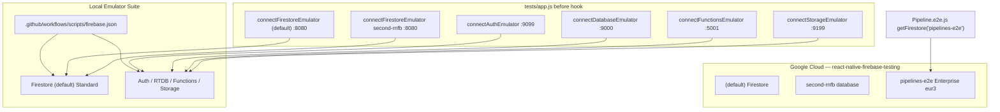

# Overview

RNFB Detox/Jet e2e uses Firebase project **`react-native-firebase-testing`**. Most modules use local emulators; **Firestore Pipelines** uses a cloud Enterprise DB.



# Where configuration lives

Config root: [`.github/workflows/scripts/`](../../.github/workflows/scripts/) (`firebase.json` cwd for Firebase CLI and `yarn tests:emulator:start`).

| File | Purpose |
|------|---------|
| [`firebase.json`](../../.github/workflows/scripts/firebase.json) | Emulator ports, multi-database Firestore mapping, functions/database/storage rules paths |
| [`start-firebase-emulator.sh`](../../.github/workflows/scripts/start-firebase-emulator.sh) | Starts auth, database, firestore, functions, storage emulators |
| [`firestore.rules`](../../.github/workflows/scripts/firestore.rules) | Security rules for **`(default)`** database |
| [`firestore.indexes.json`](../../.github/workflows/scripts/firestore.indexes.json) | Composite indexes for **`(default)`** |
| [`firestore.pipelines-e2e.rules`](../../.github/workflows/scripts/firestore.pipelines-e2e.rules) | Security rules for **`pipelines-e2e`** cloud database |
| [`firestore.pipelines-e2e.indexes.json`](../../.github/workflows/scripts/firestore.pipelines-e2e.indexes.json) | Indexes (incl. vector) for **`pipelines-e2e`** |
| [`database.rules`](../../.github/workflows/scripts/database.rules) | Realtime Database rules (emulator) |
| [`storage.rules`](../../.github/workflows/scripts/storage.rules) | Storage rules (emulator) |
| [`functions/`](../../.github/workflows/scripts/functions/) | Cloud Functions used by some e2e (e.g. Vertex AI mock) |
| [`deploy-firestore.sh`](../../.github/workflows/scripts/deploy-firestore.sh) | Deploy Firestore rules + indexes to cloud |
| [`sync-firestore-indexes.sh`](../../.github/workflows/scripts/sync-firestore-indexes.sh) | Pull indexes from cloud into repo (non-interactive) |
| [`README-firestore.md`](../../.github/workflows/scripts/README-firestore.md) | Short operator cheat sheet |

Runtime wiring:

| File | Role |
|------|------|
| [`tests/app.js`](../../tests/app.js) | `before` hook: `connect*Emulator` for each enabled module |
| [`packages/firestore/e2e/helpers.js`](../../packages/firestore/e2e/helpers.js) | `wipe()` — DELETE against **emulator** REST API only |
| [`tests/android/app/google-services.json`](../../tests/android/app/google-services.json) | Firebase project id `react-native-firebase-testing` |

# Emulator vs cloud by product

## Started locally

```bash
yarn tests:emulator:start        # foreground (dev)
yarn tests:emulator:start-ci     # background (CI)
```

Runs from `.github/workflows/scripts/`:

| Emulator | Port | Config |
|----------|------|--------|
| Firestore | 8080 | `firestore.rules` + `firestore.indexes.json` for **`(default)`** only |
| Auth | 9099 | — |
| Realtime Database | 9000 | `database.rules` |
| Functions | 5001 | `functions/` (built on start) |
| Storage | 9199 | `storage.rules` |
| Emulator UI | 4000 | enabled in `firebase.json` |

**Emulator deploy:** edit repo rules/indexes and restart emulator. No separate deploy; rules hot-reload.

**Wiping emulator Firestore data** (between tests):

```bash
# Per-database via helpers.wipe() in e2e, or manually:
curl -X DELETE \
  "http://localhost:8080/emulator/v1/projects/react-native-firebase-testing/databases/(default)/documents" \
  -H "Authorization: Bearer owner"
```

## Firestore databases

| Database ID | Edition | Emulator connected? | E2e usage |
|-------------|---------|---------------------|-----------|
| `(default)` | Standard | Yes — `tests/app.js` | Most `packages/firestore/e2e/*` |
| `second-rnfb` | Standard | Yes — same emulator host | `SecondDatabase/*` e2e |
| **`pipelines-e2e`** | **Enterprise** (`eur3`) | **No** | `Pipeline.e2e.js` only |

**Critical:** `Pipeline.e2e.js` uses `getFirestore('pipelines-e2e')`. No `connectFirestoreEmulator` for that DB; `execute()` talks to **live cloud**. Local Standard emulator breaks tests.

**Why not emulator:** emulator multi-DB/rules behavior broke Standard Firestore security-rules e2e when Enterprise pipelines were mixed in. `pipelines-e2e` uses dedicated cloud rules/indexes.

Pipelines require Enterprise. RNFB does not enable Enterprise emulator mode today.

See also [Firestore Pipelines design](/packages/firestore/pipelines.md) for bridge/coercion and coverage notes.

# Cloud project: deploy rules and indexes

Firebase CLI must be authenticated for `react-native-firebase-testing`. Scripts use repo `firebase-tools`; global install optional.

## Multi-database `firebase.json`

```json
"firestore": [
  { "database": "(default)", "rules": "firestore.rules", "indexes": "firestore.indexes.json" },
  { "database": "pipelines-e2e", "rules": "firestore.pipelines-e2e.rules", "indexes": "firestore.pipelines-e2e.indexes.json" }
]
```

## Pull indexes from cloud (sync repo → truth)

```bash
cd .github/workflows/scripts
./sync-firestore-indexes.sh
```

Uses `firebase firestore:indexes --database …`. No CLI pulls security rules; edit `.rules` in repo.

**Sync `(default)` indexes before deploy** if cloud has indexes not in repo; deploy deletes missing indexes.

## Deploy to cloud

```bash
cd .github/workflows/scripts
./deploy-firestore.sh
```

Deploys **both** databases via `firebase deploy --only firestore`.

**Do not use** `--only firestore:indexes` or `firestore:rules`; with multi-DB array they can exit 0 while deploying nothing ([firebase-tools#10447](https://github.com/firebase/firebase-tools/issues/10447)).

### Vector indexes (`findNearest`)

Vector indexes live in **`firestore.pipelines-e2e.indexes.json`**, not rules:

```json
{
  "collectionGroup": "find-nearest",
  "queryScope": "COLLECTION",
  "fields": [
    {
      "fieldPath": "embedding",
      "vectorConfig": { "dimension": 3, "flat": {} }
    }
  ]
}
```

After deploy, index creation is async; `findNearest` may wait/stay skipped until console shows `READY`.

### `pipelines-e2e` rules

`firestore.pipelines-e2e.rules` is intentionally permissive for dedicated shared CI/local test DB.

# CI

GHA e2e:

1. `yarn tests:emulator:start-ci` — background emulator
2. Build + Detox/Jet run (needs network for `pipelines-e2e` cloud)
3. Emulator cache under `~/.cache/firebase/emulators`

Pipeline tests share Jet session with Firestore e2e but execute on cloud; `(default)` setup/wipe stays emulator.

# Local e2e workflow

Run e2e via [runbook](running-e2e.md). This doc owns only emulator/cloud setup.

Pipeline-only debugging may temporarily scope `tests/app.js` to `Pipeline.e2e.js`; revert before merge.

# Learnings and pitfalls

| Topic | Learning |
|-------|----------|
| Pipelines backend | Cloud Enterprise `pipelines-e2e`, not emulator |
| **Why pipelines split from emulator** | Emulator multi-database + shared rules bundle broke Standard e2e security-rules testing; `pipelines-e2e` moved to dedicated cloud rules/indexes files |
| `second-rnfb` on emulator | Same `firestore.rules` file with `database == "second-rnfb"` guards — not a separate `firebase.json` deploy entry |
| `helpers.wipe()` | Emulator REST only; does not clear cloud `pipelines-e2e` |
| Index deploy safety | Pull `(default)` indexes before `deploy-firestore.sh` |
| Multi-DB deploy | Use `--only firestore`, not `:indexes` / `:rules` sub-targets |
| Emulator rules | File edits + restart (or hot-reload for rules); no `firebase deploy` |
| `cp` / shell aliases | Use `/bin/cp -f` or `sync-firestore-indexes.sh` — interactive `cp` alias can hang on overwrite prompts |
| Vector search | Index in `firestore.pipelines-e2e.indexes.json`; deploy to cloud; not emulator rules |
| Firestore cache | `clearIndexedDbPersistence` in `tests/app.js` for non-macOS platforms between runs |
| Native coverage | iOS profraw pulled in `finally` even when Jet fails — see [Coverage design](/testing/coverage-design.md) |

# Related

* [Coverage design](/testing/coverage-design.md)
* [Firestore Pipelines](/packages/firestore/pipelines.md)
* [CI workflows](/ci-workflows/index.md)
