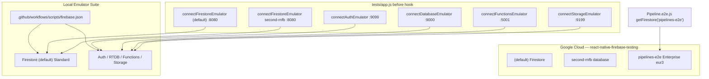

# Overview

RNFB Detox/Jet e2e runs against a shared Firebase project **`react-native-firebase-testing`** (see `tests/android/app/google-services.json`). Most modules use the **local Firebase Emulator Suite**; **Firestore Pipelines** e2e is an exception and hits a **cloud Enterprise database**.



# Where configuration lives

All emulator and deploy configuration is under [`.github/workflows/scripts/`](../../.github/workflows/scripts/). That directory is the Firebase project root (`firebase.json` cwd for `firebase` CLI and `yarn tests:emulator:start`).

| File | Purpose |
|------|---------|
| [`firebase.json`](../../.github/workflows/scripts/firebase.json) | Emulator ports, multi-database Firestore mapping, functions/database/storage rules paths |
| [`start-firebase-emulator.sh`](../../.github/workflows/scripts/start-firebase-emulator.sh) | Starts auth, database, firestore, functions, storage emulators |
| [`firestore.rules`](../../.github/workflows/scripts/firestore.rules) | Security rules for **`(default)`** database |
| [`firestore.indexes.json`](../../.github/workflows/scripts/firestore.indexes.json) | Composite indexes for **`(default)`** |
| [`firestore.pipelines-e2e.rules`](../../.github/workflows/scripts/firestore.pipelines-e2e.rules) | Security rules for **`pipelines-e2e`** cloud database |
| [`firestore.pipelines-e2e.indexes.json`](../../.github/workflows/scripts/firestore.pipelines-e2e.indexes.json) | Indexes (incl. vector) for **`pipelines-e2e`** |
| [`database.rules`](../../.github/workflows/scripts/database.rules) | Realtime Database rules (emulator) |
| [`storage.rules`](../../.github/workflows/scripts/storage.rules) | Storage rules (emulator) |
| [`functions/`](../../.github/workflows/scripts/functions/) | Cloud Functions used by some e2e (e.g. Vertex AI mock) |
| [`deploy-firestore.sh`](../../.github/workflows/scripts/deploy-firestore.sh) | Deploy Firestore rules + indexes to cloud |
| [`sync-firestore-indexes.sh`](../../.github/workflows/scripts/sync-firestore-indexes.sh) | Pull indexes from cloud into repo (non-interactive) |
| [`README-firestore.md`](../../.github/workflows/scripts/README-firestore.md) | Short operator cheat sheet |

Runtime wiring in the test app:

| File | Role |
|------|------|
| [`tests/app.js`](../../tests/app.js) | `before` hook: `connect*Emulator` for each enabled module |
| [`packages/firestore/e2e/helpers.js`](../../packages/firestore/e2e/helpers.js) | `wipe()` — DELETE against **emulator** REST API only |
| [`tests/android/app/google-services.json`](../../tests/android/app/google-services.json) | Firebase project id `react-native-firebase-testing` |

# Emulator vs cloud by product

## Started locally

```bash
yarn tests:emulator:start        # foreground (dev)
yarn tests:emulator:start-ci     # background (CI)
```

Runs from `.github/workflows/scripts/` with project `react-native-firebase-testing`:

| Emulator | Port | Config |
|----------|------|--------|
| Firestore | 8080 | `firestore.rules` + `firestore.indexes.json` for **`(default)`** only |
| Auth | 9099 | — |
| Realtime Database | 9000 | `database.rules` |
| Functions | 5001 | `functions/` (built on start) |
| Storage | 9199 | `storage.rules` |
| Emulator UI | 4000 | enabled in `firebase.json` |

**Deploying to the emulator:** edit the rules/indexes files in-repo and **restart the emulator**. There is no separate deploy step — the emulator loads `firebase.json` on startup. Rules hot-reload when files change (`firestore: Change detected, updating rules…` in emulator logs).

**Wiping emulator Firestore data** (between tests):

```bash
# Per-database via helpers.wipe() in e2e, or manually:
curl -X DELETE \
  "http://localhost:8080/emulator/v1/projects/react-native-firebase-testing/databases/(default)/documents" \
  -H "Authorization: Bearer owner"
```

## Firestore databases

| Database ID | Edition | Emulator connected? | E2e usage |
|-------------|---------|---------------------|-----------|
| `(default)` | Standard | Yes — `tests/app.js` | Most `packages/firestore/e2e/*` |
| `second-rnfb` | Standard | Yes — same emulator host | `SecondDatabase/*` e2e |
| **`pipelines-e2e`** | **Enterprise** (`eur3`) | **No** | `Pipeline.e2e.js` only |

**Critical:** `Pipeline.e2e.js` uses `getFirestore('pipelines-e2e')`. Because `connectFirestoreEmulator` is **not** called for that database, pipeline `execute()` talks to **live cloud**. Connecting it to the local Standard emulator breaks tests (`permission-denied` / `invalid-argument`).

Pipelines require Enterprise; the emulator defaults to Standard unless `firebase.json` sets `"edition": "enterprise"` under `firestore` or `emulators.firestore`. RNFB does not enable Enterprise emulator mode today.

See also [Firestore Pipelines design](/packages/firestore/pipelines.md) for bridge/coercion and coverage notes.

# Cloud project: deploy rules and indexes

Firebase CLI must be authenticated (`firebase login`) with access to `react-native-firebase-testing`. Scripts resolve `firebase-tools` from repo `node_modules` (or `yarn firebase` / `npx`) — a global install is optional.

## Multi-database `firebase.json`

```json
"firestore": [
  { "database": "(default)", "rules": "firestore.rules", "indexes": "firestore.indexes.json" },
  { "database": "pipelines-e2e", "rules": "firestore.pipelines-e2e.rules", "indexes": "firestore.pipelines-e2e.indexes.json" }
]
```

## Pull indexes from cloud (sync repo → truth)

```bash
cd .github/workflows/scripts
./sync-firestore-indexes.sh
```

Uses `firebase firestore:indexes --database …` — there is **no** CLI command to pull security rules; edit `.rules` files in-repo intentionally.

**Always sync `(default)` indexes before deploying** if the cloud project has indexes not in repo. Deploying a minimal `firestore.indexes.json` would **delete** cloud indexes missing from the file.

## Deploy to cloud

```bash
cd .github/workflows/scripts
./deploy-firestore.sh
```

Uses `firebase deploy --only firestore` for **both** databases.

**Do not use** `firebase deploy --only firestore:indexes` or `firestore:rules` with the multi-database array config — those sub-targets can exit 0 while deploying nothing ([firebase-tools#10447](https://github.com/firebase/firebase-tools/issues/10447)).

### Vector indexes (`findNearest`)

Vector indexes are defined in **`firestore.pipelines-e2e.indexes.json`**, not in security rules:

```json
{
  "collectionGroup": "find-nearest",
  "queryScope": "COLLECTION",
  "fields": [
    {
      "fieldPath": "embedding",
      "vectorConfig": { "dimension": 3, "flat": {} }
    }
  ]
}
```

After deploy, index creation is asynchronous; `findNearest` e2e may need to wait or stay skipped until the index is `READY` in console.

### `pipelines-e2e` rules

`firestore.pipelines-e2e.rules` is intentionally permissive (`allow read, write` when `database == "pipelines-e2e"`) for shared CI/local testing on a dedicated test database.

# CI

GitHub Actions e2e workflows (`tests_e2e_ios.yml`, `tests_e2e_android.yml`, `tests_e2e_other.yml`):

1. `yarn tests:emulator:start-ci` — background emulator
2. Build + Detox/Jet run (needs network for `pipelines-e2e` cloud)
3. Emulator cache under `~/.cache/firebase/emulators`

Pipeline tests run in the same Jet session as other Firestore e2e but hit cloud for execute while setup/wipe for `(default)` still uses emulator.

# Local e2e workflow

Typical loop for Firestore work:

```bash
# Terminal 1
yarn tests:emulator:start

# Terminal 2
yarn tests:packager:jet

# Terminal 3
yarn tests:ios:build          # after native changes
yarn tests:ios:test           # or tests:ios:test-cover-reuse
```

For **pipeline-only** debugging, `tests/app.js` may be temporarily scoped to `Pipeline.e2e.js` (revert before merge).

# Learnings and pitfalls

| Topic | Learning |
|-------|----------|
| Pipelines backend | Cloud Enterprise `pipelines-e2e`, not emulator |
| `helpers.wipe()` | Emulator REST only; does not clear cloud `pipelines-e2e` |
| Index deploy safety | Pull `(default)` indexes before `deploy-firestore.sh` |
| Multi-DB deploy | Use `--only firestore`, not `:indexes` / `:rules` sub-targets |
| Emulator rules | File edits + restart (or hot-reload for rules); no `firebase deploy` |
| `cp` / shell aliases | Use `/bin/cp -f` or `sync-firestore-indexes.sh` — interactive `cp` alias can hang on overwrite prompts |
| Vector search | Index in `firestore.pipelines-e2e.indexes.json`; deploy to cloud; not emulator rules |
| Firestore cache | `clearIndexedDbPersistence` in `tests/app.js` for non-macOS platforms between runs |
| Native coverage | iOS profraw pulled in `finally` even when Jet fails — see [Coverage design](/testing/coverage-design.md) |

# Related

* [Coverage design](/testing/coverage-design.md)
* [Firestore Pipelines](/packages/firestore/pipelines.md)
* [CI workflows](/ci-workflows/index.md)
